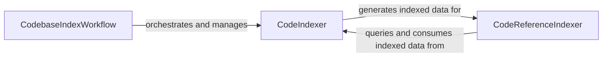

## Details

The `Codebase Intelligence Agents` subsystem is responsible for processing codebases to create a comprehensive index of file structures, content, and inter-file relationships. It also provides the functionality to search and retrieve relevant code references from this index, supporting Retrieval-Augmented Generation (RAG) within the larger multi-agent system.

### CodebaseIndexWorkflow
This component acts as the orchestrator for the entire codebase indexing process. It manages the configuration, defines the target structure for indexing, and initiates the `CodeIndexer` to perform the analysis and index generation. It ensures the codebase is processed according to a defined plan, making it a critical control flow component within the multi-agent architecture.

**Related Classes/Methods**:

- <a href="https://github.com/HKUDS/DeepCode/blob/main/workflows/codebase_index_workflow.py#L30-L678" target="_blank" rel="noopener noreferrer">`CodebaseIndexWorkflow`:30-678</a>

### CodeIndexer
This component performs the deep analysis of a given code repository. Its responsibilities include processing individual files, generating a file tree, analyzing file content (potentially using an LLM for summarization and entity extraction), identifying inter-file relationships, and compiling a comprehensive index of the codebase. It supports both sequential and concurrent file processing for efficiency.

**Related Classes/Methods**:

- <a href="https://github.com/HKUDS/DeepCode/blob/main/tools/code_indexer.py#L99-L1489" target="_blank" rel="noopener noreferrer">`CodeIndexer`:99-1489</a>

### CodeReferenceIndexer
This component provides search and retrieval capabilities over the indexes created by the `CodeIndexer`. It allows for querying specific code references, finding relevant code snippets, and identifying direct relationships between code elements based on user queries. This component is crucial for supporting Retrieval-Augmented Generation (RAG) by providing contextually relevant code information to other agents.

**Related Classes/Methods**:

- <a href="https://github.com/HKUDS/DeepCode/blob/main/tools/code_reference_indexer.py" target="_blank" rel="noopener noreferrer">`CodeReferenceIndexer`</a>

### [FAQ](https://github.com/CodeBoarding/GeneratedOnBoardings/tree/main?tab=readme-ov-file#faq)