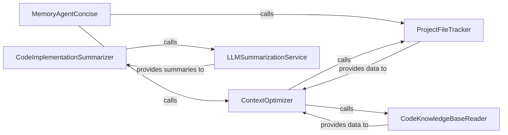

## Details

The `Context Management (Memory Agent)` subsystem is encapsulated within the `workflows/agents/memory_agent_concise.py` file. Its primary responsibility is to manage and optimize conversational context and agent memory, specifically for token limits, by summarizing past interactions, creating concise messages, and providing relevant information to other agents within the DeepCode project.

### MemoryAgentConcise
The orchestrator for all memory management operations, including context optimization, summary generation, and overall memory lifecycle. It serves as the primary interface for the subsystem, coordinating the various memory-related tasks.

**Related Classes/Methods**:

- <a href="https://github.com/HKUDS/DeepCode/blob/main/workflows/agents/memory_agent_concise.py" target="_blank" rel="noopener noreferrer">`MemoryAgentConcise`</a>

### ContextOptimizer
Manages the core logic for optimizing conversational context. It initiates the memory optimization process, summarizes content, and integrates relevant project context to ensure messages fit within token limits, crucial for efficient LLM interaction.

**Related Classes/Methods**:

- <a href="https://github.com/HKUDS/DeepCode/blob/main/workflows/agents/memory_agent_concise.py#L1304-L1341" target="_blank" rel="noopener noreferrer">`apply_memory_optimization`:1304-1341</a>
- <a href="https://github.com/HKUDS/DeepCode/blob/main/workflows/agents/memory_agent_concise.py#L876-L1004" target="_blank" rel="noopener noreferrer">`create_concise_messages`:876-1004</a>

### CodeKnowledgeBaseReader
Responsible for retrieving past implementation details and relevant code information from the agent's knowledge base, providing crucial context for code generation and message optimization.

**Related Classes/Methods**:

- <a href="https://github.com/HKUDS/DeepCode/blob/main/workflows/agents/memory_agent_concise.py#L1006-L1029" target="_blank" rel="noopener noreferrer">`_read_code_knowledge_base`:1006-1029</a>

### CodeImplementationSummarizer
Generates concise summaries of the current code implementation progress, often leveraging an LLM for intelligent summarization to provide a high-level overview of the development state.

**Related Classes/Methods**:

- <a href="https://github.com/HKUDS/DeepCode/blob/main/workflows/agents/memory_agent_concise.py#L428-L499" target="_blank" rel="noopener noreferrer">`create_code_implementation_summary`:428-499</a>

### LLMSummarizationService
Provides a dedicated interface for direct interaction with the underlying Language Model to request and receive summaries, acting as a utility for various summarization tasks within the subsystem.

**Related Classes/Methods**:

- <a href="https://github.com/HKUDS/DeepCode/blob/main/workflows/agents/memory_agent_concise.py#L749-L805" target="_blank" rel="noopener noreferrer">`_call_llm_for_summary`:749-805</a>

### ProjectFileTracker
Manages the identification and tracking of files relevant to the project plan. It parses various project plan formats to establish the initial scope and identifies files that are planned but not yet implemented, providing critical status for context.

**Related Classes/Methods**:

- <a href="https://github.com/HKUDS/DeepCode/blob/main/workflows/agents/memory_agent_concise.py#L1232-L1241" target="_blank" rel="noopener noreferrer">`get_unimplemented_files`:1232-1241</a>
- <a href="https://github.com/HKUDS/DeepCode/blob/main/workflows/agents/memory_agent_concise.py#L149-L186" target="_blank" rel="noopener noreferrer">`_extract_all_files_from_plan`:149-186</a>

### [FAQ](https://github.com/CodeBoarding/GeneratedOnBoardings/tree/main?tab=readme-ov-file#faq)