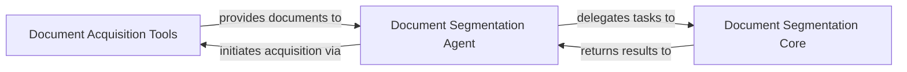

## Details

The `Document Processing Agents` subsystem is responsible for the entire lifecycle of external document handling, from acquisition and preprocessing to segmentation and analysis. It acts as a self-contained unit for transforming raw external documents into structured, segmented information usable by other agents in the system.

### Document Acquisition Tools
Responsible for retrieving raw documents from various external sources (e.g., PDF files, Git repositories) and converting them into a standardized, processable format suitable for further analysis.

**Related Classes/Methods**:

- <a href="https://github.com/HKUDS/DeepCode/blob/main/tools/pdf_downloader.py" target="_blank" rel="noopener noreferrer">`/home/ubuntu/CodeBoarding/repo/DeepCode/tools/pdf_downloader.py`</a>
- <a href="https://github.com/HKUDS/DeepCode/blob/main/tools/git_command.py" target="_blank" rel="noopener noreferrer">`/home/ubuntu/CodeBoarding/repo/DeepCode/tools/git_command.py`</a>
- <a href="https://github.com/HKUDS/DeepCode/blob/main/tools/pdf_converter.py" target="_blank" rel="noopener noreferrer">`/home/ubuntu/CodeBoarding/repo/DeepCode/tools/pdf_converter.py`</a>

### Document Segmentation Core
Provides the core functionalities for in-depth analysis and intelligent segmentation of document content. This includes detecting document types, determining optimal segmentation strategies, and applying various algorithms for semantic chunking and preserving algorithm integrity.

**Related Classes/Methods**:

- <a href="https://github.com/HKUDS/DeepCode/blob/main/tools/document_segmentation_server.py" target="_blank" rel="noopener noreferrer">`/home/ubuntu/CodeBoarding/repo/DeepCode/tools/document_segmentation_server.py`</a>

### Document Segmentation Agent
Acts as a specialized agent within the multi-agent system, orchestrating the entire document segmentation workflow. It manages the lifecycle of document processing, from initiating acquisition to delegating segmentation tasks and validating the output.

**Related Classes/Methods**:

- <a href="https://github.com/HKUDS/DeepCode/blob/main/workflows/agents/document_segmentation_agent.py" target="_blank" rel="noopener noreferrer">`/home/ubuntu/CodeBoarding/repo/DeepCode/workflows/agents/document_segmentation_agent.py`</a>

### [FAQ](https://github.com/CodeBoarding/GeneratedOnBoardings/tree/main?tab=readme-ov-file#faq)