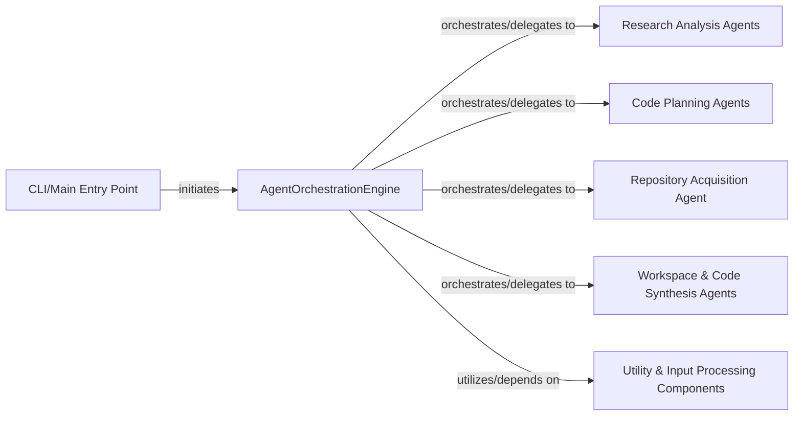

## Details

The `Orchestration Engine` subsystem is the core control unit of the DeepCode project, managing the entire multi-agent workflow for code generation.

### AgentOrchestrationEngine
The central control unit that manages the overall multi-agent workflow. It coordinates tasks, directs data flow between different agents, initiates pipelines, sequences agent actions, manages state transitions, and synthesizes results. It defines the sequence of operations for the code generation process.

**Related Classes/Methods**:

- <a href="https://github.com/HKUDS/DeepCode/blob/main/workflows/agent_orchestration_engine.py" target="_blank" rel="noopener noreferrer">`DeepCode.workflows.agent_orchestration_engine.AgentOrchestrationEngine`</a>

### CLI/Main Entry Point
The primary interface for users to interact with the DeepCode system, initiating the overall code generation process by triggering the `AgentOrchestrationEngine`.

**Related Classes/Methods**:

- <a href="https://github.com/HKUDS/DeepCode/blob/main/deepcode.py" target="_blank" rel="noopener noreferrer">`DeepCode.deepcode.main`</a>

### Research Analysis Agents
A group of specialized agents responsible for gathering, processing, and analyzing information relevant to the code generation task, such as understanding requirements or researching existing solutions.

**Related Classes/Methods**:

- <a href="https://github.com/HKUDS/DeepCode/blob/main/workflows/agent_orchestration_engine.py" target="_blank" rel="noopener noreferrer">`AgentOrchestrationEngine:execute_multi_agent_research_pipeline`</a>
- <a href="https://github.com/HKUDS/DeepCode/blob/main/workflows/agent_orchestration_engine.py" target="_blank" rel="noopener noreferrer">`AgentOrchestrationEngine:orchestrate_research_analysis_agent`</a>
- <a href="https://github.com/HKUDS/DeepCode/blob/main/workflows/agent_orchestration_engine.py" target="_blank" rel="noopener noreferrer">`AgentOrchestrationEngine:run_research_analyzer`</a>
- <a href="https://github.com/HKUDS/DeepCode/blob/main/workflows/agent_orchestration_engine.py" target="_blank" rel="noopener noreferrer">`AgentOrchestrationEngine:run_resource_processor`</a>
- <a href="https://github.com/HKUDS/DeepCode/blob/main/workflows/agent_orchestration_engine.py" target="_blank" rel="noopener noreferrer">`AgentOrchestrationEngine:paper_reference_analyzer`</a>

### Code Planning Agents
Specialized agents that translate the analyzed requirements and research into a structured code plan, outlining the architecture, modules, and implementation steps.

**Related Classes/Methods**:

- <a href="https://github.com/HKUDS/DeepCode/blob/main/workflows/agent_orchestration_engine.py" target="_blank" rel="noopener noreferrer">`AgentOrchestrationEngine:execute_chat_based_planning_pipeline`</a>
- <a href="https://github.com/HKUDS/DeepCode/blob/main/workflows/agent_orchestration_engine.py" target="_blank" rel="noopener noreferrer">`AgentOrchestrationEngine:orchestrate_code_planning_agent`</a>
- <a href="https://github.com/HKUDS/DeepCode/blob/main/workflows/agent_orchestration_engine.py" target="_blank" rel="noopener noreferrer">`AgentOrchestrationEngine:run_chat_planning_agent`</a>

### Repository Acquisition Agent
An agent dedicated to retrieving external code repositories, either for reference, integration, or as a starting point for code generation.

**Related Classes/Methods**:

- <a href="https://github.com/HKUDS/DeepCode/blob/main/workflows/agent_orchestration_engine.py" target="_blank" rel="noopener noreferrer">`AgentOrchestrationEngine:automate_repository_acquisition_agent`</a>
- <a href="https://github.com/HKUDS/DeepCode/blob/main/workflows/agent_orchestration_engine.py" target="_blank" rel="noopener noreferrer">`AgentOrchestrationEngine:github_repo_download`</a>

### Workspace & Code Synthesis Agents
A group of agents responsible for setting up the development environment (workspace infrastructure) and generating the actual code based on the code plan.

**Related Classes/Methods**:

- <a href="https://github.com/HKUDS/DeepCode/blob/main/workflows/agent_orchestration_engine.py" target="_blank" rel="noopener noreferrer">`AgentOrchestrationEngine:synthesize_workspace_infrastructure_agent`</a>
- <a href="https://github.com/HKUDS/DeepCode/blob/main/workflows/agent_orchestration_engine.py" target="_blank" rel="noopener noreferrer">`AgentOrchestrationEngine:synthesize_code_implementation_agent`</a>
- <a href="https://github.com/HKUDS/DeepCode/blob/main/workflows/agent_orchestration_engine.py" target="_blank" rel="noopener noreferrer">`AgentOrchestrationEngine:run_code_analyzer`</a>

### Utility & Input Processing Components
Helper components responsible for initial input processing, data cleaning, parsing, and configuration management, ensuring that data is in a usable format for the agents.

**Related Classes/Methods**:

- <a href="https://github.com/HKUDS/DeepCode/blob/main/workflows/agent_orchestration_engine.py" target="_blank" rel="noopener noreferrer">`AgentOrchestrationEngine:_process_input_source`</a>
- <a href="https://github.com/HKUDS/DeepCode/blob/main/workflows/agent_orchestration_engine.py" target="_blank" rel="noopener noreferrer">`AgentOrchestrationEngine:extract_clean_json`</a>
- <a href="https://github.com/HKUDS/DeepCode/blob/main/workflows/agent_orchestration_engine.py" target="_blank" rel="noopener noreferrer">`AgentOrchestrationEngine:get_search_server_names`</a>

### [FAQ](https://github.com/CodeBoarding/GeneratedOnBoardings/tree/main?tab=readme-ov-file#faq)