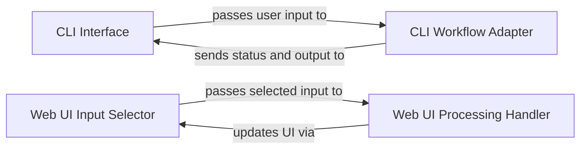

## Details

The DeepCode system provides dual user interaction channels: a Command-Line Interface (CLI) and a Web User Interface (Web UI). The `CLI Interface` serves as the primary command-line interaction point, capturing user input and displaying processing feedback. It delegates complex workflow orchestration to the `CLI Workflow Adapter`, which translates CLI commands into structured inputs for the DeepCode engine and manages the execution flow. Concurrently, the `Web UI Input Selector` facilitates web-based input collection, passing user-selected data to the `Web UI Processing Handler`. This handler is responsible for initiating and managing the core DeepCode processing triggered by the Web UI, providing real-time status updates back to the user interface. Both `CLI Workflow Adapter` and `Web UI Processing Handler` act as crucial intermediaries, bridging their respective frontends with the DeepCode's multi-agent backend for code generation and analysis.

### CLI Interface
Serves as the direct command-line interaction point. It is responsible for capturing various forms of user input (e.g., file paths, URLs, chat messages) and for displaying real-time processing status, intermediate feedback, and the final generated code or reports to the user.

**Related Classes/Methods**:

### CLI Workflow Adapter
Acts as an orchestrator for CLI-driven workflows. It adapts raw CLI user input into a structured format suitable for the core DeepCode engine, manages the execution flow of complex processing pipelines (e.g., chat-based interactions, full code generation pipelines), and bridges the CLI with the multi-agent system's core.

**Related Classes/Methods**:

### Web UI Input Selector
Provides the web-based user interface with options for selecting input methods (e.g., URL, file upload, direct chat input) and collects the corresponding user-provided data.

**Related Classes/Methods**:

### Web UI Processing Handler
Manages the execution of the core DeepCode processing workflow triggered by user actions within the Web UI. This includes handling asynchronous tasks, updating the UI with processing status, and tracking overall progress. It serves as the primary interface between the web frontend and the multi-agent backend.

**Related Classes/Methods**:

- <a href="https://github.com/HKUDS/DeepCode/blob/main/ui/handlers.py#L57-L74" target="_blank" rel="noopener noreferrer">`handlers`:57-74</a>

### [FAQ](https://github.com/CodeBoarding/GeneratedOnBoardings/tree/main?tab=readme-ov-file#faq)