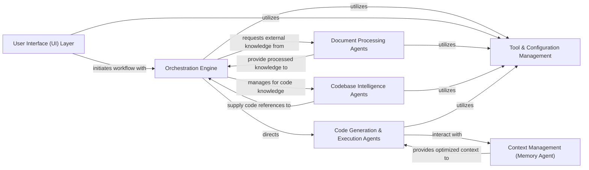

## Details

The `DeepCode` architecture is designed around a robust `Orchestration Engine` that serves as the central coordinator for all operations. User interactions originate from the `User Interface (UI) Layer`, which then triggers workflows within the Orchestration Engine. This engine intelligently dispatches tasks to specialized agents: `Document Processing Agents` handle external information, `Codebase Intelligence Agents` manage internal code knowledge, and `Code Generation & Execution Agents` are responsible for code implementation. All these components, including the UI and Orchestration Engine, leverage the `Tool & Configuration Management` system to access and manage their operational tools. Furthermore, the `Context Management (Memory Agent)` provides crucial contextual support, particularly for the Code Generation & Execution Agents, by optimizing conversational history. This modular design ensures clear responsibilities and facilitates a streamlined data flow, making it highly suitable for both detailed documentation and intuitive visual diagram generation.

### User Interface (UI) Layer [[Expand]](./User_Interface_UI_Layer.md)
The primary interaction point for users, encompassing both a Command Line Interface (CLI) and a Web-based Graphical User Interface. It is responsible for capturing user requirements, displaying processing status, and presenting generated code and reports.

**Related Classes/Methods**:

- <a href="https://github.com/HKUDS/DeepCode/blob/main/cli/" target="_blank" rel="noopener noreferrer">`cli/`</a>
- <a href="https://github.com/HKUDS/DeepCode/blob/main/ui/" target="_blank" rel="noopener noreferrer">`ui/`</a>

### Orchestration Engine [[Expand]](./Orchestration_Engine.md)
The central control unit that manages the overall multi-agent workflow. It coordinates tasks, directs data flow between different agents, initiates pipelines, sequences agent actions, manages state transitions, and synthesizes results.

**Related Classes/Methods**:

- <a href="https://github.com/HKUDS/DeepCode/blob/main/workflows/agent_orchestration_engine.py" target="_blank" rel="noopener noreferrer">`workflows/agent_orchestration_engine.py`</a>
- <a href="https://github.com/HKUDS/DeepCode/blob/main/deepcode.py" target="_blank" rel="noopener noreferrer">`deepcode.py`</a>

### Document Processing Agents [[Expand]](./Document_Processing_Agents.md)
A consolidated component responsible for the entire lifecycle of external document handling, from acquisition and preprocessing (downloading, format conversion) to segmentation and analysis (type detection, semantic chunking, algorithm integrity preservation).

**Related Classes/Methods**:

- <a href="https://github.com/HKUDS/DeepCode/blob/main/tools/pdf_downloader.py" target="_blank" rel="noopener noreferrer">`tools.pdf_downloader.py`</a>
- <a href="https://github.com/HKUDS/DeepCode/blob/main/tools/git_command.py" target="_blank" rel="noopener noreferrer">`tools/git_command.py`</a>
- <a href="https://github.com/HKUDS/DeepCode/blob/main/tools/pdf_converter.py" target="_blank" rel="noopener noreferrer">`tools/pdf_converter.py`</a>
- <a href="https://github.com/HKUDS/DeepCode/blob/main/tools/document_segmentation_server.py" target="_blank" rel="noopener noreferrer">`tools/document_segmentation_server.py`</a>
- <a href="https://github.com/HKUDS/DeepCode/blob/main/workflows/agents/document_segmentation_agent.py" target="_blank" rel="noopener noreferrer">`workflows/agents/document_segmentation_agent.py`</a>

### Codebase Intelligence Agents [[Expand]](./Codebase_Intelligence_Agents.md)
This component handles the processing of existing codebases to build a comprehensive index of file structures, content summaries, and inter-file relationships. It also includes the functionality to search and retrieve relevant code references and relationships from this index.

**Related Classes/Methods**:

- <a href="https://github.com/HKUDS/DeepCode/blob/main/tools/code_indexer.py" target="_blank" rel="noopener noreferrer">`tools/code_indexer.py`</a>
- <a href="https://github.com/HKUDS/DeepCode/blob/main/tools/code_reference_indexer.py" target="_blank" rel="noopener noreferrer">`tools/code_reference_indexer.py`</a>
- <a href="https://github.com/HKUDS/DeepCode/blob/main/workflows/codebase_index_workflow.py" target="_blank" rel="noopener noreferrer">`workflows/codebase_index_workflow.py`</a>

### Code Generation & Execution Agents [[Expand]](./Code_Generation_Execution_Agents.md)
Encompasses the planning, implementation, and execution of code. It generates high-level plans, writes/modifies code, and executes it in a sandboxed environment, interacting with the file system and tracking implementation progress.

**Related Classes/Methods**:

- <a href="https://github.com/HKUDS/DeepCode/blob/main/prompts/code_prompts.py" target="_blank" rel="noopener noreferrer">`prompts/code_prompts.py`</a>
- <a href="https://github.com/HKUDS/DeepCode/blob/main/workflows/code_implementation_workflow.py" target="_blank" rel="noopener noreferrer">`workflows/code_implementation_workflow.py`</a>
- <a href="https://github.com/HKUDS/DeepCode/blob/main/workflows/agents/code_implementation_agent.py" target="_blank" rel="noopener noreferrer">`workflows/agents/code_implementation_agent.py`</a>
- <a href="https://github.com/HKUDS/DeepCode/blob/main/tools/code_implementation_server.py" target="_blank" rel="noopener noreferrer">`tools/code_implementation_server.py`</a>
- <a href="https://github.com/HKUDS/DeepCode/blob/main/tools/command_executor.py" target="_blank" rel="noopener noreferrer">`tools/command_executor.py`</a>

### Context Management (Memory Agent) [[Expand]](./Context_Management_Memory_Agent_.md)
Manages the conversational context and agent memory, optimizing for token limits by summarizing past interactions, creating concise messages, and providing relevant information to agents.

**Related Classes/Methods**:

- <a href="https://github.com/HKUDS/DeepCode/blob/main/workflows/agents/memory_agent_concise.py" target="_blank" rel="noopener noreferrer">`workflows/agents/memory_agent_concise.py`</a>

### Tool & Configuration Management
A centralized repository for defining, configuring, and managing the various tools and their specifications that agents can utilize during their operations.

**Related Classes/Methods**:

- <a href="https://github.com/HKUDS/DeepCode/blob/main/config/mcp_tool_definitions.py" target="_blank" rel="noopener noreferrer">`config/mcp_tool_definitions.py`</a>
- <a href="https://github.com/HKUDS/DeepCode/blob/main/config/mcp_tool_definitions_index.py" target="_blank" rel="noopener noreferrer">`config/mcp_tool_definitions_index.py`</a>

### [FAQ](https://github.com/CodeBoarding/GeneratedOnBoardings/tree/main?tab=readme-ov-file#faq)