```mermaid
graph LR
    Compatibility_Layer["Compatibility Layer"]
    PyTorch_API["PyTorch API"]
    TensorFlow_API["TensorFlow API"]
    PyTorch_Pose_Models["PyTorch Pose Models"]
    TensorFlow_Pose_Networks["TensorFlow Pose Networks"]
    PyTorch_Runners["PyTorch Runners"]
    Core_Metrics["Core Metrics"]
    PyTorch_Data_Handling["PyTorch Data Handling"]
    TensorFlow_Data_Handling["TensorFlow Data Handling"]
    Configuration_Management["Configuration Management"]
    Compatibility_Layer -- "Dispatches calls to" --> PyTorch_API
    Compatibility_Layer -- "Dispatches calls to" --> TensorFlow_API
    PyTorch_API -- "Utilizes" --> PyTorch_Pose_Models
    PyTorch_API -- "Manages execution with" --> PyTorch_Runners
    PyTorch_API -- "Consumes data from" --> PyTorch_Data_Handling
    PyTorch_API -- "Reports performance using" --> Core_Metrics
    PyTorch_API -- "Configures with" --> Configuration_Management
    TensorFlow_API -- "Utilizes" --> TensorFlow_Pose_Networks
    TensorFlow_API -- "Consumes data from" --> TensorFlow_Data_Handling
    TensorFlow_API -- "Reports performance using" --> Core_Metrics
    TensorFlow_API -- "Configures with" --> Configuration_Management
    PyTorch_Pose_Models -- "Utilized by" --> PyTorch_API
    PyTorch_Pose_Models -- "Interacts with" --> PyTorch_Runners
    TensorFlow_Pose_Networks -- "Utilized by" --> TensorFlow_API
    PyTorch_Runners -- "Interacts with" --> PyTorch_Pose_Models
    PyTorch_Runners -- "Consumes data from" --> PyTorch_Data_Handling
    Core_Metrics -- "Utilized by" --> PyTorch_API
    Core_Metrics -- "Utilized by" --> TensorFlow_API
    PyTorch_Data_Handling -- "Provides data to" --> PyTorch_API
    PyTorch_Data_Handling -- "Provides data to" --> PyTorch_Runners
    TensorFlow_Data_Handling -- "Provides data to" --> TensorFlow_API
    Configuration_Management -- "Configures" --> PyTorch_API
    Configuration_Management -- "Configures" --> PyTorch_Pose_Models
    Configuration_Management -- "Configures" --> TensorFlow_API
    Configuration_Management -- "Configures" --> TensorFlow_Pose_Networks
```

## Details

The `Core Pose Estimation Pipeline` in DeepLabCut is designed to provide a robust and flexible framework for 2D pose estimation, supporting both TensorFlow and PyTorch backends. Its primary purpose is to facilitate the training of deep learning models, perform inference to predict keypoint locations, and quantitatively evaluate model performance. The architecture is modular, allowing for easy extension and maintenance of framework-specific implementations while presenting a unified interface to the user.

### Compatibility Layer
This module acts as the primary public interface for DeepLabCut functionalities. It abstracts away the underlying deep learning framework (TensorFlow or PyTorch), directing calls to the appropriate backend implementation for tasks like training, evaluation, and video analysis.

**Related Classes/Methods**:

- `deeplabcut/compat/__init__.py` (0:0)

### PyTorch API
Contains high-level functions and entry points for training, evaluation, and video analysis when using the PyTorch backend. It orchestrates the use of PyTorch models, data loaders, and runners.

**Related Classes/Methods**:

- <a href="https://github.com/DeepLabCut/DeepLabCut/deeplabcut/pose_estimation_pytorch/apis/training.py#L0-L0" target="_blank" rel="noopener noreferrer">`deeplabcut/pose_estimation_pytorch/apis/training.py` (0:0)</a>
- <a href="https://github.com/DeepLabCut/DeepLabCut/deeplabcut/pose_estimation_pytorch/apis/evaluation.py#L0-L0" target="_blank" rel="noopener noreferrer">`deeplabcut/pose_estimation_pytorch/apis/evaluation.py` (0:0)</a>
- <a href="https://github.com/DeepLabCut/DeepLabCut/deeplabcut/pose_estimation_pytorch/apis/videos.py#L0-L0" target="_blank" rel="noopener noreferrer">`deeplabcut/pose_estimation_pytorch/apis/videos.py` (0:0)</a>

### TensorFlow API
Provides the high-level functions for training, evaluation, and video analysis when using the TensorFlow backend. It manages TensorFlow model loading, prediction, and data handling.

**Related Classes/Methods**:

- <a href="https://github.com/DeepLabCut/DeepLabCut/deeplabcut/pose_estimation_tensorflow/training.py#L0-L0" target="_blank" rel="noopener noreferrer">`deeplabcut/pose_estimation_tensorflow/training.py` (0:0)</a>
- <a href="https://github.com/DeepLabCut/DeepLabCut/deeplabcut/pose_estimation_tensorflow/core/evaluate.py#L0-L0" target="_blank" rel="noopener noreferrer">`deeplabcut/pose_estimation_tensorflow/core/evaluate.py` (0:0)</a>
- <a href="https://github.com/DeepLabCut/DeepLabCut/deeplabcut/pose_estimation_tensorflow/predict_videos.py#L0-L0" target="_blank" rel="noopener noreferrer">`deeplabcut/pose_estimation_tensorflow/predict_videos.py` (0:0)</a>

### PyTorch Pose Models
This component defines the core neural network architectures for pose estimation in PyTorch. It integrates various sub-components like backbones, heads, predictors, and target generators to form a complete model.

**Related Classes/Methods**:

- <a href="https://github.com/DeepLabCut/DeepLabCut/deeplabcut/pose_estimation_pytorch/models/model.py#L0-L0" target="_blank" rel="noopener noreferrer">`deeplabcut/pose_estimation_pytorch/models/model.py` (0:0)</a>
- <a href="https://github.com/DeepLabCut/DeepLabCut/deeplabcut/pose_estimation_pytorch/models/backbones/base.py#L0-L0" target="_blank" rel="noopener noreferrer">`deeplabcut/pose_estimation_pytorch/models/backbones/base.py` (0:0)</a>
- <a href="https://github.com/DeepLabCut/DeepLabCut/deeplabcut/pose_estimation_pytorch/models/heads/base.py#L0-L0" target="_blank" rel="noopener noreferrer">`deeplabcut/pose_estimation_pytorch/models/heads/base.py` (0:0)</a>
- <a href="https://github.com/DeepLabCut/DeepLabCut/deeplabcut/pose_estimation_pytorch/models/predictors/base.py#L0-L0" target="_blank" rel="noopener noreferrer">`deeplabcut/pose_estimation_pytorch/models/predictors/base.py` (0:0)</a>
- <a href="https://github.com/DeepLabCut/DeepLabCut/deeplabcut/pose_estimation_pytorch/models/target_generators/base.py#L0-L0" target="_blank" rel="noopener noreferrer">`deeplabcut/pose_estimation_pytorch/models/target_generators/base.py` (0:0)</a>

### TensorFlow Pose Networks
This component defines the neural network architectures for pose estimation in the TensorFlow backend. It provides the common interface and functionalities for different TensorFlow-based pose estimation models.

**Related Classes/Methods**:

- <a href="https://github.com/DeepLabCut/DeepLabCut/deeplabcut/pose_estimation_tensorflow/nnets/base.py#L0-L0" target="_blank" rel="noopener noreferrer">`deeplabcut/pose_estimation_tensorflow/nnets/base.py` (0:0)</a>
- <a href="https://github.com/DeepLabCut/DeepLabCut/deeplabcut/pose_estimation_tensorflow/nnets/efficientnet.py#L0-L0" target="_blank" rel="noopener noreferrer">`deeplabcut/pose_estimation_tensorflow/nnets/efficientnet.py` (0:0)</a>
- <a href="https://github.com/DeepLabCut/DeepLabCut/deeplabcut/pose_estimation_tensorflow/nnets/mobilenet.py#L0-L0" target="_blank" rel="noopener noreferrer">`deeplabcut/pose_estimation_tensorflow/nnets/mobilenet.py` (0:0)</a>
- <a href="https://github.com/DeepLabCut/DeepLabCut/deeplabcut/pose_estimation_tensorflow/nnets/resnet.py#L0-L0" target="_blank" rel="noopener noreferrer">`deeplabcut/pose_estimation_tensorflow/nnets/resnet.py` (0:0)</a>

### PyTorch Runners
These classes manage the execution flow for training and inference processes in PyTorch. They handle data loading, model forward/backward passes, optimization, logging, and snapshot management.

**Related Classes/Methods**:

- <a href="https://github.com/DeepLabCut/DeepLabCut/deeplabcut/pose_estimation_pytorch/runners/train.py#L0-L0" target="_blank" rel="noopener noreferrer">`deeplabcut/pose_estimation_pytorch/runners/train.py` (0:0)</a>
- <a href="https://github.com/DeepLabCut/DeepLabCut/deeplabcut/pose_estimation_pytorch/runners/inference.py#L0-L0" target="_blank" rel="noopener noreferrer">`deeplabcut/pose_estimation_pytorch/runners/inference.py` (0:0)</a>
- <a href="https://github.com/DeepLabCut/DeepLabCut/deeplabcut/pose_estimation_pytorch/runners/logger.py#L0-L0" target="_blank" rel="noopener noreferrer">`deeplabcut/pose_estimation_pytorch/runners/logger.py` (0:0)</a>
- <a href="https://github.com/DeepLabCut/DeepLabCut/deeplabcut/pose_estimation_pytorch/runners/snapshots.py#L0-L0" target="_blank" rel="noopener noreferrer">`deeplabcut/pose_estimation_pytorch/runners/snapshots.py` (0:0)</a>

### Core Metrics
This module provides functionalities for computing various evaluation metrics, such as Object Keypoint Similarity (OKS) and Root Mean Squared Error (RMSE), to assess the performance of pose estimation models.

**Related Classes/Methods**:

- <a href="https://github.com/DeepLabCut/DeepLabCut/deeplabcut/core/metrics/api.py#L0-L0" target="_blank" rel="noopener noreferrer">`deeplabcut/core/metrics/api.py` (0:0)</a>
- <a href="https://github.com/DeepLabCut/DeepLabCut/deeplabcut/core/metrics/distance_metrics.py#L0-L0" target="_blank" rel="noopener noreferrer">`deeplabcut/core/metrics/distance_metrics.py` (0:0)</a>
- <a href="https://github.com/DeepLabCut/DeepLabCut/deeplabcut/core/metrics/__init__.py#L0-L0" target="_blank" rel="noopener noreferrer">`deeplabcut/core/metrics/__init__.py` (0:0)</a>

### PyTorch Data Handling
This component is responsible for loading, preprocessing, and transforming data for PyTorch models. It includes classes for datasets, data loaders, and image transformations.

**Related Classes/Methods**:

- <a href="https://github.com/DeepLabCut/DeepLabCut/deeplabcut/pose_estimation_pytorch/data/dlcloader.py#L0-L0" target="_blank" rel="noopener noreferrer">`deeplabcut/pose_estimation_pytorch/data/dlcloader.py` (0:0)</a>
- <a href="https://github.com/DeepLabCut/DeepLabCut/deeplabcut/pose_estimation_pytorch/data/transforms.py#L0-L0" target="_blank" rel="noopener noreferrer">`deeplabcut/pose_estimation_pytorch/data/transforms.py` (0:0)</a>
- <a href="https://github.com/DeepLabCut/DeepLabCut/deeplabcut/pose_estimation_pytorch/data/dataset.py#L0-L0" target="_blank" rel="noopener noreferrer">`deeplabcut/pose_estimation_pytorch/data/dataset.py` (0:0)</a>
- <a href="https://github.com/DeepLabCut/DeepLabCut/deeplabcut/pose_estimation_pytorch/data/preprocessor.py#L0-L0" target="_blank" rel="noopener noreferrer">`deeplabcut/pose_estimation_pytorch/data/preprocessor.py` (0:0)</a>
- <a href="https://github.com/DeepLabCut/DeepLabCut/deeplabcut/pose_estimation_pytorch/data/postprocessor.py#L0-L0" target="_blank" rel="noopener noreferrer">`deeplabcut/pose_estimation_pytorch/data/postprocessor.py` (0:0)</a>

### TensorFlow Data Handling
This component is responsible for loading, preprocessing, and augmenting data specifically for TensorFlow models. It includes various dataset implementations tailored for different data augmentation strategies.

**Related Classes/Methods**:

- <a href="https://github.com/DeepLabCut/DeepLabCut/deeplabcut/pose_estimation_tensorflow/datasets/pose_base.py#L0-L0" target="_blank" rel="noopener noreferrer">`deeplabcut/pose_estimation_tensorflow/datasets/pose_base.py` (0:0)</a>
- <a href="https://github.com/DeepLabCut/DeepLabCut/deeplabcut/pose_estimation_tensorflow/datasets/factory.py#L0-L0" target="_blank" rel="noopener noreferrer">`deeplabcut/pose_estimation_tensorflow/datasets/factory.py` (0:0)</a>
- <a href="https://github.com/DeepLabCut/DeepLabCut/deeplabcut/pose_estimation_tensorflow/datasets/pose_deterministic.py#L0-L0" target="_blank" rel="noopener noreferrer">`deeplabcut/pose_estimation_tensorflow/datasets/pose_deterministic.py` (0:0)</a>
- <a href="https://github.com/DeepLabCut/DeepLabCut/deeplabcut/pose_estimation_tensorflow/datasets/pose_imgaug.py#L0-L0" target="_blank" rel="noopener noreferrer">`deeplabcut/pose_estimation_tensorflow/datasets/pose_imgaug.py` (0:0)</a>
- <a href="https://github.com/DeepLabCut/DeepLabCut/deeplabcut/pose_estimation_tensorflow/datasets/pose_multianimal_imgaug.py#L0-L0" target="_blank" rel="noopener noreferrer">`deeplabcut/pose_estimation_tensorflow/datasets/pose_multianimal_imgaug.py` (0:0)</a>

### Configuration Management
Manages the loading and parsing of configuration files specific to both PyTorch and TensorFlow models, which define model parameters, training settings, and other operational details.

**Related Classes/Methods**:

- `deeplabcut/pose_estimation_pytorch/config.py` (0:0)
- <a href="https://github.com/DeepLabCut/DeepLabCut/deeplabcut/pose_estimation_pytorch/config/utils.py#L0-L0" target="_blank" rel="noopener noreferrer">`deeplabcut/pose_estimation_pytorch/config/utils.py` (0:0)</a>
- <a href="https://github.com/DeepLabCut/DeepLabCut/deeplabcut/pose_estimation_tensorflow/config.py#L0-L0" target="_blank" rel="noopener noreferrer">`deeplabcut/pose_estimation_tensorflow/config.py` (0:0)</a>

### [FAQ](https://github.com/CodeBoarding/GeneratedOnBoardings/tree/main?tab=readme-ov-file#faq)