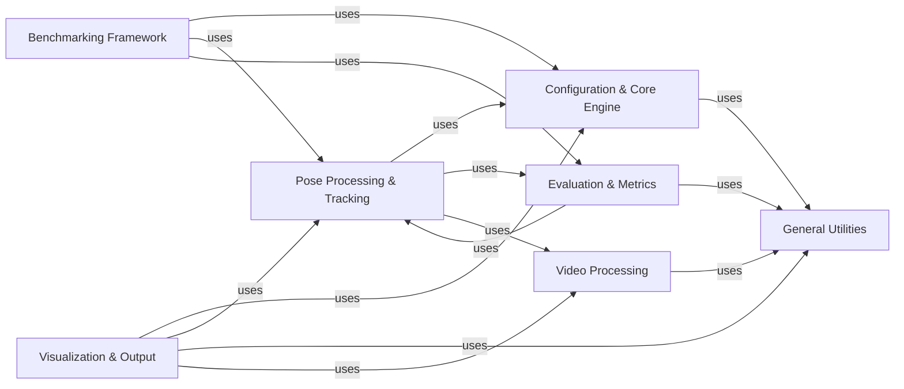

## Details

The `Core Services & Utilities` component in DeepLabCut serves as the foundational layer, providing essential, low-level services and common functionalities that are pervasive across the entire library. Its structure is modular, organized into distinct sub-components that handle specific core tasks. The flow within this component involves configuration loading, data management, video processing, pose estimation result processing, metric computation, and various visualization outputs. Its primary purpose is to ensure robust, efficient, and consistent operations by centralizing critical functionalities, thereby supporting higher-level DeepLabCut workflows such as training, analysis, and evaluation. These components are fundamental because they collectively form the backbone of DeepLabCut's core functionality, providing essential setup, central control, pose processing, evaluation, low-level utilities, visualization, and benchmarking capabilities.

### Configuration & Core Engine
Manages project-wide configurations, data paths, and the central operational logic of DeepLabCut. It provides foundational data structures and ensures consistent settings across modules. The Engine class acts as a central hub for managing the overall state and flow of the application.

**Related Classes/Methods**:

- <a href="https://github.com/DeepLabCut/DeepLabCut/deeplabcut/core/config.py#L1-L1000" target="_blank" rel="noopener noreferrer">`deeplabcut.core.config:all` (1:1000)</a>
- <a href="https://github.com/DeepLabCut/DeepLabCut/deeplabcut/core/engine.py#L1-L1000" target="_blank" rel="noopener noreferrer">`deeplabcut.core.engine:all` (1:1000)</a>

### Pose Processing & Tracking
Handles the transformation of raw model outputs into structured pose estimations, including individual identification and tracking across frames using various algorithms (e.g., SORT-based trackers for ellipses, skeletons, and bounding boxes). It also includes logic for parsing ground truth data and assembling detected individuals and their keypoints.

**Related Classes/Methods**:

- <a href="https://github.com/DeepLabCut/DeepLabCut/deeplabcut/core/inferenceutils.py#L1-L1000" target="_blank" rel="noopener noreferrer">`deeplabcut.core.inferenceutils:all` (1:1000)</a>
- <a href="https://github.com/DeepLabCut/DeepLabCut/deeplabcut/core/trackingutils.py#L1-L1000" target="_blank" rel="noopener noreferrer">`deeplabcut.core.trackingutils:all` (1:1000)</a>

### Evaluation & Metrics
Provides functionalities for computing various quantitative metrics (e.g., Object Keypoint Similarity (OKS), Root Mean Squared Error (RMSE), mean Average Precision (mAP)) to assess the accuracy and performance of pose estimations. It also includes utilities for cross-validation procedures, ensuring robust model evaluation.

**Related Classes/Methods**:

- `deeplabcut.core.metrics:all` (1:1000)
- <a href="https://github.com/DeepLabCut/DeepLabCut/deeplabcut/core/crossvalutils.py#L1-L1000" target="_blank" rel="noopener noreferrer">`deeplabcut.core.crossvalutils:all` (1:1000)</a>

### General Utilities
A collection of general-purpose utility functions that support various aspects of DeepLabCut. This includes functionalities for reading and writing configuration files, managing file paths, and loading diverse data types, serving as a common toolkit for other components.

**Related Classes/Methods**:

- <a href="https://github.com/DeepLabCut/DeepLabCut/deeplabcut/utils/auxiliaryfunctions.py#L1-L1000" target="_blank" rel="noopener noreferrer">`deeplabcut.utils.auxiliaryfunctions:all` (1:1000)</a>

### Video Processing
Offers fundamental functionalities for interacting with video files. This includes capabilities for reading frames, writing new videos, and performing basic video manipulations such as shortening, cropping, and resizing, which are crucial for input preparation and output generation.

**Related Classes/Methods**:

- <a href="https://github.com/DeepLabCut/DeepLabCut/deeplabcut/utils/auxfun_videos.py#L1-L1000" target="_blank" rel="noopener noreferrer">`deeplabcut.utils.auxfun_videos:all` (1:1000)</a>
- <a href="https://github.com/DeepLabCut/DeepLabCut/deeplabcut/utils/video_processor.py#L1-L1000" target="_blank" rel="noopener noreferrer">`deeplabcut.utils.video_processor:all` (1:1000)</a>

### Visualization & Output
Responsible for generating visual representations of pose estimation results. It overlays predicted keypoints, tracks, and other relevant information onto video frames to create labeled videos, and provides functions for plotting various data aspects for qualitative analysis and visualization.

**Related Classes/Methods**:

- <a href="https://github.com/DeepLabCut/DeepLabCut/deeplabcut/utils/make_labeled_video.py#L1-L1000" target="_blank" rel="noopener noreferrer">`deeplabcut.utils.make_labeled_video:all` (1:1000)</a>
- <a href="https://github.com/DeepLabCut/DeepLabCut/deeplabcut/utils/plotting.py#L1-L1000" target="_blank" rel="noopener noreferrer">`deeplabcut.utils.plotting:all` (1:1000)</a>
- <a href="https://github.com/DeepLabCut/DeepLabCut/deeplabcut/core/visualization.py#L1-L1000" target="_blank" rel="noopener noreferrer">`deeplabcut.core.visualization:all` (1:1000)</a>

### Benchmarking Framework
Orchestrates and provides tools for evaluating pose estimation models by computing performance metrics within a standardized framework. It manages the overall evaluation workflow, including data loading, prediction validation, and metric calculation for specific benchmarks.

**Related Classes/Methods**:

- <a href="https://github.com/DeepLabCut/DeepLabCut/deeplabcut/benchmark/base.py#L1-L1000" target="_blank" rel="noopener noreferrer">`deeplabcut.benchmark.base:all` (1:1000)</a>
- <a href="https://github.com/DeepLabCut/DeepLabCut/deeplabcut/benchmark/metrics.py#L1-L1000" target="_blank" rel="noopener noreferrer">`deeplabcut.benchmark.metrics:all` (1:1000)</a>

### [FAQ](https://github.com/CodeBoarding/GeneratedOnBoardings/tree/main?tab=readme-ov-file#faq)