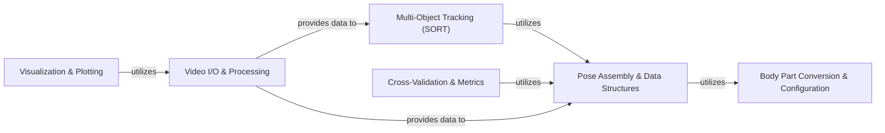

## Details

This document outlines the core utilities and foundational components of the DeepLabCut system.

### Video I/O & Processing
This component provides the fundamental capabilities for interacting with video files. It handles reading video metadata, accessing individual frames, performing integrity checks, and enabling various video manipulations such as writing, shortening, splitting, cropping, rotating, and rescaling. It forms the bedrock for all video-based operations within DeepLabCut.

**Related Classes/Methods**:

- <a href="https://github.com/DeepLabCut/DeepLabCut/deeplabcut/utils/auxfun_videos.py#L36-L214" target="_blank" rel="noopener noreferrer">`deeplabcut.utils.auxfun_videos.VideoReader` (36:214)</a>
- <a href="https://github.com/DeepLabCut/DeepLabCut/deeplabcut/utils/auxfun_videos.py#L217-L372" target="_blank" rel="noopener noreferrer">`deeplabcut.utils.auxfun_videos.VideoWriter` (217:372)</a>
- <a href="https://github.com/DeepLabCut/DeepLabCut/deeplabcut/utils/video_processor.py#L125-L165" target="_blank" rel="noopener noreferrer">`deeplabcut.utils.video_processor.VideoProcessorCV` (125:165)</a>

### Pose Assembly & Data Structures
This component is crucial for transforming raw keypoint detections and Part Affinity Fields (PAFs) from neural network outputs into structured, coherent individual poses (assemblies). It also defines the foundational data structures (Assembly, EngineDataMixin) used to represent these assembled poses and provides data management capabilities for the core processing engine.

**Related Classes/Methods**:

- <a href="https://github.com/DeepLabCut/DeepLabCut/deeplabcut/core/inferenceutils.py#L230-L920" target="_blank" rel="noopener noreferrer">`deeplabcut.core.inferenceutils.Assembler` (230:920)</a>
- <a href="https://github.com/DeepLabCut/DeepLabCut/deeplabcut/core/inferenceutils.py#L87-L227" target="_blank" rel="noopener noreferrer">`deeplabcut.core.inferenceutils.Assembly` (87:227)</a>
- <a href="https://github.com/DeepLabCut/DeepLabCut/deeplabcut/core/engine.py#L18-L22" target="_blank" rel="noopener noreferrer">`deeplabcut.core.engine.EngineDataMixin` (18:22)</a>

### Multi-Object Tracking (SORT)
This component implements the Simple Online and Realtime Tracking (SORT) algorithm, adapted for various types of tracked objects (bounding boxes, ellipses, or full skeletons/keypoints). It manages the state of individual trackers and associates new detections with existing tracks across video frames, ensuring identity preservation over time. It also includes the orchestration logic for applying these tracking algorithms.

**Related Classes/Methods**:

- <a href="https://github.com/DeepLabCut/DeepLabCut/deeplabcut/core/trackingutils.py#L645-L747" target="_blank" rel="noopener noreferrer">`deeplabcut.core.trackingutils.SORTBox` (645:747)</a>
- <a href="https://github.com/DeepLabCut/DeepLabCut/deeplabcut/core/trackingutils.py#L414-L521" target="_blank" rel="noopener noreferrer">`deeplabcut.core.trackingutils.SORTEllipse` (414:521)</a>
- <a href="https://github.com/DeepLabCut/DeepLabCut/deeplabcut/core/trackingutils.py#L524-L642" target="_blank" rel="noopener noreferrer">`deeplabcut.core.trackingutils.SORTSkeleton` (524:642)</a>
- <a href="https://github.com/DeepLabCut/DeepLabCut/deeplabcut/core/trackingutils.py#L828-L860" target="_blank" rel="noopener noreferrer">`deeplabcut.core.trackingutils._track_individuals` (828:860)</a>

### Cross-Validation & Metrics
This component provides utilities for evaluating the performance and robustness of the pose estimation and tracking pipeline. It specifically includes functionalities for cross-validating Part Affinity Field (PAF) graphs, which are essential for multi-animal pose estimation, and general metrics for assessing model accuracy.

**Related Classes/Methods**:

- <a href="https://github.com/DeepLabCut/DeepLabCut/deeplabcut/core/crossvalutils.py#L398-L479" target="_blank" rel="noopener noreferrer">`deeplabcut.core.crossvalutils.cross_validate_paf_graphs` (398:479)</a>
- `deeplabcut.core.metrics` (1:1)

### Body Part Conversion & Configuration
This component ensures consistency in body part naming and indexing across different stages and modules of the DeepLabCut pipeline. It validates and facilitates conversions between various representations of body parts, which is essential for maintaining data integrity and interoperability throughout the system.

**Related Classes/Methods**:

- <a href="https://github.com/DeepLabCut/DeepLabCut/deeplabcut/core/conversion_table.py#L19-L78" target="_blank" rel="noopener noreferrer">`deeplabcut.core.conversion_table.ConversionTable` (19:78)</a>

### Visualization & Plotting
This component is responsible for generating various visual outputs, including new video files with detected keypoints and/or assembled poses overlaid, as well as general trajectory plots. This visual feedback is crucial for users to verify, interpret, and debug the pose estimation and tracking results.

**Related Classes/Methods**:

- <a href="https://github.com/DeepLabCut/DeepLabCut/deeplabcut/utils/make_labeled_video.py#L1189-L1384" target="_blank" rel="noopener noreferrer">`deeplabcut.utils.make_labeled_video.create_video_with_all_detections` (1189:1384)</a>
- <a href="https://github.com/DeepLabCut/DeepLabCut/deeplabcut/utils/make_labeled_video.py#L419-L806" target="_blank" rel="noopener noreferrer">`deeplabcut.utils.make_labeled_video.create_labeled_video` (419:806)</a>
- <a href="https://github.com/DeepLabCut/DeepLabCut/deeplabcut/utils/plotting.py#L1-L1" target="_blank" rel="noopener noreferrer">`deeplabcut.utils.plotting` (1:1)</a>
- <a href="https://github.com/DeepLabCut/DeepLabCut/deeplabcut/core/visualization.py#L1-L1" target="_blank" rel="noopener noreferrer">`deeplabcut.core.visualization` (1:1)</a>

### [FAQ](https://github.com/CodeBoarding/GeneratedOnBoardings/tree/main?tab=readme-ov-file#faq)