```mermaid
graph LR
    Model_Management["Model Management"]
    ModelZoo_Utilities["ModelZoo Utilities"]
    Generalized_Data_Converter["Generalized Data Converter"]
    Conversion_Table_Handler["Conversion Table Handler"]
    Dataset_Handlers["Dataset Handlers"]
    Data_Materializer["Data Materializer"]
    Video_Inference_Module["Video Inference Module"]
    Weight_Initialization_Module["Weight Initialization Module"]
    Web_App_Inference["Web App Inference"]
    Core_Configuration["Core Configuration"]
    Auxiliary_Functions["Auxiliary Functions"]
    Model_Management -- "Orchestrates" --> ModelZoo_Utilities
    Model_Management -- "Orchestrates" --> Generalized_Data_Converter
    Model_Management -- "Orchestrates" --> Video_Inference_Module
    Model_Management -- "Orchestrates" --> Weight_Initialization_Module
    Model_Management -- "Orchestrates" --> Web_App_Inference
    ModelZoo_Utilities -- "Depends on" --> Core_Configuration
    ModelZoo_Utilities -- "Depends on" --> Auxiliary_Functions
    ModelZoo_Utilities -- "Used by" --> Generalized_Data_Converter
    ModelZoo_Utilities -- "Used by" --> Video_Inference_Module
    ModelZoo_Utilities -- "Used by" --> Weight_Initialization_Module
    ModelZoo_Utilities -- "Used by" --> Web_App_Inference
    Generalized_Data_Converter -- "Uses" --> Conversion_Table_Handler
    Generalized_Data_Converter -- "Uses" --> Dataset_Handlers
    Generalized_Data_Converter -- "Outputs to" --> Data_Materializer
    Generalized_Data_Converter -- "Depends on" --> Auxiliary_Functions
    Conversion_Table_Handler -- "Used by" --> Generalized_Data_Converter
    Conversion_Table_Handler -- "Used by" --> Dataset_Handlers
    Conversion_Table_Handler -- "Used by" --> Weight_Initialization_Module
    Dataset_Handlers -- "Used by" --> Generalized_Data_Converter
    Dataset_Handlers -- "Uses" --> Conversion_Table_Handler
    Dataset_Handlers -- "Provides data to" --> Data_Materializer
    Data_Materializer -- "Consumes data from" --> Dataset_Handlers
    Data_Materializer -- "Used by" --> Generalized_Data_Converter
    Video_Inference_Module -- "Uses" --> ModelZoo_Utilities
    Video_Inference_Module -- "Uses" --> Weight_Initialization_Module
    Video_Inference_Module -- "Depends on" --> Core_Configuration
    Video_Inference_Module -- "Depends on" --> Auxiliary_Functions
    Weight_Initialization_Module -- "Uses" --> ModelZoo_Utilities
    Weight_Initialization_Module -- "Uses" --> Conversion_Table_Handler
    Weight_Initialization_Module -- "Depends on" --> Core_Configuration
    Weight_Initialization_Module -- "Depends on" --> Auxiliary_Functions
    Web_App_Inference -- "Uses" --> ModelZoo_Utilities
    Web_App_Inference -- "Depends on" --> Auxiliary_Functions
    Core_Configuration -- "Provides configuration to" --> ModelZoo_Utilities
    Core_Configuration -- "Provides configuration to" --> Video_Inference_Module
    Core_Configuration -- "Provides configuration to" --> Weight_Initialization_Module
    Auxiliary_Functions -- "Provides utilities to" --> ModelZoo_Utilities
    Auxiliary_Functions -- "Provides utilities to" --> Generalized_Data_Converter
    Auxiliary_Functions -- "Provides utilities to" --> Video_Inference_Module
    Auxiliary_Functions -- "Provides utilities to" --> Weight_Initialization_Module
    Auxiliary_Functions -- "Provides utilities to" --> Web_App_Inference
    click Model_Management href "https://github.com/CodeBoarding/GeneratedOnBoardings/blob/main/DeepLabCut/Model_Management.md" "Details"
```

## Details

The `Model Management` component in DeepLabCut is a crucial subsystem dedicated to handling pre-trained DeepLabCut models, facilitating transfer learning, and ensuring data compatibility across various model architectures. It acts as the central hub for accessing the "model zoo" and preparing data for efficient deployment and adaptation.

### Model Management [[Expand]](./Model_Management.md)
This is the overarching component responsible for orchestrating the entire model lifecycle within the `modelzoo`. It provides the high-level interface for users to interact with pre-trained models, manage data conversions, and perform inference.

**Related Classes/Methods**:

- `deeplabcut.modelzoo` (0:0)

### ModelZoo Utilities
This component provides essential utility functions for the model zoo. It handles path management for model configurations, retrieves project-specific settings, and manages conversion tables for body part definitions. It serves as the foundational layer for accessing and managing model-related metadata.

**Related Classes/Methods**:

- <a href="https://github.com/DeepLabCut/DeepLabCut/deeplabcut/modelzoo/utils.py#L0-L0" target="_blank" rel="noopener noreferrer">`deeplabcut.modelzoo.utils` (0:0)</a>

### Generalized Data Converter
This component is designed to standardize and convert diverse pose estimation dataset formats (e.g., DLC, COCO) into a unified internal representation. This flexibility is key for preparing data for model training and evaluation, irrespective of the original data source. It orchestrates the use of conversion tables and specific dataset handlers.

**Related Classes/Methods**:

- `deeplabcut.modelzoo.generalized_data_converter` (0:0)
- <a href="https://github.com/DeepLabCut/DeepLabCut/deeplabcut/modelzoo/generalized_data_converter/utils.py#L0-L0" target="_blank" rel="noopener noreferrer">`deeplabcut.modelzoo.generalized_data_converter.utils` (0:0)</a>

### Conversion Table Handler
This component manages the mapping of body parts between different datasets or models. It's critical for flexible remapping of keypoints, enabling the application of models trained on one set of body parts to data with a different set. The `getClassHierarchy` shows classes like `ConversionTableFromCSV` and `ConversionTableFromDict` which are used by dataset handlers.

**Related Classes/Methods**:

- <a href="https://github.com/DeepLabCut/DeepLabCut/deeplabcut/modelzoo/generalized_data_converter/conversion_table/conversion_table.py#L0-L0" target="_blank" rel="noopener noreferrer">`deeplabcut.modelzoo.generalized_data_converter.conversion_table.conversion_table` (0:0)</a>
- <a href="https://github.com/DeepLabCut/DeepLabCut/deeplabcut/modelzoo/generalized_data_converter/conversion_table/conversion_table.py#L31-L143" target="_blank" rel="noopener noreferrer">`deeplabcut.modelzoo.generalized_data_converter.conversion_table.conversion_table:ConversionTableFromCSV` (31:143)</a>
- <a href="https://github.com/DeepLabCut/DeepLabCut/deeplabcut/modelzoo/generalized_data_converter/conversion_table/conversion_table.py#L16-L28" target="_blank" rel="noopener noreferrer">`deeplabcut.modelzoo.generalized_data_converter.conversion_table.conversion_table:ConversionTableFromDict` (16:28)</a>

### Dataset Handlers
This collection of classes (e.g., `BasePoseDataset`, `COCOPoseDataset`, `SingleDLCPoseDataset`, `MaDLCPoseDataset`) is responsible for loading, parsing, and representing pose estimation data from various formats (DLC, COCO, multi-animal DLC) into a unified structure. The `getClassHierarchy` confirms a clear inheritance structure, abstracting different data sources.

**Related Classes/Methods**:

- <a href="https://github.com/DeepLabCut/DeepLabCut/deeplabcut/modelzoo/generalized_data_converter/datasets/base.py#L0-L0" target="_blank" rel="noopener noreferrer">`deeplabcut.modelzoo.generalized_data_converter.datasets.base` (0:0)</a>
- <a href="https://github.com/DeepLabCut/DeepLabCut/deeplabcut/modelzoo/generalized_data_converter/datasets/base.py#L48-L324" target="_blank" rel="noopener noreferrer">`deeplabcut.modelzoo.generalized_data_converter.datasets.base:BasePoseDataset` (48:324)</a>
- <a href="https://github.com/DeepLabCut/DeepLabCut/deeplabcut/modelzoo/generalized_data_converter/datasets/coco.py#L0-L0" target="_blank" rel="noopener noreferrer">`deeplabcut.modelzoo.generalized_data_converter.datasets.coco` (0:0)</a>
- <a href="https://github.com/DeepLabCut/DeepLabCut/deeplabcut/modelzoo/generalized_data_converter/datasets/coco.py#L17-L89" target="_blank" rel="noopener noreferrer">`deeplabcut.modelzoo.generalized_data_converter.datasets.coco:COCOPoseDataset` (17:89)</a>
- <a href="https://github.com/DeepLabCut/DeepLabCut/deeplabcut/modelzoo/generalized_data_converter/datasets/ma_dlc.py#L0-L0" target="_blank" rel="noopener noreferrer">`deeplabcut.modelzoo.generalized_data_converter.datasets.ma_dlc` (0:0)</a>
- <a href="https://github.com/DeepLabCut/DeepLabCut/deeplabcut/modelzoo/generalized_data_converter/datasets/ma_dlc.py#L24-L159" target="_blank" rel="noopener noreferrer">`deeplabcut.modelzoo.generalized_data_converter.datasets.ma_dlc:MaDLCPoseDataset` (24:159)</a>
- <a href="https://github.com/DeepLabCut/DeepLabCut/deeplabcut/modelzoo/generalized_data_converter/datasets/ma_dlc_dataframe.py#L0-L0" target="_blank" rel="noopener noreferrer">`deeplabcut.modelzoo.generalized_data_converter.datasets.ma_dlc_dataframe` (0:0)</a>
- <a href="https://github.com/DeepLabCut/DeepLabCut/deeplabcut/modelzoo/generalized_data_converter/datasets/multi.py#L0-L0" target="_blank" rel="noopener noreferrer">`deeplabcut.modelzoo.generalized_data_converter.datasets.multi` (0:0)</a>
- <a href="https://github.com/DeepLabCut/DeepLabCut/deeplabcut/modelzoo/generalized_data_converter/datasets/single_dlc.py#L0-L0" target="_blank" rel="noopener noreferrer">`deeplabcut.modelzoo.generalized_data_converter.datasets.single_dlc` (0:0)</a>
- <a href="https://github.com/DeepLabCut/DeepLabCut/deeplabcut/modelzoo/generalized_data_converter/datasets/single_dlc.py#L24-L134" target="_blank" rel="noopener noreferrer">`deeplabcut.modelzoo.generalized_data_converter.datasets.single_dlc:SingleDLCPoseDataset` (24:134)</a>
- <a href="https://github.com/DeepLabCut/DeepLabCut/deeplabcut/modelzoo/generalized_data_converter/datasets/single_dlc_dataframe.py#L0-L0" target="_blank" rel="noopener noreferrer">`deeplabcut.modelzoo.generalized_data_converter.datasets.single_dlc_dataframe` (0:0)</a>
- <a href="https://github.com/DeepLabCut/DeepLabCut/deeplabcut/modelzoo/generalized_data_converter/datasets/utils.py#L0-L0" target="_blank" rel="noopener noreferrer">`deeplabcut.modelzoo.generalized_data_converter.datasets.utils` (0:0)</a>

### Data Materializer
This component converts the generic dataset representation, processed by the `Dataset Handlers`, into DeepLabCut-specific training datasets (single-animal or multi-animal formats). It handles the creation of configuration files and the actual training data files, bridging the gap between generalized data and DLC's training pipeline.

**Related Classes/Methods**:

- <a href="https://github.com/DeepLabCut/DeepLabCut/deeplabcut/modelzoo/generalized_data_converter/datasets/materialize.py#L0-L0" target="_blank" rel="noopener noreferrer">`deeplabcut.modelzoo.generalized_data_converter.datasets.materialize` (0:0)</a>

### Video Inference Module
This module manages the process of performing inference on video data using pre-trained "superanimal" models. It handles loading model configurations, snapshots, and orchestrates the actual pose estimation on video frames, providing the core functionality for applying models to new data.

**Related Classes/Methods**:

- <a href="https://github.com/DeepLabCut/DeepLabCut/deeplabcut/modelzoo/video_inference.py#L0-L0" target="_blank" rel="noopener noreferrer">`deeplabcut.modelzoo.video_inference` (0:0)</a>

### Weight Initialization Module
This component facilitates the initialization of model weights, often leveraging pre-trained "superanimal" model snapshots and conversion tables to adapt weights for new projects or different body part configurations. This is a critical aspect of transfer learning, allowing models to be fine-tuned efficiently.

**Related Classes/Methods**:

- <a href="https://github.com/DeepLabCut/DeepLabCut/deeplabcut/modelzoo/weight_initialization.py#L0-L0" target="_blank" rel="noopener noreferrer">`deeplabcut.modelzoo.weight_initialization` (0:0)</a>

### Web App Inference
This component provides an interface for running model inference within a web application context, likely for demonstration or simplified deployment. It manages inference runners and model initialization for web-based predictions, as indicated by its relation to `SingletonTopDownRunners` and PyTorch inference runners in the `getClassHierarchy`.

**Related Classes/Methods**:

- <a href="https://github.com/DeepLabCut/DeepLabCut/deeplabcut/modelzoo/webapp/inference.py#L0-L0" target="_blank" rel="noopener noreferrer">`deeplabcut.modelzoo.webapp.inference` (0:0)</a>
- <a href="https://github.com/DeepLabCut/DeepLabCut/deeplabcut/modelzoo/webapp/inference.py#L19-L58" target="_blank" rel="noopener noreferrer">`deeplabcut.modelzoo.webapp.inference:SingletonTopDownRunners` (19:58)</a>
- <a href="https://github.com/DeepLabCut/DeepLabCut/deeplabcut/modelzoo/webapp/inference.py#L0-L0" target="_blank" rel="noopener noreferrer">`deeplabcut.modelzoo.webapp.inference:PyTorchInferenceRunners` (0:0)</a>

### Core Configuration
This component handles reading and managing DeepLabCut project configuration files, which are central to defining project settings, model parameters, and data paths. While not exclusively part of `modelzoo`, it's a fundamental dependency for many `modelzoo` components that need to access project-specific settings.

**Related Classes/Methods**:

- <a href="https://github.com/DeepLabCut/DeepLabCut/deeplabcut/core/config.py#L0-L0" target="_blank" rel="noopener noreferrer">`deeplabcut.core.config` (0:0)</a>

### Auxiliary Functions
This component comprises a collection of general utility functions used across DeepLabCut, including reading/writing configuration files, getting DeepLabCut installation paths, and extracting body parts. It serves as a common toolkit for various operations within the `modelzoo` and other DeepLabCut modules.

**Related Classes/Methods**:

- <a href="https://github.com/DeepLabCut/DeepLabCut/deeplabcut/utils/auxiliaryfunctions.py#L0-L0" target="_blank" rel="noopener noreferrer">`deeplabcut.utils.auxiliaryfunctions` (0:0)</a>

### [FAQ](https://github.com/CodeBoarding/GeneratedOnBoardings/tree/main?tab=readme-ov-file#faq)