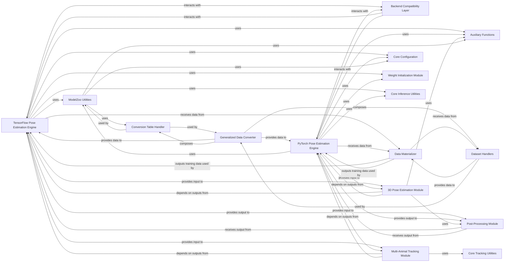

## Details

The `Pose Estimation & Analysis` subsystem in DeepLabCut is a sophisticated computational engine designed for deep learning-based pose estimation. It offers flexibility by supporting both TensorFlow and PyTorch backends through a compatibility layer, enabling users to leverage their preferred framework. Beyond core pose estimation, it integrates advanced post-inference analyses, including 3D pose estimation and multi-animal tracking, to provide comprehensive insights from video data.

### TensorFlow Pose Estimation Engine
This component is the core engine for deep learning-based pose estimation using the TensorFlow backend. It manages the entire workflow, from model configuration and training to evaluation and inference on video data.

**Related Classes/Methods**:

- <a href="https://github.com/DeepLabCut/DeepLabCut/deeplabcut/pose_estimation_tensorflow/config.py#L1-L1" target="_blank" rel="noopener noreferrer">`deeplabcut.pose_estimation_tensorflow.config` (1:1)</a>
- <a href="https://github.com/DeepLabCut/DeepLabCut/deeplabcut/pose_estimation_tensorflow/core/train.py#L146-L313" target="_blank" rel="noopener noreferrer">`deeplabcut.pose_estimation_tensorflow.core.train` (146:313)</a>
- <a href="https://github.com/DeepLabCut/DeepLabCut/deeplabcut/pose_estimation_tensorflow/core/evaluate.py#L1-L1" target="_blank" rel="noopener noreferrer">`deeplabcut.pose_estimation_tensorflow.core.evaluate` (1:1)</a>
- <a href="https://github.com/DeepLabCut/DeepLabCut/deeplabcut/pose_estimation_tensorflow/predict_videos.py#L1-L1" target="_blank" rel="noopener noreferrer">`deeplabcut.pose_estimation_tensorflow.predict_videos` (1:1)</a>
- `deeplabcut.pose_estimation_tensorflow.nnets` (1:1)
- `deeplabcut.pose_estimation_tensorflow.datasets` (1:1)

### PyTorch Pose Estimation Engine
This component serves as the primary computational engine for deep learning-based pose estimation when utilizing the PyTorch backend. It offers comprehensive APIs for model training, evaluation, and inference, along with robust mechanisms for data handling and defining model architectures.

**Related Classes/Methods**:

- <a href="https://github.com/DeepLabCut/DeepLabCut/deeplabcut/pose_estimation_pytorch/apis/training.py#L1-L1" target="_blank" rel="noopener noreferrer">`deeplabcut.pose_estimation_pytorch.apis.training` (1:1)</a>
- <a href="https://github.com/DeepLabCut/DeepLabCut/deeplabcut/pose_estimation_pytorch/apis/analyze_images.py#L217-L382" target="_blank" rel="noopener noreferrer">`deeplabcut.pose_estimation_pytorch.apis.analyze_images` (217:382)</a>
- <a href="https://github.com/DeepLabCut/DeepLabCut/deeplabcut/pose_estimation_pytorch/apis/evaluation.py#L1-L1" target="_blank" rel="noopener noreferrer">`deeplabcut.pose_estimation_pytorch.apis.evaluation` (1:1)</a>
- `deeplabcut.pose_estimation_pytorch.data` (1:1)
- `deeplabcut.pose_estimation_pytorch.models` (1:1)
- `deeplabcut.pose_estimation_pytorch.runners` (1:1)
- <a href="https://github.com/DeepLabCut/DeepLabCut/deeplabcut/pose_estimation_pytorch/task.py#L1-L1" target="_blank" rel="noopener noreferrer">`deeplabcut.pose_estimation_pytorch.task` (1:1)</a>

### Backend Compatibility Layer
This module acts as an essential abstraction layer, enabling seamless compatibility and interchangeability between the TensorFlow and PyTorch deep learning backends for various pose estimation tasks. It encapsulates common functionalities and configurations that are independent of the underlying framework.

**Related Classes/Methods**:

- <a href="https://github.com/DeepLabCut/DeepLabCut/deeplabcut/compat.py#L1-L1" target="_blank" rel="noopener noreferrer">`deeplabcut.compat` (1:1)</a>
- <a href="https://github.com/DeepLabCut/DeepLabCut/deeplabcut/core/engine.py#L1-L1" target="_blank" rel="noopener noreferrer">`deeplabcut.core.engine` (1:1)</a>
- <a href="https://github.com/DeepLabCut/DeepLabCut/deeplabcut/core/visualization.py#L1-L1" target="_blank" rel="noopener noreferrer">`deeplabcut.core.visualization` (1:1)</a>

### 3D Pose Estimation Module
This specialized component is dedicated to reconstructing 3D pose information from 2D pose estimations, typically derived from multiple synchronized camera views. Its functionalities include precise camera calibration, triangulation algorithms to infer 3D coordinates, and tools for 3D visualization.

**Related Classes/Methods**:

- <a href="https://github.com/DeepLabCut/DeepLabCut/deeplabcut/pose_estimation_3d/camera_calibration.py#L1-L1" target="_blank" rel="noopener noreferrer">`deeplabcut.pose_estimation_3d.camera_calibration` (1:1)</a>
- <a href="https://github.com/DeepLabCut/DeepLabCut/deeplabcut/pose_estimation_3d/triangulation.py#L1-L1" target="_blank" rel="noopener noreferrer">`deeplabcut.pose_estimation_3d.triangulation` (1:1)</a>
- <a href="https://github.com/DeepLabCut/DeepLabCut/deeplabcut/pose_estimation_3d/plotting3D.py#L1-L1" target="_blank" rel="noopener noreferrer">`deeplabcut.pose_estimation_3d.plotting3D` (1:1)</a>

### Multi-Animal Tracking Module
This module focuses on the complex task of tracking and identifying multiple individual animals within a video sequence, building upon the initial 2D pose estimations. It provides functionalities for creating specialized tracking datasets and for training and performing inference with re-identification models.

**Related Classes/Methods**:

- <a href="https://github.com/DeepLabCut/DeepLabCut/deeplabcut/pose_tracking_pytorch/apis.py#L1-L1" target="_blank" rel="noopener noreferrer">`deeplabcut.pose_tracking_pytorch.apis` (1:1)</a>
- <a href="https://github.com/DeepLabCut/DeepLabCut/deeplabcut/pose_tracking_pytorch/create_dataset.py#L1-L1" target="_blank" rel="noopener noreferrer">`deeplabcut.pose_tracking_pytorch.create_dataset` (1:1)</a>
- <a href="https://github.com/DeepLabCut/DeepLabCut/deeplabcut/pose_tracking_pytorch/train_dlctransreid.py#L1-L1" target="_blank" rel="noopener noreferrer">`deeplabcut.pose_tracking_pytorch.train_dlctransreid` (1:1)</a>
- <a href="https://github.com/DeepLabCut/DeepLabCut/deeplabcut/pose_tracking_pytorch/inference.py#L1-L1" target="_blank" rel="noopener noreferrer">`deeplabcut.pose_tracking_pytorch.inference` (1:1)</a>

### ModelZoo Utilities
Provides foundational utility functions for managing and interacting with the DeepLabCut model zoo. This includes handling paths for model configurations, retrieving project-specific configurations, and managing conversion tables for different body part definitions.

**Related Classes/Methods**:

- <a href="https://github.com/DeepLabCut/DeepLabCut/deeplabcut/modelzoo/utils.py#L31-L34" target="_blank" rel="noopener noreferrer">`deeplabcut.modelzoo.utils.dlc_modelzoo_path` (31:34)</a>
- <a href="https://github.com/DeepLabCut/DeepLabCut/deeplabcut/modelzoo/utils.py#L37-L58" target="_blank" rel="noopener noreferrer">`deeplabcut.modelzoo.utils.get_super_animal_project_cfg` (37:58)</a>
- <a href="https://github.com/DeepLabCut/DeepLabCut/deeplabcut/modelzoo/utils.py#L93-L134" target="_blank" rel="noopener noreferrer">`deeplabcut.modelzoo.utils.create_conversion_table` (93:134)</a>
- <a href="https://github.com/DeepLabCut/DeepLabCut/deeplabcut/modelzoo/utils.py#L137-L168" target="_blank" rel="noopener noreferrer">`deeplabcut.modelzoo.utils.get_conversion_table` (137:168)</a>
- <a href="https://github.com/DeepLabCut/DeepLabCut/deeplabcut/modelzoo/utils.py#L180-L231" target="_blank" rel="noopener noreferrer">`deeplabcut.modelzoo.utils.parse_project_model_name` (180:231)</a>

### Generalized Data Converter
A comprehensive module designed to standardize and convert various pose estimation dataset formats (e.g., DLC, COCO) into a generic internal representation. This allows for flexible data handling and preparation for model training and evaluation, regardless of the original data source.

**Related Classes/Methods**:

- `deeplabcut.modelzoo.generalized_data_converter` (1:1)
- <a href="https://github.com/DeepLabCut/DeepLabCut/deeplabcut/modelzoo/generalized_data_converter/utils.py#L1-L1" target="_blank" rel="noopener noreferrer">`deeplabcut.modelzoo.generalized_data_converter.utils` (1:1)</a>

### Dataset Handlers
A collection of classes (e.g., BasePoseDataset, COCOPoseDataset, SingleDLCPoseDataset, MaDLCPoseDataset, MultiSourceDataset) responsible for loading, parsing, and representing pose estimation data from various formats (DLC, COCO, multi-animal DLC) into a unified structure.

**Related Classes/Methods**:

- `deeplabcut.modelzoo.generalized_data_converter.datasets.BasePoseDataset` (1:1)
- `deeplabcut.modelzoo.generalized_data_converter.datasets.COCOPoseDataset` (1:1)
- `deeplabcut.modelzoo.generalized_data_converter.datasets.SingleDLCPoseDataset` (1:1)
- `deeplabcut.modelzoo.generalized_data_converter.datasets.MaDLCPoseDataset` (1:1)
- `deeplabcut.modelzoo.generalized_data_converter.datasets.MultiSourceDataset` (1:1)

### Data Materializer
Converts the generic dataset representation into DeepLabCut-specific training datasets (single-animal or multi-animal formats). It handles the creation of configuration files and the actual training data files.

**Related Classes/Methods**:

- <a href="https://github.com/DeepLabCut/DeepLabCut/deeplabcut/modelzoo/generalized_data_converter/datasets/materialize.py#L783-L796" target="_blank" rel="noopener noreferrer">`deeplabcut.modelzoo.generalized_data_converter.datasets.materialize.mat_func_factory` (783:796)</a>
- <a href="https://github.com/DeepLabCut/DeepLabCut/deeplabcut/modelzoo/generalized_data_converter/datasets/materialize.py#L174-L425" target="_blank" rel="noopener noreferrer">`deeplabcut.modelzoo.generalized_data_converter.datasets.materialize._generic2madlc` (174:425)</a>
- <a href="https://github.com/DeepLabCut/DeepLabCut/deeplabcut/modelzoo/generalized_data_converter/datasets/materialize.py#L428-L653" target="_blank" rel="noopener noreferrer">`deeplabcut.modelzoo.generalized_data_converter.datasets.materialize._generic2sdlc` (428:653)</a>
- <a href="https://github.com/DeepLabCut/DeepLabCut/deeplabcut/modelzoo/generalized_data_converter/datasets/materialize.py#L41-L64" target="_blank" rel="noopener noreferrer">`deeplabcut.modelzoo.generalized_data_converter.datasets.materialize.modify_train_test_cfg` (41:64)</a>

### Post-Processing Module
Provides functionalities for refining and filtering pose estimation outputs, including smoothing, outlier detection, and other post-inference data manipulations to improve accuracy and usability.

**Related Classes/Methods**:

- <a href="https://github.com/DeepLabCut/DeepLabCut/deeplabcut/post_processing/filtering.py#L1-L1" target="_blank" rel="noopener noreferrer">`deeplabcut.post_processing.filtering` (1:1)</a>
- <a href="https://github.com/DeepLabCut/DeepLabCut/deeplabcut/post_processing/analyze_skeleton.py#L1-L1" target="_blank" rel="noopener noreferrer">`deeplabcut.post_processing.analyze_skeleton` (1:1)</a>

### Core Configuration
A component for managing core project settings and model parameters.

**Related Classes/Methods**: _None_

### Auxiliary Functions
A component providing general utility functions.

**Related Classes/Methods**: _None_

### Weight Initialization Module
A component responsible for initializing model weights.

**Related Classes/Methods**: _None_

### Core Inference Utilities
A component providing common inference helper functions.

**Related Classes/Methods**: _None_

### Core Tracking Utilities
A component providing core tracking algorithms.

**Related Classes/Methods**: _None_

### Conversion Table Handler
A component for managing body part mappings and conversion tables.

**Related Classes/Methods**: _None_

### [FAQ](https://github.com/CodeBoarding/GeneratedOnBoardings/tree/main?tab=readme-ov-file#faq)