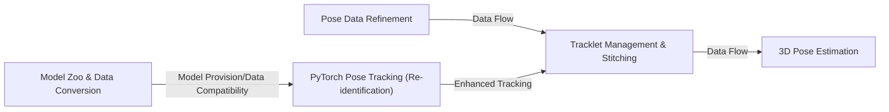

## Details

This subsystem of DeepLabCut focuses on enhancing the quality and utility of pose estimation results through various post-processing techniques and extending capabilities to three-dimensional analysis and advanced multi-animal tracking. It ensures that the raw pose data is refined, continuous, and suitable for complex behavioral studies.

### Pose Data Refinement
This component is responsible for enhancing the quality and continuity of raw 2D pose estimation results. It includes functionalities for filtering noisy predictions, identifying and handling outliers, and smoothing pose trajectories to improve data accuracy and reliability.

**Related Classes/Methods**:

- <a href="https://github.com/DeepLabCut/DeepLabCut/deeplabcut/post_processing/filtering.py#L0-L0" target="_blank" rel="noopener noreferrer">`deeplabcut.post_processing.filtering` (0:0)</a>
- <a href="https://github.com/DeepLabCut/DeepLabCut/deeplabcut/refine_training_dataset/outlier_frames.py#L0-L0" target="_blank" rel="noopener noreferrer">`deeplabcut.refine_training_dataset.outlier_frames` (0:0)</a>

### Tracklet Management & Stitching
This component focuses on managing and refining sequences of pose detections (tracklets) to create continuous and coherent animal trajectories, especially in multi-animal scenarios. It includes functionalities for stitching fragmented tracklets and interpolating missing data points, often supported by a graphical user interface for manual refinement.

**Related Classes/Methods**:

- <a href="https://github.com/DeepLabCut/DeepLabCut/deeplabcut/refine_training_dataset/stitch.py#L443-L1028" target="_blank" rel="noopener noreferrer">`deeplabcut.refine_training_dataset.stitch.TrackletStitcher` (443:1028)</a>
- <a href="https://github.com/DeepLabCut/DeepLabCut/deeplabcut/refine_training_dataset/tracklets.py#L19-L384" target="_blank" rel="noopener noreferrer">`deeplabcut.refine_training_dataset.tracklets.TrackletManager` (19:384)</a>
- <a href="https://github.com/DeepLabCut/DeepLabCut/deeplabcut/gui/tracklet_toolbox.py#L298-L988" target="_blank" rel="noopener noreferrer">`deeplabcut.gui.tracklet_toolbox.TrackletVisualizer` (298:988)</a>

### 3D Pose Estimation
This component extends DeepLabCut's capabilities to estimate poses in three dimensions from multiple 2D views. It encompasses functionalities for camera calibration (determining intrinsic and extrinsic camera parameters) and triangulation (reconstructing 3D points from corresponding 2D projections across calibrated cameras). It also includes utilities for 3D visualization.

**Related Classes/Methods**:

- <a href="https://github.com/DeepLabCut/DeepLabCut/deeplabcut/pose_estimation_3d/camera_calibration.py#L0-L0" target="_blank" rel="noopener noreferrer">`deeplabcut.pose_estimation_3d.camera_calibration` (0:0)</a>
- <a href="https://github.com/DeepLabCut/DeepLabCut/deeplabcut/pose_estimation_3d/triangulation.py#L0-L0" target="_blank" rel="noopener noreferrer">`deeplabcut.pose_estimation_3d.triangulation` (0:0)</a>
- <a href="https://github.com/DeepLabCut/DeepLabCut/deeplabcut/pose_estimation_3d/plotting3D.py#L0-L0" target="_blank" rel="noopener noreferrer">`deeplabcut.pose_estimation_3d.plotting3D` (0:0)</a>
- <a href="https://github.com/DeepLabCut/DeepLabCut/deeplabcut/utils/auxiliaryfunctions_3d.py#L0-L0" target="_blank" rel="noopener noreferrer">`deeplabcut.utils.auxiliaryfunctions_3d` (0:0)</a>

### Model Zoo & Data Conversion
This component serves as a repository and management system for pre-trained DeepLabCut models (Model Zoo). It provides essential utilities for converting data formats to ensure compatibility with various model architectures and training paradigms, thereby facilitating transfer learning and the application of pre-trained models for diverse tracking tasks, including multi-animal scenarios.

**Related Classes/Methods**:

- <a href="https://github.com/DeepLabCut/DeepLabCut/deeplabcut/modelzoo/generalized_data_converter/datasets/base.py#L48-L324" target="_blank" rel="noopener noreferrer">`deeplabcut.modelzoo.generalized_data_converter.datasets.base.BasePoseDataset` (48:324)</a>
- <a href="https://github.com/DeepLabCut/DeepLabCut/deeplabcut/modelzoo/generalized_data_converter/conversion_table/conversion_table.py#L31-L143" target="_blank" rel="noopener noreferrer">`deeplabcut.modelzoo.generalized_data_converter.conversion_table.conversion_table.ConversionTableFromCSV` (31:143)</a>
- <a href="https://github.com/DeepLabCut/DeepLabCut/deeplabcut/modelzoo/webapp/inference.py#L19-L58" target="_blank" rel="noopener noreferrer">`deeplabcut.modelzoo.webapp.inference.SingletonTopDownRunners` (19:58)</a>

### PyTorch Pose Tracking (Re-identification)
This specialized component implements advanced multi-animal tracking capabilities using PyTorch-based models, with a particular focus on re-identifying individual animals across frames. It includes functionalities for model training, inference, and dataset creation tailored for re-identification tasks, crucial for maintaining individual identities in complex multi-animal scenarios.

**Related Classes/Methods**:

- <a href="https://github.com/DeepLabCut/DeepLabCut/deeplabcut/pose_tracking_pytorch/model/backbones/vit_pytorch.py#L198-L343" target="_blank" rel="noopener noreferrer">`deeplabcut.pose_tracking_pytorch.model.backbones.vit_pytorch.DLCTransReID` (198:343)</a>
- <a href="https://github.com/DeepLabCut/DeepLabCut/deeplabcut/pose_tracking_pytorch/inference.py#L26-L86" target="_blank" rel="noopener noreferrer">`deeplabcut.pose_tracking_pytorch.inference.DLCTrans` (26:86)</a>
- <a href="https://github.com/DeepLabCut/DeepLabCut/deeplabcut/pose_tracking_pytorch/solver/cosine_lr.py#L26-L143" target="_blank" rel="noopener noreferrer">`deeplabcut.pose_tracking_pytorch.solver.cosine_lr.CosineLRScheduler` (26:143)</a>

### [FAQ](https://github.com/CodeBoarding/GeneratedOnBoardings/tree/main?tab=readme-ov-file#faq)