```mermaid
graph LR
    Project_Initialization_Configuration["Project Initialization & Configuration"]
    Frame_Extraction_Management["Frame Extraction & Management"]
    Data_Labeling_Annotation["Data Labeling & Annotation"]
    Training_Dataset_Generation["Training Dataset Generation"]
    Data_Loading_Preprocessing_PyTorch_["Data Loading & Preprocessing (PyTorch)"]
    Data_Loading_Preprocessing_TensorFlow_["Data Loading & Preprocessing (TensorFlow)"]
    Core_Engine_Configuration_Management["Core Engine & Configuration Management"]
    Project_Initialization_Configuration -- "creates and modifies configuration files for" --> Core_Engine_Configuration_Management
    Core_Engine_Configuration_Management -- "loads and validates configurations for" --> Project_Initialization_Configuration
    Project_Initialization_Configuration -- "provides video paths and project details to" --> Frame_Extraction_Management
    Frame_Extraction_Management -- "provides extracted frames to" --> Data_Labeling_Annotation
    Data_Labeling_Annotation -- "produces labeled data for" --> Training_Dataset_Generation
    Training_Dataset_Generation -- "outputs structured datasets for" --> Data_Loading_Preprocessing_PyTorch_
    Training_Dataset_Generation -- "outputs structured datasets for" --> Data_Loading_Preprocessing_TensorFlow_
    Core_Engine_Configuration_Management -- "orchestrates" --> Frame_Extraction_Management
    Core_Engine_Configuration_Management -- "orchestrates" --> Training_Dataset_Generation
    Core_Engine_Configuration_Management -- "orchestrates" --> Data_Loading_Preprocessing_PyTorch_
    Core_Engine_Configuration_Management -- "orchestrates" --> Data_Loading_Preprocessing_TensorFlow_
```

## Details

This component is central to the DeepLabCut ecosystem, orchestrating the entire project lifecycle from initial setup to the meticulous preparation of data for model training. It provides the foundational tools for users to manage their projects, integrate video data, and generate high-quality datasets for pose estimation.

### Project Initialization & Configuration
This component handles the creation of new DeepLabCut projects, including setting up the project directory structure, generating the configuration file, and allowing users to add new videos to an existing project. It also manages the loading and saving of project configurations.

**Related Classes/Methods**:

- <a href="https://github.com/DeepLabCut/DeepLabCut/deeplabcut/create_project/new.py#L0-L0" target="_blank" rel="noopener noreferrer">`deeplabcut.create_project.new` (0:0)</a>
- <a href="https://github.com/DeepLabCut/DeepLabCut/deeplabcut/create_project/add.py#L0-L0" target="_blank" rel="noopener noreferrer">`deeplabcut.create_project.add` (0:0)</a>
- <a href="https://github.com/DeepLabCut/DeepLabCut/deeplabcut/core/config.py#L0-L0" target="_blank" rel="noopener noreferrer">`deeplabcut.core.config` (0:0)</a>

### Frame Extraction & Management
Responsible for extracting frames from videos, which are then used for manual labeling. It provides functionalities to select frames based on various criteria and ensures efficient storage and retrieval of these frames for the annotation process.

**Related Classes/Methods**:

- <a href="https://github.com/DeepLabCut/DeepLabCut/deeplabcut/generate_training_dataset/frame_extraction.py#L0-L0" target="_blank" rel="noopener noreferrer">`deeplabcut.generate_training_dataset.frame_extraction` (0:0)</a>
- <a href="https://github.com/DeepLabCut/DeepLabCut/deeplabcut/utils/auxfun_videos.py#L0-L0" target="_blank" rel="noopener noreferrer">`deeplabcut.utils.auxfun_videos` (0:0)</a>

### Data Labeling & Annotation
This component provides the user interface and underlying logic for manual or semi-automatic labeling of keypoints on extracted frames. It manages the creation, modification, and storage of these annotations, which are crucial for supervised model training.

**Related Classes/Methods**:

- <a href="https://github.com/DeepLabCut/DeepLabCut/deeplabcut/gui/tabs/label_frames.py#L24-L96" target="_blank" rel="noopener noreferrer">`deeplabcut.gui.tabs.label_frames` (24:96)</a>

### Training Dataset Generation
This component takes the labeled data and organizes it into a structured format suitable for model training. It handles tasks such as splitting data into training and testing sets, managing metadata associated with the dataset, and potentially performing data augmentation.

**Related Classes/Methods**:

- <a href="https://github.com/DeepLabCut/DeepLabCut/deeplabcut/generate_training_dataset/trainingsetmanipulation.py#L0-L0" target="_blank" rel="noopener noreferrer">`deeplabcut.generate_training_dataset.trainingsetmanipulation` (0:0)</a>
- <a href="https://github.com/DeepLabCut/DeepLabCut/deeplabcut/generate_training_dataset/metadata.py#L0-L0" target="_blank" rel="noopener noreferrer">`deeplabcut.generate_training_dataset.metadata` (0:0)</a>

### Data Loading & Preprocessing (PyTorch)
This component focuses on loading and preprocessing data specifically for PyTorch-based pose estimation models. It includes classes for handling different dataset formats (e.g., COCO, DLC's internal format) and applying various preprocessing steps like resizing, normalization, and augmentation before feeding data to the neural network.

**Related Classes/Methods**:

- `deeplabcut.pose_estimation_pytorch.data.COCOLoader` (0:0)
- `deeplabcut.pose_estimation_pytorch.data.DLCLoader` (0:0)
- <a href="https://github.com/DeepLabCut/DeepLabCut/deeplabcut/pose_estimation_pytorch/data/preprocessor.py#L29-L53" target="_blank" rel="noopener noreferrer">`deeplabcut.pose_estimation_pytorch.data.Preprocessor` (29:53)</a>

### Data Loading & Preprocessing (TensorFlow)
Similar to its PyTorch counterpart, this component handles data loading and preprocessing for TensorFlow-based pose estimation models. It provides dataset classes that manage data input pipelines and apply transformations relevant to TensorFlow's requirements.

**Related Classes/Methods**:

- `deeplabcut.pose_estimation_tensorflow.datasets.BasePoseDataset` (0:0)
- `deeplabcut.pose_estimation_tensorflow.datasets.ImgaugPoseDataset` (0:0)

### Core Engine & Configuration Management
This component represents the central control unit for DeepLabCut projects. It manages the overall project state, interacts with the configuration files, and potentially orchestrates the flow between different stages of the DeepLabCut workflow. The `Engine` class appears to be a central orchestrator.

**Related Classes/Methods**:

- <a href="https://github.com/DeepLabCut/DeepLabCut/deeplabcut/core/engine.py#L25-L48" target="_blank" rel="noopener noreferrer">`deeplabcut.core.engine.Engine` (25:48)</a>
- <a href="https://github.com/DeepLabCut/DeepLabCut/deeplabcut/core/config.py#L0-L0" target="_blank" rel="noopener noreferrer">`deeplabcut.core.config` (0:0)</a>

### [FAQ](https://github.com/CodeBoarding/GeneratedOnBoardings/tree/main?tab=readme-ov-file#faq)