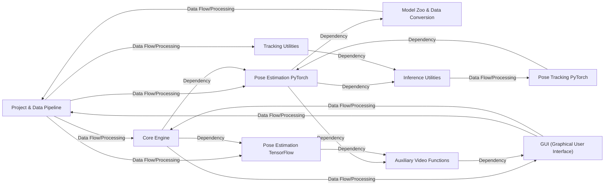

## Details

These components were chosen because they represent distinct, high-level functionalities within DeepLabCut, as evidenced by their dedicated directories, clear class hierarchies, and the descriptions of their related classes/methods. They are fundamental because:

1.  `Project & Data Pipeline`: This is the user-facing entry point for most DeepLabCut workflows. It encapsulates the entire data preparation and refinement process, which is crucial for any successful pose estimation project. Its direct links to `create_project`, `generate_training_dataset`, `post_processing`, and `refine_training_dataset` highlight its central role in data management.

2.  `Core Engine`: The `Engine` class is a central orchestrator, indicating its importance in managing the overall flow and data within the application. It acts as a bridge between various functionalities.

3.  `Pose Estimation PyTorch` & `Pose Estimation TensorFlow`: These two components represent the core computational power of DeepLabCut – the actual pose estimation models and their associated training/inference pipelines. The presence of separate directories for PyTorch and TensorFlow indicates their distinct implementations and the project's support for both frameworks. They are fundamental as they perform the primary task of the software.

4.  `GUI (Graphical User Interface)`: For a tool like DeepLabCut, a user-friendly interface is paramount for accessibility and ease of use. The `gui` package, with its `MainWindow` and various `tabs`, clearly defines the interactive layer of the application.

5.  `Tracking Utilities`: Multi-animal tracking is a significant feature of DeepLabCut. The `trackingutils` package, with its `BaseTracker` and various specialized trackers, is essential for maintaining animal identities across frames.

6.  `Model Zoo & Data Conversion`: The ability to leverage pre-trained models and handle diverse datasets is critical for the flexibility and usability of DeepLabCut. This component facilitates the integration of external models and data.

7.  `Auxiliary Video Functions`: Video processing is a foundational requirement for any video-based analysis tool. The `auxfun_videos` module provides the basic building blocks for interacting with video files.

8.  `Inference Utilities`: The `inferenceutils` package is crucial for post-processing the raw outputs of the pose estimation models, ensuring that the predictions are correctly assembled and matched.

9.  `Pose Tracking PyTorch`: This component signifies a more advanced and specialized aspect of tracking, particularly with the use of PyTorch and transformer models, indicating its importance for complex tracking scenarios.

These components collectively cover the essential aspects of DeepLabCut: project management, core computational models, user interaction, and specialized functionalities like tracking and model integration. Their interdependencies demonstrate a well-structured system where each component plays a vital role in the overall functionality.

### Project & Data Pipeline [[Expand]](./Project_Data_Pipeline.md)
This component orchestrates the entire data lifecycle within a DeepLabCut project, from initial setup to the refinement of pose estimation results. It ensures data quality and prepares data for subsequent processing stages.

**Related Classes/Methods**:

- <a href="https://github.com/DeepLabCut/DeepLabCut/deeplabcut/create_project/new.py#L1-L1" target="_blank" rel="noopener noreferrer">`deeplabcut.create_project.new` (1:1)</a>
- <a href="https://github.com/DeepLabCut/DeepLabCut/deeplabcut/generate_training_dataset/frame_extraction.py#L1-L1" target="_blank" rel="noopener noreferrer">`deeplabcut.generate_training_dataset.frame_extraction` (1:1)</a>
- <a href="https://github.com/DeepLabCut/DeepLabCut/deeplabcut/post_processing/filtering.py#L1-L1" target="_blank" rel="noopener noreferrer">`deeplabcut.post_processing.filtering` (1:1)</a>
- <a href="https://github.com/DeepLabCut/DeepLabCut/deeplabcut/refine_training_dataset/outlier_frames.py#L1-L1" target="_blank" rel="noopener noreferrer">`deeplabcut.refine_training_dataset.outlier_frames` (1:1)</a>
- <a href="https://github.com/DeepLabCut/DeepLabCut/deeplabcut/refine_training_dataset/stitch.py#L443-L1028" target="_blank" rel="noopener noreferrer">`deeplabcut.refine_training_dataset.stitch.TrackletStitcher` (443:1028)</a>

### Core Engine
The central processing unit of DeepLabCut, responsible for managing the overall workflow, data handling, and integrating various sub-components. It acts as the backbone for data flow and processing.

**Related Classes/Methods**:

- <a href="https://github.com/DeepLabCut/DeepLabCut/deeplabcut/core/engine.py#L25-L48" target="_blank" rel="noopener noreferrer">`deeplabcut.core.engine.Engine` (25:48)</a>
- <a href="https://github.com/DeepLabCut/DeepLabCut/deeplabcut/core/engine.py#L18-L22" target="_blank" rel="noopener noreferrer">`deeplabcut.core.engine.EngineDataMixin` (18:22)</a>

### Pose Estimation PyTorch
This component handles the core pose estimation functionalities using the PyTorch framework. It encompasses data loading, preprocessing, model definition (backbones, heads, predictors), loss functions, and the training and inference runners.

**Related Classes/Methods**:

- <a href="https://github.com/DeepLabCut/DeepLabCut/deeplabcut/pose_estimation_pytorch/runners/inference.py#L414-L474" target="_blank" rel="noopener noreferrer">`deeplabcut.pose_estimation_pytorch.runners.inference.PoseInferenceRunner` (414:474)</a>
- <a href="https://github.com/DeepLabCut/DeepLabCut/deeplabcut/pose_estimation_pytorch/runners/train.py#L42-L343" target="_blank" rel="noopener noreferrer">`deeplabcut.pose_estimation_pytorch.runners.train.TrainingRunner` (42:343)</a>
- <a href="https://github.com/DeepLabCut/DeepLabCut/deeplabcut/pose_estimation_pytorch/models/backbones/base.py#L26-L83" target="_blank" rel="noopener noreferrer">`deeplabcut.pose_estimation_pytorch.models.backbones.base.BaseBackbone` (26:83)</a>
- <a href="https://github.com/DeepLabCut/DeepLabCut/deeplabcut/pose_estimation_pytorch/models/heads/base.py#L32-L140" target="_blank" rel="noopener noreferrer">`deeplabcut.pose_estimation_pytorch.models.heads.base.BaseHead` (32:140)</a>
- <a href="https://github.com/DeepLabCut/DeepLabCut/deeplabcut/pose_estimation_pytorch/data/preprocessor.py#L29-L53" target="_blank" rel="noopener noreferrer">`deeplabcut.pose_estimation_pytorch.data.preprocessor.Preprocessor` (29:53)</a>
- <a href="https://github.com/DeepLabCut/DeepLabCut/deeplabcut/pose_estimation_pytorch/data/postprocessor.py#L23-L40" target="_blank" rel="noopener noreferrer">`deeplabcut.pose_estimation_pytorch.data.postprocessor.Postprocessor` (23:40)</a>

### Pose Estimation TensorFlow
This component provides pose estimation functionalities using the TensorFlow framework. It includes datasets and neural network architectures specific to TensorFlow.

**Related Classes/Methods**:

- <a href="https://github.com/DeepLabCut/DeepLabCut/deeplabcut/pose_estimation_tensorflow/nnets/base.py#L18-L245" target="_blank" rel="noopener noreferrer">`deeplabcut.pose_estimation_tensorflow.nnets.base.BasePoseNet` (18:245)</a>
- <a href="https://github.com/DeepLabCut/DeepLabCut/deeplabcut/pose_estimation_tensorflow/datasets/pose_base.py#L16-L36" target="_blank" rel="noopener noreferrer">`deeplabcut.pose_estimation_tensorflow.datasets.pose_base.BasePoseDataset` (16:36)</a>

### GUI (Graphical User Interface)
This component provides the graphical interface for interacting with DeepLabCut. It includes various tabs and widgets for project management, data labeling, training, analysis, and visualization.

**Related Classes/Methods**:

- <a href="https://github.com/DeepLabCut/DeepLabCut/deeplabcut/gui/window.py#L83-L740" target="_blank" rel="noopener noreferrer">`deeplabcut.gui.window.MainWindow` (83:740)</a>
- <a href="https://github.com/DeepLabCut/DeepLabCut/deeplabcut/gui/components.py#L291-L327" target="_blank" rel="noopener noreferrer">`deeplabcut.gui.components.DefaultTab` (291:327)</a>
- <a href="https://github.com/DeepLabCut/DeepLabCut/deeplabcut/gui/tabs/create_project.py#L184-L538" target="_blank" rel="noopener noreferrer">`deeplabcut.gui.tabs.create_project.ProjectCreator` (184:538)</a>
- <a href="https://github.com/DeepLabCut/DeepLabCut/deeplabcut/gui/tabs/label_frames.py#L102-L146" target="_blank" rel="noopener noreferrer">`deeplabcut.gui.tabs.label_frames.LabelFrames` (102:146)</a>

### Tracking Utilities
This component provides various utility functions and classes specifically designed for object tracking within videos, including different tracking algorithms and data structures for managing tracked objects.

**Related Classes/Methods**:

- <a href="https://github.com/DeepLabCut/DeepLabCut/deeplabcut/core/trackingutils.py#L52-L91" target="_blank" rel="noopener noreferrer">`deeplabcut.core.trackingutils.BaseTracker` (52:91)</a>
- <a href="https://github.com/DeepLabCut/DeepLabCut/deeplabcut/core/trackingutils.py#L323-L401" target="_blank" rel="noopener noreferrer">`deeplabcut.core.trackingutils.BoxTracker` (323:401)</a>
- <a href="https://github.com/DeepLabCut/DeepLabCut/deeplabcut/core/trackingutils.py#L404-L411" target="_blank" rel="noopener noreferrer">`deeplabcut.core.trackingutils.SORTBase` (404:411)</a>

### Model Zoo & Data Conversion
This component manages the integration of pre-trained models from the DeepLabCut model zoo and handles the conversion of various pose estimation datasets into a generalized format for use within DeepLabCut.

**Related Classes/Methods**:

- <a href="https://github.com/DeepLabCut/DeepLabCut/deeplabcut/modelzoo/generalized_data_converter/datasets/base.py#L48-L324" target="_blank" rel="noopener noreferrer">`deeplabcut.modelzoo.generalized_data_converter.datasets.base.BasePoseDataset` (48:324)</a>
- <a href="https://github.com/DeepLabCut/DeepLabCut/deeplabcut/gui/tabs/modelzoo.py#L41-L401" target="_blank" rel="noopener noreferrer">`deeplabcut.gui.tabs.modelzoo.ModelZoo` (41:401)</a>

### Auxiliary Video Functions
This component provides a collection of utility functions for video processing, including reading and writing video files, which are essential for various stages of the DeepLabCut pipeline.

**Related Classes/Methods**:

- <a href="https://github.com/DeepLabCut/DeepLabCut/deeplabcut/utils/auxfun_videos.py#L36-L214" target="_blank" rel="noopener noreferrer">`deeplabcut.utils.auxfun_videos.VideoReader` (36:214)</a>
- <a href="https://github.com/DeepLabCut/DeepLabCut/deeplabcut/utils/auxfun_videos.py#L217-L372" target="_blank" rel="noopener noreferrer">`deeplabcut.utils.auxfun_videos.VideoWriter` (217:372)</a>

### Inference Utilities
This component provides utilities specifically for the inference stage of pose estimation, including assembling predictions and managing matched predictions.

**Related Classes/Methods**:

- <a href="https://github.com/DeepLabCut/DeepLabCut/deeplabcut/core/inferenceutils.py#L230-L920" target="_blank" rel="noopener noreferrer">`deeplabcut.core.inferenceutils.Assembler` (230:920)</a>
- <a href="https://github.com/DeepLabCut/DeepLabCut/deeplabcut/core/inferenceutils.py#L87-L227" target="_blank" rel="noopener noreferrer">`deeplabcut.core.inferenceutils.Assembly` (87:227)</a>

### Pose Tracking PyTorch
This component focuses on advanced pose tracking functionalities using PyTorch, including specific models and solvers for tracking.

**Related Classes/Methods**:

- <a href="https://github.com/DeepLabCut/DeepLabCut/deeplabcut/pose_tracking_pytorch/model/make_model.py#L16-L52" target="_blank" rel="noopener noreferrer">`deeplabcut.pose_tracking_pytorch.model.make_model.build_dlc_transformer` (16:52)</a>
- <a href="https://github.com/DeepLabCut/DeepLabCut/deeplabcut/pose_tracking_pytorch/solver/scheduler.py#L15-L129" target="_blank" rel="noopener noreferrer">`deeplabcut.pose_tracking_pytorch.solver.scheduler.Scheduler` (15:129)</a>

### [FAQ](https://github.com/CodeBoarding/GeneratedOnBoardings/tree/main?tab=readme-ov-file#faq)