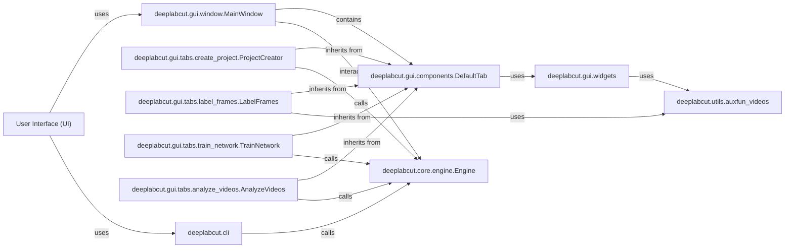

## Details

The User Interface (UI) component in DeepLabCut is designed to provide a seamless interaction layer for users, encompassing both a graphical user interface (GUI) and a command-line interface (CLI).

### User Interface (UI) [[Expand]](./User_Interface_UI_.md)
The primary interaction layer for users, offering both command-line tools (`deeplabcut.cli`) and a comprehensive graphical interface (`deeplabcut.gui`). It translates user commands and actions into calls to the underlying DeepLabCut functionalities, providing a unified entry point for all workflows.

**Related Classes/Methods**:

- `deeplabcut.gui` (1:1)
- <a href="https://github.com/DeepLabCut/DeepLabCut/deeplabcut/cli.py#L1-L1" target="_blank" rel="noopener noreferrer">`deeplabcut.cli` (1:1)</a>

### deeplabcut.gui.window.MainWindow
The central window of the DeepLabCut graphical user interface, responsible for initializing and managing all GUI tabs and overall application flow.

**Related Classes/Methods**:

- <a href="https://github.com/DeepLabCut/DeepLabCut/deeplabcut/gui/window.py#L83-L740" target="_blank" rel="noopener noreferrer">`deeplabcut.gui.window.MainWindow` (83:740)</a>

### deeplabcut.gui.components.DefaultTab
An abstract base class that provides common structure and functionality for all specific workflow tabs within the DeepLabCut GUI.

**Related Classes/Methods**:

- <a href="https://github.com/DeepLabCut/DeepLabCut/deeplabcut/gui/components.py#L291-L327" target="_blank" rel="noopener noreferrer">`deeplabcut.gui.components.DefaultTab` (291:327)</a>

### deeplabcut.gui.tabs.create_project.ProjectCreator
A GUI tab dedicated to guiding users through the process of creating new DeepLabCut projects, including setting up project configurations and initial directories.

**Related Classes/Methods**:

- <a href="https://github.com/DeepLabCut/DeepLabCut/deeplabcut/gui/tabs/create_project.py#L184-L538" target="_blank" rel="noopener noreferrer">`deeplabcut.gui.tabs.create_project.ProjectCreator` (184:538)</a>

### deeplabcut.gui.tabs.label_frames.LabelFrames
A GUI tab that provides tools for manually labeling keypoints on extracted video frames, a crucial step in creating training datasets.

**Related Classes/Methods**:

- <a href="https://github.com/DeepLabCut/DeepLabCut/deeplabcut/gui/tabs/label_frames.py#L102-L146" target="_blank" rel="noopener noreferrer">`deeplabcut.gui.tabs.label_frames.LabelFrames` (102:146)</a>

### deeplabcut.gui.tabs.train_network.TrainNetwork
A GUI tab for configuring and initiating the training of DeepLabCut's neural network models, allowing users to monitor training progress.

**Related Classes/Methods**:

- <a href="https://github.com/DeepLabCut/DeepLabCut/deeplabcut/gui/tabs/train_network.py#L49-L273" target="_blank" rel="noopener noreferrer">`deeplabcut.gui.tabs.train_network.TrainNetwork` (49:273)</a>

### deeplabcut.gui.tabs.analyze_videos.AnalyzeVideos
A GUI tab for applying trained DeepLabCut models to new videos to perform pose estimation and generate analysis results.

**Related Classes/Methods**:

- <a href="https://github.com/DeepLabCut/DeepLabCut/deeplabcut/gui/tabs/analyze_videos.py#L32-L372" target="_blank" rel="noopener noreferrer">`deeplabcut.gui.tabs.analyze_videos.AnalyzeVideos` (32:372)</a>

### deeplabcut.gui.widgets
A module containing various custom and reusable PyQt widgets and UI components used throughout the DeepLabCut GUI to enhance user interaction.

**Related Classes/Methods**:

- <a href="https://github.com/DeepLabCut/DeepLabCut/deeplabcut/gui/widgets.py#L1-L1" target="_blank" rel="noopener noreferrer">`deeplabcut.gui.widgets` (1:1)</a>

### deeplabcut.cli
The command-line interface for DeepLabCut, providing a scriptable and non-graphical way to access and execute core DeepLabCut functionalities.

**Related Classes/Methods**:

- <a href="https://github.com/DeepLabCut/DeepLabCut/deeplabcut/cli.py#L1-L1" target="_blank" rel="noopener noreferrer">`deeplabcut.cli` (1:1)</a>

### deeplabcut.core.engine.Engine
The central processing unit of DeepLabCut, responsible for managing project configurations, orchestrating workflows, and delegating tasks to specific DeepLabCut modules (e.g., for project creation, training, analysis).

**Related Classes/Methods**:

- <a href="https://github.com/DeepLabCut/DeepLabCut/deeplabcut/core/engine.py#L25-L48" target="_blank" rel="noopener noreferrer">`deeplabcut.core.engine.Engine` (25:48)</a>

### deeplabcut.utils.auxfun_videos
A collection of utility functions specifically designed for handling video-related operations, such as reading, writing, and processing video files.

**Related Classes/Methods**:

- <a href="https://github.com/DeepLabCut/DeepLabCut/deeplabcut/utils/auxfun_videos.py#L1-L1" target="_blank" rel="noopener noreferrer">`deeplabcut.utils.auxfun_videos` (1:1)</a>

### [FAQ](https://github.com/CodeBoarding/GeneratedOnBoardings/tree/main?tab=readme-ov-file#faq)