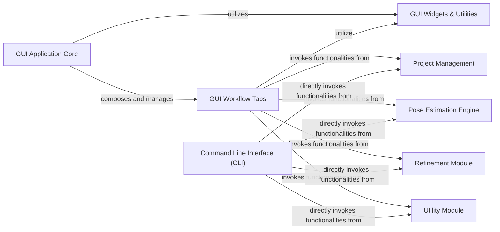

## Details

Abstract Components Overview

### GUI Application Core
This component forms the foundational structure of the DeepLabCut graphical user interface. It is responsible for launching the GUI, managing the main application window, and orchestrating the display and interaction of various functional tabs. It acts as the central coordinator for all GUI-based operations. Its deep integration with the core `Engine` highlights its role as the primary orchestrator for GUI-driven workflows.

**Related Classes/Methods**:

- <a href="https://github.com/DeepLabCut/DeepLabCut/deeplabcut/gui/launch_script.py#L0-L0" target="_blank" rel="noopener noreferrer">`deeplabcut.gui.launch_script` (0:0)</a>
- <a href="https://github.com/DeepLabCut/DeepLabCut/deeplabcut/gui/window.py#L83-L740" target="_blank" rel="noopener noreferrer">`deeplabcut.gui.window.MainWindow` (83:740)</a>
- <a href="https://github.com/DeepLabCut/DeepLabCut/deeplabcut/core/engine.py#L25-L48" target="_blank" rel="noopener noreferrer">`deeplabcut.core.engine.Engine` (25:48)</a>

### GUI Workflow Tabs
This component comprises a collection of specialized panels within the GUI, each dedicated to a distinct step or task in the DeepLabCut workflow. These tabs provide a structured and interactive way for users to perform operations like creating projects, labeling frames, training networks, and analyzing videos. They encapsulate the specific logic and UI elements for each workflow stage.

**Related Classes/Methods**:

- <a href="https://github.com/DeepLabCut/DeepLabCut/deeplabcut/gui/tabs/analyze_videos.py#L32-L372" target="_blank" rel="noopener noreferrer">`deeplabcut.gui.tabs.analyze_videos.AnalyzeVideos` (32:372)</a>
- <a href="https://github.com/DeepLabCut/DeepLabCut/deeplabcut/gui/tabs/train_network.py#L49-L273" target="_blank" rel="noopener noreferrer">`deeplabcut.gui.tabs.train_network.TrainNetwork` (49:273)</a>
- <a href="https://github.com/DeepLabCut/DeepLabCut/deeplabcut/gui/tabs/create_project.py#L0-L0" target="_blank" rel="noopener noreferrer">`deeplabcut.gui.tabs.create_project.CreateProject` (0:0)</a>
- <a href="https://github.com/DeepLabCut/DeepLabCut/deeplabcut/gui/tabs/label_frames.py#L102-L146" target="_blank" rel="noopener noreferrer">`deeplabcut.gui.tabs.label_frames.LabelFrames` (102:146)</a>
- <a href="https://github.com/DeepLabCut/DeepLabCut/deeplabcut/gui/tabs/extract_frames.py#L83-L315" target="_blank" rel="noopener noreferrer">`deeplabcut.gui.tabs.extract_frames.ExtractFrames` (83:315)</a>
- <a href="https://github.com/DeepLabCut/DeepLabCut/deeplabcut/gui/tabs/evaluate_network.py#L55-L242" target="_blank" rel="noopener noreferrer">`deeplabcut.gui.tabs.evaluate_network.EvaluateNetwork` (55:242)</a>
- <a href="https://github.com/DeepLabCut/DeepLabCut/deeplabcut/gui/tabs/extract_outlier_frames.py#L26-L176" target="_blank" rel="noopener noreferrer">`deeplabcut.gui.tabs.extract_outlier_frames.ExtractOutlierFrames` (26:176)</a>
- <a href="https://github.com/DeepLabCut/DeepLabCut/deeplabcut/gui/tabs/manage_project.py#L24-L75" target="_blank" rel="noopener noreferrer">`deeplabcut.gui.tabs.manage_project.ManageProject` (24:75)</a>
- <a href="https://github.com/DeepLabCut/DeepLabCut/deeplabcut/gui/tabs/modelzoo.py#L41-L401" target="_blank" rel="noopener noreferrer">`deeplabcut.gui.tabs.modelzoo.ModelZoo` (41:401)</a>
- <a href="https://github.com/DeepLabCut/DeepLabCut/deeplabcut/gui/tabs/refine_tracklets.py#L30-L262" target="_blank" rel="noopener noreferrer">`deeplabcut.gui.tabs.refine_tracklets.RefineTracklets` (30:262)</a>
- <a href="https://github.com/DeepLabCut/DeepLabCut/deeplabcut/gui/tabs/unsupervised_id_tracking.py#L26-L136" target="_blank" rel="noopener noreferrer">`deeplabcut.gui.tabs.unsupervised_id_tracking.UnsupervizedIdTracking` (26:136)</a>
- <a href="https://github.com/DeepLabCut/DeepLabCut/deeplabcut/gui/tabs/video_editor.py#L25-L179" target="_blank" rel="noopener noreferrer">`deeplabcut.gui.tabs.video_editor.VideoEditor` (25:179)</a>
- <a href="https://github.com/DeepLabCut/DeepLabCut/deeplabcut/gui/components.py#L291-L327" target="_blank" rel="noopener noreferrer">`deeplabcut.gui.components.DefaultTab` (291:327)</a>

### GUI Widgets & Utilities
This component provides a library of reusable graphical user interface elements (widgets) and helper utilities specifically designed for the DeepLabCut GUI. These widgets include custom input fields, display components, and interactive tools that are integrated across various GUI tabs and windows to create a consistent and functional user experience. The utilities provide common functionalities required by the GUI, such as background task execution to maintain responsiveness.

**Related Classes/Methods**:

- <a href="https://github.com/DeepLabCut/DeepLabCut/deeplabcut/gui/widgets.py#L450-L490" target="_blank" rel="noopener noreferrer">`deeplabcut.gui.widgets.ConfigEditor` (450:490)</a>
- <a href="https://github.com/DeepLabCut/DeepLabCut/deeplabcut/gui/widgets.py#L493-L545" target="_blank" rel="noopener noreferrer">`deeplabcut.gui.widgets.FrameCropper` (493:545)</a>
- <a href="https://github.com/DeepLabCut/DeepLabCut/deeplabcut/gui/widgets.py#L0-L0" target="_blank" rel="noopener noreferrer">`deeplabcut.gui.widgets.BodypartListWidget` (0:0)</a>
- <a href="https://github.com/DeepLabCut/DeepLabCut/deeplabcut/gui/widgets.py#L0-L0" target="_blank" rel="noopener noreferrer">`deeplabcut.gui.widgets.ShuffleSpinBox` (0:0)</a>
- <a href="https://github.com/DeepLabCut/DeepLabCut/deeplabcut/gui/widgets.py#L0-L0" target="_blank" rel="noopener noreferrer">`deeplabcut.gui.widgets.VideoSelectionWidget` (0:0)</a>
- <a href="https://github.com/DeepLabCut/DeepLabCut/deeplabcut/gui/utils.py#L16-L25" target="_blank" rel="noopener noreferrer">`deeplabcut.gui.utils.Worker` (16:25)</a>
- <a href="https://github.com/DeepLabCut/DeepLabCut/deeplabcut/gui/utils.py#L28-L37" target="_blank" rel="noopener noreferrer">`deeplabcut.gui.utils.CaptureWorker` (28:37)</a>
- <a href="https://github.com/DeepLabCut/DeepLabCut/deeplabcut/gui/components.py#L0-L0" target="_blank" rel="noopener noreferrer">`deeplabcut.gui.components` (0:0)</a>

### Command Line Interface (CLI)
This component offers a text-based interface for interacting with DeepLabCut, allowing users to execute core functionalities and automate workflows through scripts. It provides an alternative to the GUI for users who prefer command-line operations or need to integrate DeepLabCut into larger automated pipelines.

**Related Classes/Methods**:

- <a href="https://github.com/DeepLabCut/DeepLabCut/deeplabcut/cli.py#L0-L0" target="_blank" rel="noopener noreferrer">`deeplabcut.cli` (0:0)</a>

### Project Management
This component handles the creation, loading, saving, and overall management of DeepLabCut projects, including configuration files and data organization. It provides the foundational structure for organizing all project-related assets and settings.

**Related Classes/Methods**:

- `deeplabcut.create_project` (0:0)
- <a href="https://github.com/DeepLabCut/DeepLabCut/deeplabcut/core/config.py#L0-L0" target="_blank" rel="noopener noreferrer">`deeplabcut.core.config` (0:0)</a>

### Pose Estimation Engine
This component encapsulates the core machine learning models and algorithms responsible for pose estimation. It includes functionalities for network training, inference on new data, and evaluation of model performance. It supports both TensorFlow and PyTorch backends, providing the computational backbone for DeepLabCut's primary function.

**Related Classes/Methods**:

- `deeplabcut.pose_estimation_pytorch` (0:0)
- `deeplabcut.pose_estimation_tensorflow` (0:0)
- <a href="https://github.com/DeepLabCut/DeepLabCut/deeplabcut/core/engine.py#L0-L0" target="_blank" rel="noopener noreferrer">`deeplabcut.core.engine` (0:0)</a>

### Refinement Module
This component provides functionalities for refining and improving the quality of tracking data. This includes processes such as outlier frame detection and correction, as well as the refinement of tracklets to ensure more accurate and robust pose estimations.

**Related Classes/Methods**:

- `deeplabcut.refine_training_dataset` (0:0)

### Utility Module
This component contains a collection of general-purpose helper functions and utilities used across various parts of the DeepLabCut project. These utilities support common operations such as plotting, video processing, and multiprocessing, providing essential support functionalities for both GUI and CLI workflows.

**Related Classes/Methods**:

- `deeplabcut.utils` (0:0)

### [FAQ](https://github.com/CodeBoarding/GeneratedOnBoardings/tree/main?tab=readme-ov-file#faq)