```mermaid
graph LR
    User_Interface_Workflow_Orchestration["User Interface & Workflow Orchestration"]
    Project_Data_Management["Project & Data Management"]
    Core_Pose_Estimation_Pipeline["Core Pose Estimation Pipeline"]
    Post_processing_Specialized_Pose_Applications["Post-processing & Specialized Pose Applications"]
    Core_Utilities_Foundation["Core Utilities & Foundation"]
    User_Interface_Workflow_Orchestration -- "Uses" --> Project_Data_Management
    User_Interface_Workflow_Orchestration -- "Uses" --> Core_Pose_Estimation_Pipeline
    Project_Data_Management -- "Provides prepared data to" --> Core_Pose_Estimation_Pipeline
    Project_Data_Management -- "Uses" --> Core_Utilities_Foundation
    Core_Pose_Estimation_Pipeline -- "Receives training and inference data from" --> Project_Data_Management
    Core_Pose_Estimation_Pipeline -- "Outputs raw pose predictions to" --> Post_processing_Specialized_Pose_Applications
    Core_Pose_Estimation_Pipeline -- "Uses" --> Core_Utilities_Foundation
    Post_processing_Specialized_Pose_Applications -- "Receives 2D pose data from" --> Core_Pose_Estimation_Pipeline
    Post_processing_Specialized_Pose_Applications -- "Uses" --> Core_Utilities_Foundation
    Core_Utilities_Foundation -- "Supports" --> Project_Data_Management
    Core_Utilities_Foundation -- "Supports" --> Core_Pose_Estimation_Pipeline
    Core_Utilities_Foundation -- "Supports" --> Post_processing_Specialized_Pose_Applications
    click User_Interface_Workflow_Orchestration href "https://github.com/CodeBoarding/GeneratedOnBoardings/blob/main/DeepLabCut/User_Interface_Workflow_Orchestration.md" "Details"
    click Project_Data_Management href "https://github.com/CodeBoarding/GeneratedOnBoardings/blob/main/DeepLabCut/Project_Data_Management.md" "Details"
    click Core_Pose_Estimation_Pipeline href "https://github.com/CodeBoarding/GeneratedOnBoardings/blob/main/DeepLabCut/Core_Pose_Estimation_Pipeline.md" "Details"
    click Post_processing_Specialized_Pose_Applications href "https://github.com/CodeBoarding/GeneratedOnBoardings/blob/main/DeepLabCut/Post_processing_Specialized_Pose_Applications.md" "Details"
    click Core_Utilities_Foundation href "https://github.com/CodeBoarding/GeneratedOnBoardings/blob/main/DeepLabCut/Core_Utilities_Foundation.md" "Details"
```

## Details

This analysis consolidates the Control Flow Graph (CFG) and Source Analysis into a high-level overview of DeepLabCut's architecture, identifying five central components, their responsibilities, key source files, and inter-component relationships.

### User Interface & Workflow Orchestration [[Expand]](./User_Interface_Workflow_Orchestration.md)
Serves as the primary user interaction layer, providing both command-line and a comprehensive graphical interface for orchestrating DeepLabCut workflows. It acts as the control center, initiating operations across various backend components.

**Related Classes/Methods**:

- <a href="https://github.com/DeepLabCut/DeepLabCut/deeplabcut/cli.py#L0-L0" target="_blank" rel="noopener noreferrer">`deeplabcut.cli` (0:0)</a>
- <a href="https://github.com/DeepLabCut/DeepLabCut/deeplabcut/gui/launch_script.py#L0-L0" target="_blank" rel="noopener noreferrer">`deeplabcut.gui.launch_script` (0:0)</a>
- <a href="https://github.com/DeepLabCut/DeepLabCut/deeplabcut/gui/window.py#L0-L0" target="_blank" rel="noopener noreferrer">`deeplabcut.gui.window` (0:0)</a>
- `deeplabcut.gui.tabs` (0:0)
- <a href="https://github.com/DeepLabCut/DeepLabCut/deeplabcut/gui/components.py#L0-L0" target="_blank" rel="noopener noreferrer">`deeplabcut.gui.components` (0:0)</a>
- <a href="https://github.com/DeepLabCut/DeepLabCut/deeplabcut/gui/widgets.py#L0-L0" target="_blank" rel="noopener noreferrer">`deeplabcut.gui.widgets` (0:0)</a>
- <a href="https://github.com/DeepLabCut/DeepLabCut/deeplabcut/gui/utils.py#L16-L25" target="_blank" rel="noopener noreferrer">`deeplabcut.gui.utils.Worker` (16:25)</a>

### Project & Data Management [[Expand]](./Project_Data_Management.md)
Manages the entire lifecycle of a DeepLabCut project, including creation, adding videos, and handling project-specific configuration files. It also facilitates the preparation of data for model training, encompassing frame extraction from videos, manual or semi-automatic labeling of keypoints, and organizing these annotations into structured training datasets.

**Related Classes/Methods**:

- <a href="https://github.com/DeepLabCut/DeepLabCut/deeplabcut/create_project/new.py#L0-L0" target="_blank" rel="noopener noreferrer">`deeplabcut.create_project.new` (0:0)</a>
- <a href="https://github.com/DeepLabCut/DeepLabCut/deeplabcut/create_project/add.py#L0-L0" target="_blank" rel="noopener noreferrer">`deeplabcut.create_project.add` (0:0)</a>
- <a href="https://github.com/DeepLabCut/DeepLabCut/deeplabcut/create_project/modelzoo.py#L0-L0" target="_blank" rel="noopener noreferrer">`deeplabcut.create_project.modelzoo` (0:0)</a>
- <a href="https://github.com/DeepLabCut/DeepLabCut/deeplabcut/utils/auxiliaryfunctions.py#L0-L0" target="_blank" rel="noopener noreferrer">`deeplabcut.utils.auxiliaryfunctions` (0:0)</a>
- <a href="https://github.com/DeepLabCut/DeepLabCut/deeplabcut/core/config.py#L0-L0" target="_blank" rel="noopener noreferrer">`deeplabcut.core.config` (0:0)</a>
- <a href="https://github.com/DeepLabCut/DeepLabCut/deeplabcut/core/engine.py#L25-L48" target="_blank" rel="noopener noreferrer">`deeplabcut.core.engine.Engine` (25:48)</a>
- <a href="https://github.com/DeepLabCut/DeepLabCut/deeplabcut/generate_training_dataset/frame_extraction.py#L0-L0" target="_blank" rel="noopener noreferrer">`deeplabcut.generate_training_dataset.frame_extraction` (0:0)</a>
- <a href="https://github.com/DeepLabCut/DeepLabCut/deeplabcut/generate_training_dataset/trainingsetmanipulation.py#L0-L0" target="_blank" rel="noopener noreferrer">`deeplabcut.generate_training_dataset.trainingsetmanipulation` (0:0)</a>
- <a href="https://github.com/DeepLabCut/DeepLabCut/deeplabcut/generate_training_dataset/metadata.py#L0-L0" target="_blank" rel="noopener noreferrer">`deeplabcut.generate_training_dataset.metadata` (0:0)</a>
- <a href="https://github.com/DeepLabCut/DeepLabCut/deeplabcut/gui/tabs/label_frames.py#L24-L96" target="_blank" rel="noopener noreferrer">`deeplabcut.gui.tabs.label_frames` (24:96)</a>
- `deeplabcut.pose_estimation_pytorch.data.COCOLoader` (0:0)
- `deeplabcut.pose_estimation_pytorch.data.DLCLoader` (0:0)
- <a href="https://github.com/DeepLabCut/DeepLabCut/deeplabcut/pose_estimation_pytorch/data/preprocessor.py#L29-L53" target="_blank" rel="noopener noreferrer">`deeplabcut.pose_estimation_pytorch.data.Preprocessor` (29:53)</a>
- <a href="https://github.com/DeepLabCut/DeepLabCut/deeplabcut/pose_estimation_pytorch/data/postprocessor.py#L23-L40" target="_blank" rel="noopener noreferrer">`deeplabcut.pose_estimation_pytorch.data.Postprocessor` (23:40)</a>
- `deeplabcut.pose_estimation_tensorflow.datasets.BasePoseDataset` (0:0)
- `deeplabcut.pose_estimation_tensorflow.datasets.ImgaugPoseDataset` (0:0)

### Core Pose Estimation Pipeline [[Expand]](./Core_Pose_Estimation_Pipeline.md)
Implements the fundamental deep learning pipeline for 2D pose estimation. This includes training models, performing inference to predict keypoint locations on new data, and quantitatively assessing model performance against ground truth. It supports both TensorFlow and PyTorch backends.

**Related Classes/Methods**:

- <a href="https://github.com/DeepLabCut/DeepLabCut/deeplabcut/pose_estimation_tensorflow/training.py#L0-L0" target="_blank" rel="noopener noreferrer">`deeplabcut.pose_estimation_tensorflow.training` (0:0)</a>
- <a href="https://github.com/DeepLabCut/DeepLabCut/deeplabcut/pose_estimation_tensorflow/core/train.py#L146-L313" target="_blank" rel="noopener noreferrer">`deeplabcut.pose_estimation_tensorflow.core.train` (146:313)</a>
- <a href="https://github.com/DeepLabCut/DeepLabCut/deeplabcut/pose_estimation_pytorch/apis/training.py#L0-L0" target="_blank" rel="noopener noreferrer">`deeplabcut.pose_estimation_pytorch.apis.training` (0:0)</a>
- <a href="https://github.com/DeepLabCut/DeepLabCut/deeplabcut/pose_estimation_pytorch/runners/train.py#L0-L0" target="_blank" rel="noopener noreferrer">`deeplabcut.pose_estimation_pytorch.runners.train` (0:0)</a>
- <a href="https://github.com/DeepLabCut/DeepLabCut/deeplabcut/compat.py#L0-L0" target="_blank" rel="noopener noreferrer">`deeplabcut.compat` (0:0)</a>
- `deeplabcut.pose_estimation_pytorch.models` (0:0)
- <a href="https://github.com/DeepLabCut/DeepLabCut/deeplabcut/pose_estimation_pytorch/runners/logger.py#L0-L0" target="_blank" rel="noopener noreferrer">`deeplabcut.pose_estimation_pytorch.runners.logger` (0:0)</a>
- <a href="https://github.com/DeepLabCut/DeepLabCut/deeplabcut/pose_estimation_pytorch/runners/snapshots.py#L24-L185" target="_blank" rel="noopener noreferrer">`deeplabcut.pose_estimation_pytorch.runners.snapshots.TorchSnapshotManager` (24:185)</a>
- `deeplabcut.pose_estimation_tensorflow.nnets` (0:0)
- <a href="https://github.com/DeepLabCut/DeepLabCut/deeplabcut/pose_estimation_tensorflow/predict_videos.py#L0-L0" target="_blank" rel="noopener noreferrer">`deeplabcut.pose_estimation_tensorflow.predict_videos` (0:0)</a>
- <a href="https://github.com/DeepLabCut/DeepLabCut/deeplabcut/pose_estimation_pytorch/apis/videos.py#L0-L0" target="_blank" rel="noopener noreferrer">`deeplabcut.pose_estimation_pytorch.apis.videos` (0:0)</a>
- <a href="https://github.com/DeepLabCut/DeepLabCut/deeplabcut/pose_estimation_pytorch/runners/inference.py#L0-L0" target="_blank" rel="noopener noreferrer">`deeplabcut.pose_estimation_pytorch.runners.inference` (0:0)</a>
- <a href="https://github.com/DeepLabCut/DeepLabCut/deeplabcut/pose_estimation_tensorflow/core/evaluate.py#L0-L0" target="_blank" rel="noopener noreferrer">`deeplabcut.pose_estimation_tensorflow.core.evaluate` (0:0)</a>
- <a href="https://github.com/DeepLabCut/DeepLabCut/deeplabcut/pose_estimation_pytorch/apis/evaluation.py#L0-L0" target="_blank" rel="noopener noreferrer">`deeplabcut.pose_estimation_pytorch.apis.evaluation` (0:0)</a>
- <a href="https://github.com/DeepLabCut/DeepLabCut/deeplabcut/core/metrics/api.py#L0-L0" target="_blank" rel="noopener noreferrer">`deeplabcut.core.metrics.api` (0:0)</a>
- `deeplabcut.core.metrics` (0:0)

### Post-processing & Specialized Pose Applications [[Expand]](./Post_processing_Specialized_Pose_Applications.md)
Enhances the quality and continuity of pose estimation results by filtering noisy predictions, identifying outliers, and stitching fragmented tracklets. It also extends DeepLabCut's capabilities to three-dimensional pose estimation (camera calibration, triangulation) and manages pre-trained models (Model Zoo) for transfer learning and multi-animal tracking (re-identification).

**Related Classes/Methods**:

- <a href="https://github.com/DeepLabCut/DeepLabCut/deeplabcut/post_processing/filtering.py#L0-L0" target="_blank" rel="noopener noreferrer">`deeplabcut.post_processing.filtering` (0:0)</a>
- <a href="https://github.com/DeepLabCut/DeepLabCut/deeplabcut/refine_training_dataset/outlier_frames.py#L0-L0" target="_blank" rel="noopener noreferrer">`deeplabcut.refine_training_dataset.outlier_frames` (0:0)</a>
- <a href="https://github.com/DeepLabCut/DeepLabCut/deeplabcut/refine_training_dataset/stitch.py#L0-L0" target="_blank" rel="noopener noreferrer">`deeplabcut.refine_training_dataset.stitch` (0:0)</a>
- <a href="https://github.com/DeepLabCut/DeepLabCut/deeplabcut/gui/tracklet_toolbox.py#L0-L0" target="_blank" rel="noopener noreferrer">`deeplabcut.gui.tracklet_toolbox` (0:0)</a>
- <a href="https://github.com/DeepLabCut/DeepLabCut/deeplabcut/refine_training_dataset/tracklets.py#L19-L384" target="_blank" rel="noopener noreferrer">`deeplabcut.refine_training_dataset.tracklets.TrackletManager` (19:384)</a>
- <a href="https://github.com/DeepLabCut/DeepLabCut/deeplabcut/refine_training_dataset/stitch.py#L443-L1028" target="_blank" rel="noopener noreferrer">`deeplabcut.refine_training_dataset.stitch.TrackletStitcher` (443:1028)</a>
- <a href="https://github.com/DeepLabCut/DeepLabCut/deeplabcut/pose_estimation_3d/camera_calibration.py#L0-L0" target="_blank" rel="noopener noreferrer">`deeplabcut.pose_estimation_3d.camera_calibration` (0:0)</a>
- <a href="https://github.com/DeepLabCut/DeepLabCut/deeplabcut/pose_estimation_3d/triangulation.py#L0-L0" target="_blank" rel="noopener noreferrer">`deeplabcut.pose_estimation_3d.triangulation` (0:0)</a>
- <a href="https://github.com/DeepLabCut/DeepLabCut/deeplabcut/pose_estimation_3d/plotting3D.py#L0-L0" target="_blank" rel="noopener noreferrer">`deeplabcut.pose_estimation_3d.plotting3D` (0:0)</a>
- <a href="https://github.com/DeepLabCut/DeepLabCut/deeplabcut/utils/auxiliaryfunctions_3d.py#L0-L0" target="_blank" rel="noopener noreferrer">`deeplabcut.utils.auxiliaryfunctions_3d` (0:0)</a>
- <a href="https://github.com/DeepLabCut/DeepLabCut/deeplabcut/modelzoo/utils.py#L0-L0" target="_blank" rel="noopener noreferrer">`deeplabcut.modelzoo.utils` (0:0)</a>
- <a href="https://github.com/DeepLabCut/DeepLabCut/deeplabcut/modelzoo/video_inference.py#L0-L0" target="_blank" rel="noopener noreferrer">`deeplabcut.modelzoo.video_inference` (0:0)</a>
- <a href="https://github.com/DeepLabCut/DeepLabCut/deeplabcut/modelzoo/weight_initialization.py#L0-L0" target="_blank" rel="noopener noreferrer">`deeplabcut.modelzoo.weight_initialization` (0:0)</a>
- `deeplabcut.pose_estimation_pytorch.modelzoo` (0:0)
- `deeplabcut.modelzoo.generalized_data_converter` (0:0)
- <a href="https://github.com/DeepLabCut/DeepLabCut/deeplabcut/modelzoo/webapp/inference.py#L0-L0" target="_blank" rel="noopener noreferrer">`deeplabcut.modelzoo.webapp.inference` (0:0)</a>
- <a href="https://github.com/DeepLabCut/DeepLabCut/deeplabcut/pose_tracking_pytorch/apis.py#L0-L0" target="_blank" rel="noopener noreferrer">`deeplabcut.pose_tracking_pytorch.apis` (0:0)</a>
- <a href="https://github.com/DeepLabCut/DeepLabCut/deeplabcut/pose_tracking_pytorch/create_dataset.py#L0-L0" target="_blank" rel="noopener noreferrer">`deeplabcut.pose_tracking_pytorch.create_dataset` (0:0)</a>
- <a href="https://github.com/DeepLabCut/DeepLabCut/deeplabcut/pose_tracking_pytorch/train_dlctransreid.py#L0-L0" target="_blank" rel="noopener noreferrer">`deeplabcut.pose_tracking_pytorch.train_dlctransreid` (0:0)</a>
- <a href="https://github.com/DeepLabCut/DeepLabCut/deeplabcut/pose_tracking_pytorch/inference.py#L0-L0" target="_blank" rel="noopener noreferrer">`deeplabcut.pose_tracking_pytorch.inference` (0:0)</a>
- `deeplabcut.pose_tracking_pytorch.model` (0:0)

### Core Utilities & Foundation [[Expand]](./Core_Utilities_Foundation.md)
Provides foundational data structures (e.g., Assembly for pose representations, Tracklet for tracking segments), essential algorithms (e.g., Non-Maximum Suppression, object keypoint similarity calculations, Kalman filters for tracking, cross-validation utilities), and general-purpose utilities for video manipulation (reading, writing, cropping, rotating) and visualization (labeled videos, trajectory plots). These are fundamental building blocks used across multiple higher-level components.

**Related Classes/Methods**:

- <a href="https://github.com/DeepLabCut/DeepLabCut/deeplabcut/utils/auxfun_videos.py#L0-L0" target="_blank" rel="noopener noreferrer">`deeplabcut.utils.auxfun_videos` (0:0)</a>
- <a href="https://github.com/DeepLabCut/DeepLabCut/deeplabcut/utils/make_labeled_video.py#L0-L0" target="_blank" rel="noopener noreferrer">`deeplabcut.utils.make_labeled_video` (0:0)</a>
- <a href="https://github.com/DeepLabCut/DeepLabCut/deeplabcut/utils/plotting.py#L0-L0" target="_blank" rel="noopener noreferrer">`deeplabcut.utils.plotting` (0:0)</a>
- <a href="https://github.com/DeepLabCut/DeepLabCut/deeplabcut/core/visualization.py#L0-L0" target="_blank" rel="noopener noreferrer">`deeplabcut.core.visualization` (0:0)</a>
- <a href="https://github.com/DeepLabCut/DeepLabCut/deeplabcut/utils/video_processor.py#L0-L0" target="_blank" rel="noopener noreferrer">`deeplabcut.utils.video_processor` (0:0)</a>
- <a href="https://github.com/DeepLabCut/DeepLabCut/deeplabcut/core/inferenceutils.py#L0-L0" target="_blank" rel="noopener noreferrer">`deeplabcut.core.inferenceutils` (0:0)</a>
- <a href="https://github.com/DeepLabCut/DeepLabCut/deeplabcut/core/trackingutils.py#L0-L0" target="_blank" rel="noopener noreferrer">`deeplabcut.core.trackingutils` (0:0)</a>
- <a href="https://github.com/DeepLabCut/DeepLabCut/deeplabcut/core/crossvalutils.py#L0-L0" target="_blank" rel="noopener noreferrer">`deeplabcut.core.crossvalutils` (0:0)</a>
- <a href="https://github.com/DeepLabCut/DeepLabCut/deeplabcut/core/conversion_table.py#L0-L0" target="_blank" rel="noopener noreferrer">`deeplabcut.core.conversion_table` (0:0)</a>
- <a href="https://github.com/DeepLabCut/DeepLabCut/deeplabcut/core/engine.py#L18-L22" target="_blank" rel="noopener noreferrer">`deeplabcut.core.engine.EngineDataMixin` (18:22)</a>

### [FAQ](https://github.com/CodeBoarding/GeneratedOnBoardings/tree/main?tab=readme-ov-file#faq)