```mermaid
graph LR
    User_Interface_UI_["User Interface (UI)"]
    Project_Data_Pipeline["Project & Data Pipeline"]
    Pose_Estimation_Analysis["Pose Estimation & Analysis"]
    Model_Management["Model Management"]
    Core_Services_Utilities["Core Services & Utilities"]
    User_Interface_UI_ -- "Orchestrates" --> Project_Data_Pipeline
    User_Interface_UI_ -- "Initiates" --> Pose_Estimation_Analysis
    Project_Data_Pipeline -- "Provides Input To" --> Pose_Estimation_Analysis
    Project_Data_Pipeline -- "Receives Output From" --> Pose_Estimation_Analysis
    Pose_Estimation_Analysis -- "Processes Data From" --> Project_Data_Pipeline
    Pose_Estimation_Analysis -- "Utilizes" --> Model_Management
    Model_Management -- "Provides Models To" --> Pose_Estimation_Analysis
    Core_Services_Utilities -- "Supports" --> Project_Data_Pipeline
    Core_Services_Utilities -- "Supports" --> Pose_Estimation_Analysis
    click User_Interface_UI_ href "https://github.com/CodeBoarding/GeneratedOnBoardings/blob/main/DeepLabCut/User_Interface_UI_.md" "Details"
    click Project_Data_Pipeline href "https://github.com/CodeBoarding/GeneratedOnBoardings/blob/main/DeepLabCut/Project_Data_Pipeline.md" "Details"
    click Pose_Estimation_Analysis href "https://github.com/CodeBoarding/GeneratedOnBoardings/blob/main/DeepLabCut/Pose_Estimation_Analysis.md" "Details"
    click Model_Management href "https://github.com/CodeBoarding/GeneratedOnBoardings/blob/main/DeepLabCut/Model_Management.md" "Details"
    click Core_Services_Utilities href "https://github.com/CodeBoarding/GeneratedOnBoardings/blob/main/DeepLabCut/Core_Services_Utilities.md" "Details"
```

## Details

Final Architecture Analysis for DeepLabCut

### User Interface (UI) [[Expand]](./User_Interface_UI_.md)
The primary interaction layer for users, offering both command-line tools (`deeplabcut.cli`) and a comprehensive graphical interface (`deeplabcut.gui`). It translates user commands and actions into calls to the underlying DeepLabCut functionalities, providing a unified entry point for all workflows.

**Related Classes/Methods**:

- <a href="https://github.com/DeepLabCut/DeepLabCut/deeplabcut/cli.py#L1-L1" target="_blank" rel="noopener noreferrer">`deeplabcut.cli` (1:1)</a>
- `deeplabcut.gui` (1:1)

### Project & Data Pipeline [[Expand]](./Project_Data_Pipeline.md)
Manages the entire data lifecycle within a DeepLabCut project. This includes initial project setup, data preparation (e.g., frame extraction, training dataset generation), and the crucial refinement of pose estimation results (e.g., filtering raw predictions, identifying and correcting outlier frames, stitching fragmented tracks). It ensures data quality and prepares data for subsequent processing stages.

**Related Classes/Methods**:

- `deeplabcut.create_project` (1:1)
- `deeplabcut.generate_training_dataset` (1:1)
- <a href="https://github.com/DeepLabCut/DeepLabCut/deeplabcut/post_processing/filtering.py#L1-L1" target="_blank" rel="noopener noreferrer">`deeplabcut.post_processing.filtering` (1:1)</a>
- `deeplabcut.refine_training_dataset` (1:1)

### Pose Estimation & Analysis [[Expand]](./Pose_Estimation_Analysis.md)
The central computational engine responsible for deep learning-based pose estimation. It handles model training (supporting both TensorFlow and PyTorch backends via a compatibility layer), performs inference on videos to generate pose predictions, and integrates specialized post-inference analyses such as 3D pose estimation and advanced multi-animal tracking.

**Related Classes/Methods**:

- `deeplabcut.pose_estimation_tensorflow` (1:1)
- `deeplabcut.pose_estimation_pytorch` (1:1)
- <a href="https://github.com/DeepLabCut/DeepLabCut/deeplabcut/compat.py#L1-L1" target="_blank" rel="noopener noreferrer">`deeplabcut.compat` (1:1)</a>
- `deeplabcut.pose_estimation_3d` (1:1)
- `deeplabcut.pose_tracking_pytorch` (1:1)

### Model Management [[Expand]](./Model_Management.md)
Dedicated to handling pre-trained DeepLabCut models. This component provides access to a "model zoo," facilitates transfer learning, and manages data format conversions to ensure compatibility with various model architectures, enabling efficient deployment and adaptation.

**Related Classes/Methods**:

- `deeplabcut.modelzoo` (1:1)

### Core Services & Utilities [[Expand]](./Core_Services_Utilities.md)
A foundational and pervasive component that provides essential, low-level services and common functionalities across the entire DeepLabCut library. This includes core data structures, configuration management, general auxiliary functions, video processing capabilities (e.g., reading, writing, manipulation), visualization tools (e.g., plotting, labeled video creation), and benchmarking frameworks for performance evaluation.

**Related Classes/Methods**:

- `deeplabcut.utils` (1:1)
- `deeplabcut.core` (1:1)
- `deeplabcut.benchmark` (1:1)

### [FAQ](https://github.com/CodeBoarding/GeneratedOnBoardings/tree/main?tab=readme-ov-file#faq)