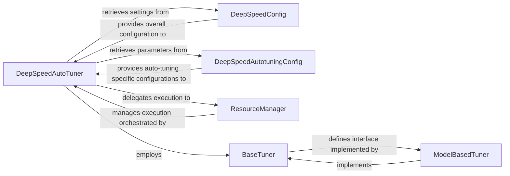

## Details

The DeepSpeed auto-tuning subsystem is orchestrated by the `DeepSpeedAutoTuner`, which serves as the central control unit. It leverages `DeepSpeedConfig` for general DeepSpeed settings and `DeepSpeedAutotuningConfig` for specific auto-tuning parameters, defining the search space and operational details. The `ResourceManager` is crucial for managing the distributed execution of tuning experiments, handling resource allocation and job scheduling. The `DeepSpeedAutoTuner` employs various tuning strategies, adhering to a `BaseTuner` interface, with `ModelBasedTuner` being a concrete implementation that guides the search for optimal configurations. This architecture allows for flexible and efficient exploration of the DeepSpeed configuration space to achieve optimal performance.

### DeepSpeedAutoTuner
The primary orchestrator of the auto-tuning process. It initiates and controls the auto-tuning workflow, defining the search space, executing experiments, and identifying optimal configurations. This component is central as it drives the entire auto-tuning mechanism, aligning with the "Optimization Layer" and "Distributed Computing Patterns" by managing distributed experiments.

**Related Classes/Methods**:

- <a href="https://github.com/deepspeedai/DeepSpeed/blob/master/deepspeed/autotuning/autotuner.py" target="_blank" rel="noopener noreferrer">`deepspeed.autotuning.autotuner.DeepSpeedAutoTuner`</a>

### DeepSpeedConfig
The central component for parsing, validating, and managing DeepSpeed's overall configuration. It acts as the central repository for all DeepSpeed configuration parameters, handling parsing and structured access. This is fundamental for any "ML Toolkit/Optimization Library" as it provides the entry point for users to customize behavior and performance.

**Related Classes/Methods**:

- <a href="https://github.com/deepspeedai/DeepSpeed/blob/master/deepspeed/runtime/config.py#L648-L997" target="_blank" rel="noopener noreferrer">`deepspeed.runtime.config.DeepSpeedConfig`:648-997</a>

### DeepSpeedAutotuningConfig
Manages configuration parameters specifically for the auto-tuning mechanism, such as model information required for profiling and search space definitions. While `DeepSpeedConfig` is general, `DeepSpeedAutotuningConfig` is specialized for the auto-tuning process, defining its specific operational parameters and search space, which is critical for the "Optimization Layer."

**Related Classes/Methods**:

- <a href="https://github.com/deepspeedai/DeepSpeed/blob/master/deepspeed/autotuning/config.py#L10-L85" target="_blank" rel="noopener noreferrer">`deepspeed.autotuning.config.DeepSpeedAutotuningConfig`:10-85</a>

### ResourceManager
Responsible for scheduling and managing the execution of auto-tuning experiments, orchestrating job runs and resource requests. This component is vital for the "Distributed Computing Patterns" as it handles the execution flow of potentially many distributed tuning trials.

**Related Classes/Methods**:

- <a href="https://github.com/deepspeedai/DeepSpeed/blob/master/deepspeed/autotuning/scheduler.py#L32-L256" target="_blank" rel="noopener noreferrer">`deepspeed.autotuning.scheduler.ResourceManager`:32-256</a>

### BaseTuner
Provides the foundational interface for various auto-tuning algorithms, defining the contract for generating and evaluating candidate DeepSpeed configurations. This component is key to the "Plugin/Extension Architecture" pattern, allowing different tuning strategies to be integrated seamlessly.

**Related Classes/Methods**:

- <a href="https://github.com/deepspeedai/DeepSpeed/blob/master/deepspeed/autotuning/tuner/base_tuner.py" target="_blank" rel="noopener noreferrer">`deepspeed.autotuning.tuner.base_tuner`</a>

### ModelBasedTuner
A concrete implementation of a tuner that likely uses a model to guide the search for optimal configurations, providing a data-driven approach for generating and evaluating candidates. This component represents a specific, advanced optimization strategy within the "Optimization Layer."

**Related Classes/Methods**:

- <a href="https://github.com/deepspeedai/DeepSpeed/blob/master/deepspeed/autotuning/tuner/model_based_tuner.py" target="_blank" rel="noopener noreferrer">`deepspeed.autotuning.tuner.model_based_tuner`</a>

### [FAQ](https://github.com/CodeBoarding/GeneratedOnBoardings/tree/main?tab=readme-ov-file#faq)