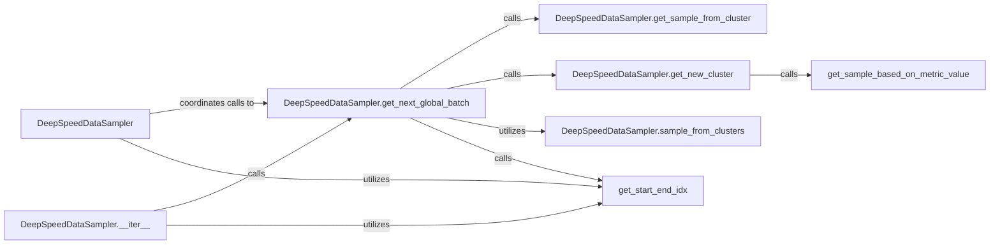

## Details

The `Data Pipeline & Loading` subsystem in DeepSpeed is primarily responsible for managing advanced data loading strategies, including curriculum learning, dynamic batching, and efficient data sampling for distributed training. Its core functionality is encapsulated within the `deepspeed.runtime.data_pipeline.data_sampling.data_sampler.py` module, with `DeepSpeedDataSampler` serving as the central component.

### DeepSpeedDataSampler
The primary orchestrator of the data pipeline, acting as an iterable interface to yield global batches of data. It encapsulates the complex logic for advanced data loading strategies, crucial for high-performance distributed training.

**Related Classes/Methods**:

- <a href="https://github.com/deepspeedai/DeepSpeed/blob/master/deepspeed/runtime/data_pipeline/data_sampling/data_sampler.py#L36-L349" target="_blank" rel="noopener noreferrer">`deepspeed.runtime.data_pipeline.data_sampling.data_sampler.DeepSpeedDataSampler`:36-349</a>

### DeepSpeedDataSampler.__iter__
Enables the `DeepSpeedDataSampler` to be iterated over, providing a continuous stream of processed data batches to the training loop. This method is the entry point for consuming the data pipeline.

**Related Classes/Methods**:

- <a href="https://github.com/deepspeedai/DeepSpeed/blob/master/deepspeed/runtime/data_pipeline/data_sampling/data_sampler.py" target="_blank" rel="noopener noreferrer">`deepspeed.runtime.data_pipeline.data_sampling.data_sampler.DeepSpeedDataSampler:__iter__`</a>

### DeepSpeedDataSampler.get_next_global_batch
Manages the logic for fetching the next global batch of data. This involves deciding whether to retrieve samples from existing clusters or acquire new ones, and then applying the appropriate sampling strategy for distributed processing.

**Related Classes/Methods**:

- <a href="https://github.com/deepspeedai/DeepSpeed/blob/master/deepspeed/runtime/data_pipeline/data_sampling/data_sampler.py" target="_blank" rel="noopener noreferrer">`deepspeed.runtime.data_pipeline.data_sampling.data_sampler.DeepSpeedDataSampler:get_next_global_batch`</a>

### DeepSpeedDataSampler.get_sample_from_cluster
Retrieves data samples from already loaded data clusters, focusing on efficient reuse of data to minimize redundant loading operations and optimize memory usage in distributed environments.

**Related Classes/Methods**:

- <a href="https://github.com/deepspeedai/DeepSpeed/blob/master/deepspeed/runtime/data_pipeline/data_sampling/data_sampler.py" target="_blank" rel="noopener noreferrer">`deepspeed.runtime.data_pipeline.data_sampling.data_sampler.DeepSpeedDataSampler:get_sample_from_cluster`</a>

### DeepSpeedDataSampler.get_new_cluster
Handles the process of obtaining new data clusters, often involving metric-driven sampling to prioritize certain data points, which is a key aspect of curriculum learning for improved training efficiency.

**Related Classes/Methods**:

- <a href="https://github.com/deepspeedai/DeepSpeed/blob/master/deepspeed/runtime/data_pipeline/data_sampling/data_sampler.py" target="_blank" rel="noopener noreferrer">`deepspeed.runtime.data_pipeline.data_sampling.data_sampler.DeepSpeedDataSampler:get_new_cluster`</a>

### DeepSpeedDataSampler.sample_from_clusters
Implements the actual sampling of data points from the available clusters based on the defined strategies (e.g., random sampling, curriculum-based sampling), ensuring data diversity and training stability.

**Related Classes/Methods**:

- <a href="https://github.com/deepspeedai/DeepSpeed/blob/master/deepspeed/runtime/data_pipeline/data_sampling/data_sampler.py" target="_blank" rel="noopener noreferrer">`deepspeed.runtime.data_pipeline.data_sampling.data_sampler.DeepSpeedDataSampler:sample_from_clusters`</a>

### get_sample_based_on_metric_value
A helper function that supports curriculum learning by sampling data based on a specific metric value, allowing the model to learn from easier examples first, thereby accelerating convergence.

**Related Classes/Methods**:

- <a href="https://github.com/deepspeedai/DeepSpeed/blob/master/deepspeed/runtime/data_pipeline/data_sampling/data_sampler.py#L133-L141" target="_blank" rel="noopener noreferrer">`deepspeed.runtime.data_pipeline.data_sampling.data_sampler.get_sample_based_on_metric_value`:133-141</a>

### get_start_end_idx
Calculates the start and end indices for data batches, managing the partitioning of data for efficient distributed processing across multiple devices or nodes, crucial for scalability.

**Related Classes/Methods**:

- <a href="https://github.com/deepspeedai/DeepSpeed/blob/master/deepspeed/runtime/data_pipeline/data_sampling/data_sampler.py#L122-L131" target="_blank" rel="noopener noreferrer">`deepspeed.runtime.data_pipeline.data_sampling.data_sampler.get_start_end_idx`:122-131</a>

### [FAQ](https://github.com/CodeBoarding/GeneratedOnBoardings/tree/main?tab=readme-ov-file#faq)