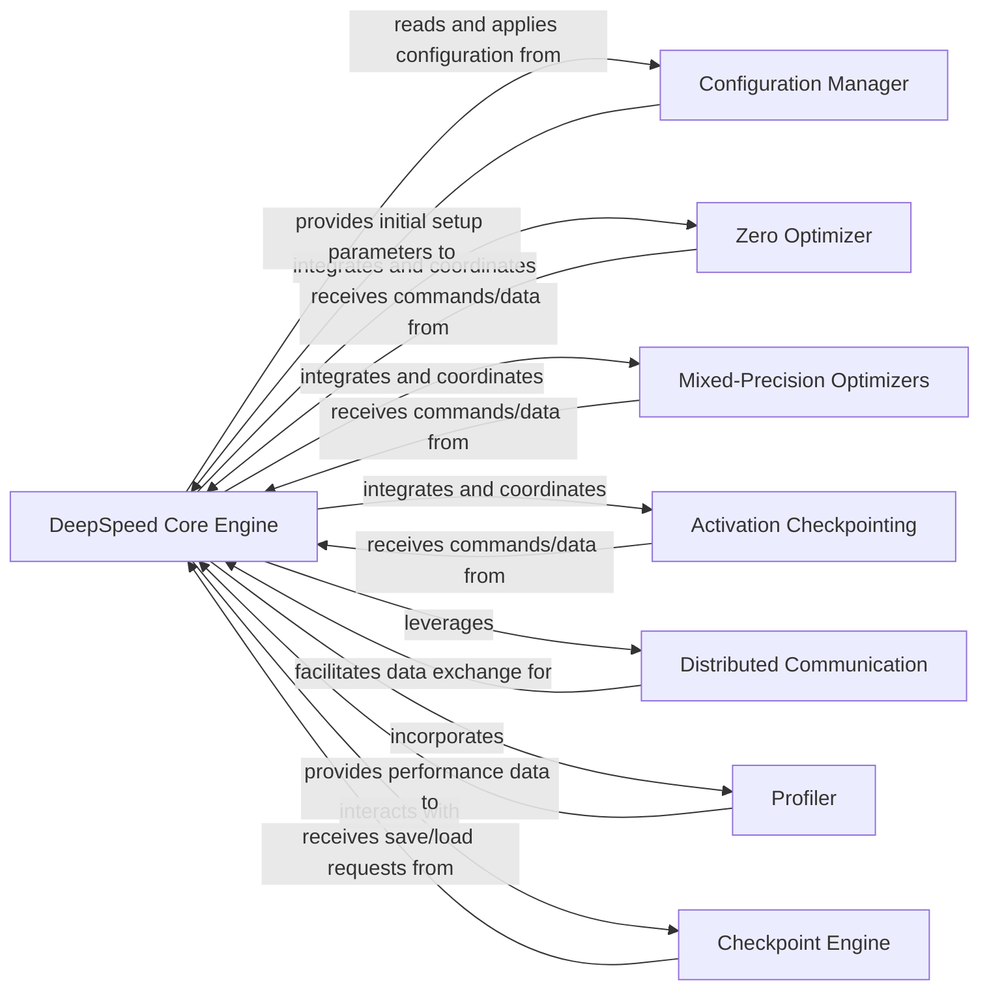

## Details

The DeepSpeed architecture is centered around the `DeepSpeed Core Engine`, which acts as the primary orchestrator for training and inference. This engine relies heavily on the `Configuration Manager` to initialize and apply various optimization settings, including those for memory efficiency (via `Zero Optimizer`), numerical stability (`Mixed-Precision Optimizers`), and memory reduction (`Activation Checkpointing`). For distributed training, the `DeepSpeed Core Engine` leverages `Distributed Communication` to manage data synchronization and gradient updates across multiple devices. Performance monitoring is handled by the `Profiler`, which provides insights back to the engine. Finally, the `Checkpoint Engine` ensures the persistence of training progress by managing the saving and loading of model and optimizer states. This modular design allows the DeepSpeed Core Engine to seamlessly integrate and coordinate these specialized components to achieve high-performance and memory-efficient deep learning.

### DeepSpeed Core Engine [[Expand]](./DeepSpeed_Core_Engine.md)
The central control plane and orchestrator for the entire DeepSpeed training and inference lifecycle. It encapsulates the core logic for managing model execution, applying various optimization techniques, and coordinating interactions with other DeepSpeed components.

**Related Classes/Methods**:

- <a href="https://github.com/deepspeedai/DeepSpeed/blob/master/deepspeed/runtime/engine.py#L195-L4078" target="_blank" rel="noopener noreferrer">`deepspeed.runtime.engine.DeepSpeedEngine`:195-4078</a>

### Configuration Manager
Manages and provides configuration settings for the DeepSpeed Core Engine and its components, parsing configuration files and initializing various DeepSpeed features.

**Related Classes/Methods**:

- <a href="https://github.com/deepspeedai/DeepSpeed/blob/master/deepspeed/runtime/config.py#L648-L997" target="_blank" rel="noopener noreferrer">`deepspeed.runtime.config.DeepSpeedConfig`:648-997</a>

### Zero Optimizer
Provides memory efficiency optimizations, specifically related to the ZeRO (Zero Redundancy Optimizer) family of techniques, by partitioning model states across devices.

**Related Classes/Methods**:

- <a href="https://github.com/deepspeedai/DeepSpeed/blob/master/deepspeed/runtime/zero/stage_1.py" target="_blank" rel="noopener noreferrer">`deepspeed.runtime.zero.stage_1.ZeroOptimizer`</a>

### Mixed-Precision Optimizers
Provides numerical stability and performance optimizations through mixed-precision training (e.g., FP16, BF16), managing gradient scaling and type conversions.

**Related Classes/Methods**:

- <a href="https://github.com/deepspeedai/DeepSpeed/blob/master/deepspeed/runtime/fp16/f16.py" target="_blank" rel="noopener noreferrer">`deepspeed.runtime.fp16.f16.FP16_Optimizer`</a>

### Activation Checkpointing
Reduces memory usage by recomputing activations during the backward pass instead of storing them, enabling training of larger models.

**Related Classes/Methods**:

- <a href="https://github.com/deepspeedai/DeepSpeed/blob/master/deepspeed/runtime/activation_checkpointing/checkpointing.py" target="_blank" rel="noopener noreferrer">`deepspeed.runtime.activation_checkpointing.checkpointing`</a>

### Distributed Communication
Handles efficient data synchronization, gradient aggregation, and parameter updates across multiple devices and nodes in a distributed environment using communication primitives.

**Related Classes/Methods**:

- <a href="https://github.com/deepspeedai/DeepSpeed/blob/master/deepspeed/runtime/comm/comm.py" target="_blank" rel="noopener noreferrer">`deepspeed.runtime.comm.DeepSpeedNCCL`</a>

### Profiler
Collects and reports performance metrics and profiling information during training and inference, aiding in performance analysis and optimization.

**Related Classes/Methods**:

- <a href="https://github.com/deepspeedai/DeepSpeed/blob/master/deepspeed/runtime/utils/flops_profiler.py" target="_blank" rel="noopener noreferrer">`deepspeed.runtime.utils.flops_profiler.FlopsProfiler`</a>

### Checkpoint Engine
Manages the saving and loading of model and optimizer states for resuming training or inference, ensuring fault tolerance and persistent progress.

**Related Classes/Methods**:

- <a href="https://github.com/deepspeedai/DeepSpeed/blob/master/deepspeed/runtime/checkpoint/checkpoint.py" target="_blank" rel="noopener noreferrer">`deepspeed.runtime.checkpoint.DeepSpeedCheckpoint`</a>

### [FAQ](https://github.com/CodeBoarding/GeneratedOnBoardings/tree/main?tab=readme-ov-file#faq)