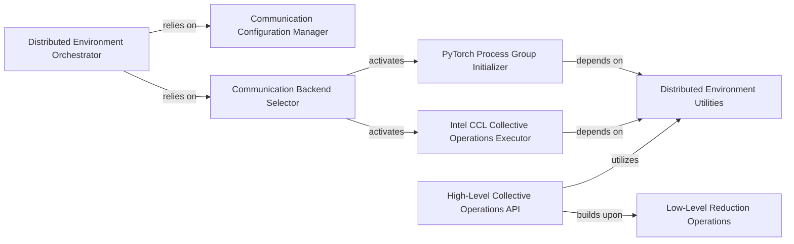

## Details

The deepspeed.comm subsystem is central to orchestrating distributed communication within DeepSpeed. The Distributed Environment Orchestrator acts as the primary entry point, responsible for initializing the communication environment. It achieves this by relying on the Communication Configuration Manager to parse and apply settings and the Communication Backend Selector to dynamically choose and activate the appropriate underlying communication library. Depending on the selection, either the PyTorch Process Group Initializer or the Intel CCL Collective Operations Executor is activated, both of which depend on Distributed Environment Utilities for essential environment context. At a higher level, the High-Level Collective Operations API provides a unified interface for common collective communication patterns, building upon Low-Level Reduction Operations for fundamental tensor manipulations and also utilizing Distributed Environment Utilities for querying distributed environment information. This architecture ensures flexibility in backend selection while providing robust, optimized collective communication capabilities.

### Distributed Environment Orchestrator
Serves as the primary entry point for setting up the entire distributed communication environment. It handles the initial configuration loading and the selection of the appropriate communication backend. This component is fundamental as it bootstraps all distributed capabilities.

**Related Classes/Methods**:

- <a href="https://github.com/deepspeedai/DeepSpeed/blob/master/deepspeed/comm/comm.py" target="_blank" rel="noopener noreferrer">`deepspeed.comm.comm`</a>

### Communication Configuration Manager
Manages the parsing and application of various communication-related settings, allowing for fine-grained control over distributed operations. This is critical for adapting DeepSpeed to diverse hardware and network configurations.

**Related Classes/Methods**:

- <a href="https://github.com/deepspeedai/DeepSpeed/blob/master/deepspeed/comm/comm.py" target="_blank" rel="noopener noreferrer">`deepspeed.comm.comm`</a>

### Communication Backend Selector
Dynamically selects and activates the underlying communication library (e.g., PyTorch's distributed module, Intel Collective Communications Library (CCL)) based on configuration or environment. This component is vital for DeepSpeed's flexibility and hardware abstraction.

**Related Classes/Methods**:

- <a href="https://github.com/deepspeedai/DeepSpeed/blob/master/deepspeed/comm/comm.py" target="_blank" rel="noopener noreferrer">`deepspeed.comm.comm`</a>

### PyTorch Process Group Initializer
Initializes the foundational PyTorch distributed process group, which is indispensable for all PyTorch-native distributed communication operations. As DeepSpeed is built on PyTorch, this is a core dependency for distributed functionality.

**Related Classes/Methods**:

- <a href="https://github.com/deepspeedai/DeepSpeed/blob/master/deepspeed/comm/torch.py" target="_blank" rel="noopener noreferrer">`deepspeed.comm.torch`</a>

### Intel CCL Collective Operations Executor
Executes collective communication operations specifically when the Intel Collective Communications Library (CCL) backend is active, leveraging Intel-optimized routines. This highlights DeepSpeed's hardware-specific optimizations.

**Related Classes/Methods**:

- <a href="https://github.com/deepspeedai/DeepSpeed/blob/master/deepspeed/comm/ccl.py" target="_blank" rel="noopener noreferrer">`deepspeed.comm.ccl`</a>

### Low-Level Reduction Operations
Implements the fundamental logic for various tensor reduction operations (e.g., sum, average) across distributed processes, forming the building blocks for more complex collectives. These are the atomic operations upon which all higher-level communication is built.

**Related Classes/Methods**:

- <a href="https://github.com/deepspeedai/DeepSpeed/blob/master/deepspeed/comm/torch.py" target="_blank" rel="noopener noreferrer">`deepspeed.comm.torch`</a>

### High-Level Collective Operations API
Provides unified, high-level APIs for common collective communication patterns like all-gather and reduce-scatter, abstracting away the complexities of backend-specific implementations. This component offers the user-facing interface for distributed operations.

**Related Classes/Methods**:

- <a href="https://github.com/deepspeedai/DeepSpeed/blob/master/deepspeed/comm/comm.py" target="_blank" rel="noopener noreferrer">`deepspeed.comm.comm`</a>

### Distributed Environment Utilities
Provides essential utility functions for querying the distributed environment (e.g., current process rank, total world size) and for calculating message sizes. These utilities are crucial for managing and optimizing distributed communication.

**Related Classes/Methods**:

- <a href="https://github.com/deepspeedai/DeepSpeed/blob/master/deepspeed/comm/comm.py" target="_blank" rel="noopener noreferrer">`deepspeed.comm.comm`</a>
- <a href="https://github.com/deepspeedai/DeepSpeed/blob/master/deepspeed/comm/utils.py" target="_blank" rel="noopener noreferrer">`deepspeed.comm.utils`</a>

### [FAQ](https://github.com/CodeBoarding/GeneratedOnBoardings/tree/main?tab=readme-ov-file#faq)