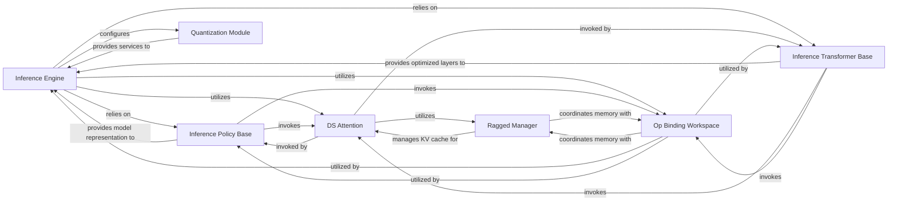

## Details

The DeepSpeed Inference subsystem is orchestrated by the Inference Engine, which serves as the central component managing the entire inference pipeline, from model loading to execution. It relies on the Inference Policy Base to understand and represent diverse model architectures and leverages the Inference Transformer Base for highly optimized, low-level transformer operations. For efficiency, the Quantization Module is configured by the Inference Engine to reduce model footprint and accelerate computation. Memory management is a critical aspect, handled collaboratively by the Ragged Manager and Op Binding Workspace, which together optimize GPU memory allocation for variable-length sequences and the Key-Value cache. The DS Attention component provides highly optimized kernels for attention computation, a core operation in transformer models, and interacts closely with the memory management components. This integrated architecture ensures high-performance and memory-efficient inference for large-scale models.

### Inference Engine
The primary orchestrator for the entire inference process. It manages distributed setup, loads models, handles CUDA graph management, and executes the inference pipeline. `engine_v2` represents an advanced iteration with potentially enhanced capabilities.

**Related Classes/Methods**:

- <a href="https://github.com/deepspeedai/DeepSpeed/blob/master/deepspeed/inference/engine.py" target="_blank" rel="noopener noreferrer">`deepspeed.inference.engine.DeepSpeedInferenceEngine`</a>
- <a href="https://github.com/deepspeedai/DeepSpeed/blob/master/deepspeed/inference/v2/engine_v2.py" target="_blank" rel="noopener noreferrer">`deepspeed.inference.v2.engine_v2`</a>

### Inference Policy Base
Defines the abstract interface and foundational logic for building and populating model parameters, particularly for efficient inference. It provides a standardized way to represent and interact with model components, ensuring compatibility across diverse architectures.

**Related Classes/Methods**:

- <a href="https://github.com/deepspeedai/DeepSpeed/blob/master/deepspeed/inference/v2/inference_parameter.py#L26-L89" target="_blank" rel="noopener noreferrer">`deepspeed.inference.v2.inference_parameter.InferenceParameter`:26-89</a>

### Inference Transformer Base
Provides concrete, highly optimized implementations for fundamental transformer layer operations. This component adapts generic transformer models for efficient inference within the DeepSpeed framework, leveraging specialized kernels and optimizations for operations like linear transformations.

**Related Classes/Methods**:

### Quantization Module
Responsible for applying quantization schemes to models, which reduces their memory footprint and accelerates computation. This is a key optimization technique for deploying large models efficiently by converting model weights to lower precision.

**Related Classes/Methods**:

- <a href="https://github.com/deepspeedai/DeepSpeed/blob/master/deepspeed/inference/quantization/quantization.py#L20-L111" target="_blank" rel="noopener noreferrer">`deepspeed.inference.quantization.quantization._init_group_wise_weight_quantization`:20-111</a>

### Ragged Manager
A specialized component for efficiently managing GPU memory, particularly for variable-length sequences and the Key-Value (KV) cache in generative models. It optimizes memory allocation and access patterns to improve throughput by providing a flexible memory allocator.

**Related Classes/Methods**:

- <a href="https://github.com/deepspeedai/DeepSpeed/blob/master/deepspeed/inference/v2/allocator.py" target="_blank" rel="noopener noreferrer">`deepspeed.inference.v2.allocator.CUDAPointerAllocator`</a>

### DS Attention
Provides highly optimized CUDA/Triton kernels for attention computation. This component directly contributes to the low-level performance of transformer models by accelerating one of their most computationally intensive operations, often leveraging mixed-precision GEMM operations.

**Related Classes/Methods**:

### Op Binding Workspace
Manages GPU memory for intermediate tensors and the KV cache, acting as a dedicated workspace for operations. Its role is to optimize memory allocation and deallocation, reducing overhead and improving overall inference efficiency. This component works in conjunction with the Ragged Manager for comprehensive memory handling.

**Related Classes/Methods**:

- <a href="https://github.com/deepspeedai/DeepSpeed/blob/master/deepspeed/inference/v2/allocator.py" target="_blank" rel="noopener noreferrer">`deepspeed.inference.v2.allocator.CUDAPointerAllocator`</a>

### [FAQ](https://github.com/CodeBoarding/GeneratedOnBoardings/tree/main?tab=readme-ov-file#faq)