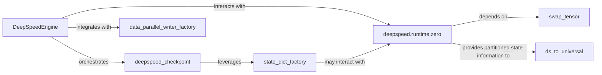

## Details

This subsystem is responsible for the comprehensive handling of model weights, optimizer states, and other training/inference states within DeepSpeed. It encompasses functionalities for saving, loading, partitioning, and converting these states, with a strong emphasis on supporting various DeepSpeed parallelisms and optimized checkpoint formats.

### DeepSpeedEngine
The central orchestrator for training and inference, responsible for initiating and managing the checkpointing process (saving and loading model/optimizer states). It acts as the high-level interface for state management within the DeepSpeed training loop.

**Related Classes/Methods**:

- <a href="https://github.com/deepspeedai/DeepSpeed/blob/master/deepspeed/runtime/engine.py#L195-L4078" target="_blank" rel="noopener noreferrer">`DeepSpeedEngine`:195-4078</a>

### deepspeed_checkpoint
Manages the core DeepSpeed checkpointing logic, including initialization, validation, and building mappings for different parallelism types (TP, PP, DP). It provides methods to retrieve specific parts of the model state and checkpoint metadata, and handles reshaping for Megatron-LM 2D parallelism.

**Related Classes/Methods**:

- <a href="https://github.com/deepspeedai/DeepSpeed/blob/master/deepspeed/checkpoint/deepspeed_checkpoint.py" target="_blank" rel="noopener noreferrer">`deepspeed_checkpoint`</a>

### state_dict_factory
Acts as a factory for loading and manipulating state dictionaries. It provides functionalities to get and set modules within a state dictionary, and to split or merge state dictionaries, which is crucial for handling different model parallelisms and checkpoint formats.

**Related Classes/Methods**:

- <a href="https://github.com/deepspeedai/DeepSpeed/blob/master/deepspeed/runtime/state_dict_factory.py" target="_blank" rel="noopener noreferrer">`state_dict_factory`</a>

### deepspeed.runtime.zero
Manages the partitioning, communication, and reassembly of model parameters, gradients, and optimizer states for ZeRO (Zero Redundancy Optimizer) stages. This is fundamental for enabling large model training by distributing memory load. `stage3` specifically handles offloading to CPU/NVMe.

**Related Classes/Methods**:

- <a href="https://github.com/deepspeedai/DeepSpeed/blob/master/deepspeed/runtime/zero" target="_blank" rel="noopener noreferrer">`deepspeed.runtime.zero`</a>
- <a href="https://github.com/deepspeedai/DeepSpeed/blob/master/deepspeed/runtime/zero" target="_blank" rel="noopener noreferrer">`deepspeed.runtime.zero`</a>

### swap_tensor
Manages the dynamic movement of tensors (parameters, gradients, optimizer states) between different memory tiers (GPU, CPU, NVMe). This is a critical enabler for ZeRO-Offload and allows training models larger than available GPU memory.

**Related Classes/Methods**:

- <a href="https://github.com/deepspeedai/DeepSpeed/blob/master/deepspeed/runtime/swap_tensor/partitioned_param_swapper.py" target="_blank" rel="noopener noreferrer">`swap_tensor`</a>

### data_parallel_writer_factory
Provides the logic for creating configurations for data parallel checkpoint writers. It determines how to slice and assign resources for efficient parallel saving of model states across different data and model parallelism configurations (DDP, 2D, 3D).

**Related Classes/Methods**:

- <a href="https://github.com/deepspeedai/DeepSpeed/blob/master/deepspeed/runtime/model_checkpointing/data_parallel_writer_factory.py" target="_blank" rel="noopener noreferrer">`data_parallel_writer_factory`</a>

### ds_to_universal
Facilitates the conversion of DeepSpeed-specific checkpoint formats, particularly those from ZeRO, into a more universal and consolidated format. This is crucial for interoperability and analysis outside of the DeepSpeed ecosystem.

**Related Classes/Methods**:

- <a href="https://github.com/deepspeedai/DeepSpeed/blob/master/deepspeed/checkpoint/ds_to_universal.py" target="_blank" rel="noopener noreferrer">`ds_to_universal`</a>

### [FAQ](https://github.com/CodeBoarding/GeneratedOnBoardings/tree/main?tab=readme-ov-file#faq)