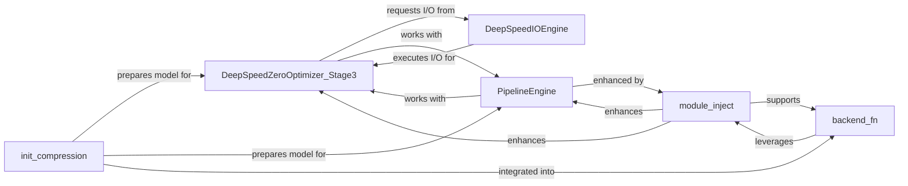

## Details

The DeepSpeed architecture is centered around optimizing deep learning model training for efficiency and scale. The `DeepSpeedZeroOptimizer_Stage3` component is crucial for memory optimization, partitioning model states across devices and leveraging the `DeepSpeedIOEngine` for efficient offloading to NVMe storage. `PipelineEngine` orchestrates model parallelism, dividing models into sequential stages for distributed execution, and is enhanced by `module_inject` for specialized module implementations. `init_compression` prepares models for training by applying compression techniques, which can be integrated into the `backend_fn`. The `backend_fn` serves as a central compilation and optimization hub, leveraging `module_inject` to enhance the computational graph. These components collectively enable DeepSpeed to manage large models, optimize memory usage, and accelerate training through various parallelism and optimization strategies.

### DeepSpeedZeroOptimizer_Stage3
Implements ZeRO Stage 3, a sophisticated memory optimization technique that partitions model parameters, gradients, and optimizer states across GPUs. It dynamically manages the offloading of these states to CPU or NVMe storage to drastically reduce GPU memory consumption during training.

**Related Classes/Methods**:

- <a href="https://github.com/deepspeedai/DeepSpeed/blob/master/deepspeed/runtime/zero/stage3.py#L128-L3100" target="_blank" rel="noopener noreferrer">`DeepSpeedZeroOptimizer_Stage3`:128-3100</a>

### PipelineEngine
Orchestrates pipeline parallelism, a model parallelism strategy where the deep learning model is divided into sequential stages, each executed on a different GPU. It manages inter-stage communication and micro-batch processing to ensure efficient data flow and computation across the pipeline.

**Related Classes/Methods**:

- <a href="https://github.com/deepspeedai/DeepSpeed/blob/master/deepspeed/runtime/pipe/engine.py#L60-L1372" target="_blank" rel="noopener noreferrer">`PipelineEngine`:60-1372</a>

### DeepSpeedIOEngine
Provides a low-level, asynchronous I/O interface specifically optimized for NVMe storage. It is crucial for efficient memory offloading and reloading of large data chunks (e.g., model states, activations) to and from GPU memory, minimizing I/O bottlenecks.

**Related Classes/Methods**:

- <a href="https://github.com/deepspeedai/DeepSpeed/blob/master/deepspeed/nvme/io_engine.py#L17-L125" target="_blank" rel="noopener noreferrer">`DeepSpeedIOEngine`:17-125</a>

### init_compression
Initializes and applies various model compression techniques, such as quantization and pruning, to the model. This reduces the model's size and can improve inference speed, indirectly benefiting training by reducing memory and potentially speeding up forward/backward passes.

**Related Classes/Methods**:

- <a href="https://github.com/deepspeedai/DeepSpeed/blob/master/deepspeed/compression/compress.py#L100-L145" target="_blank" rel="noopener noreferrer">`init_compression`:100-145</a>

### backend_fn
Serves as the primary entry point for DeepSpeed's graph compilation and optimization. It transforms the model's computational graph to enhance performance and memory efficiency, often by integrating various optimization passes.

**Related Classes/Methods**:

- <a href="https://github.com/deepspeedai/DeepSpeed/blob/master/deepspeed/compile/backend.py#L225-L385" target="_blank" rel="noopener noreferrer">`backend_fn`:225-385</a>

### module_inject
Replaces standard PyTorch modules with DeepSpeed's highly optimized, often custom-implemented, versions. This is typically done to enable specific parallelism strategies (e.g., tensor parallelism) or other performance enhancements that require specialized module implementations.

**Related Classes/Methods**:

- <a href="https://github.com/deepspeedai/DeepSpeed/blob/master/deepspeed/module_inject/inject.py#L11-L71" target="_blank" rel="noopener noreferrer">`module_inject`:11-71</a>

### [FAQ](https://github.com/CodeBoarding/GeneratedOnBoardings/tree/main?tab=readme-ov-file#faq)