```mermaid
graph LR
    DeepSpeed_Core_Engine["DeepSpeed Core Engine"]
    Hardware_Abstraction_Custom_Kernels["Hardware Abstraction & Custom Kernels"]
    Distributed_Communication_Layer["Distributed Communication Layer"]
    Training_Optimization_Suite["Training Optimization Suite"]
    Inference_Optimization_Engine["Inference Optimization Engine"]
    Model_State_Management["Model & State Management"]
    Configuration_Auto_Tuning_System["Configuration & Auto-Tuning System"]
    Data_Pipeline_Loading["Data Pipeline & Loading"]
    DeepSpeed_Core_Engine -- "applies and manages" --> Training_Optimization_Suite
    DeepSpeed_Core_Engine -- "delegates execution to" --> Inference_Optimization_Engine
    DeepSpeed_Core_Engine -- "queries and utilizes" --> Hardware_Abstraction_Custom_Kernels
    Hardware_Abstraction_Custom_Kernels -- "provides to" --> DeepSpeed_Core_Engine
    DeepSpeed_Core_Engine -- "initiates and facilitates" --> Distributed_Communication_Layer
    Distributed_Communication_Layer -- "provides services to" --> DeepSpeed_Core_Engine
    DeepSpeed_Core_Engine -- "sends states for saving to" --> Model_State_Management
    Model_State_Management -- "receives states from" --> DeepSpeed_Core_Engine
    Configuration_Auto_Tuning_System -- "provides parameters to" --> DeepSpeed_Core_Engine
    Data_Pipeline_Loading -- "provides data to" --> DeepSpeed_Core_Engine
    Training_Optimization_Suite -- "relies on" --> Distributed_Communication_Layer
    Distributed_Communication_Layer -- "supports" --> Training_Optimization_Suite
    Training_Optimization_Suite -- "leverages" --> Hardware_Abstraction_Custom_Kernels
    Training_Optimization_Suite -- "influences" --> Model_State_Management
    Model_State_Management -- "manages states for" --> Training_Optimization_Suite
    Inference_Optimization_Engine -- "utilizes" --> Hardware_Abstraction_Custom_Kernels
    Model_State_Management -- "loads models for" --> Inference_Optimization_Engine
    Model_State_Management -- "utilizes services from" --> Hardware_Abstraction_Custom_Kernels
    Hardware_Abstraction_Custom_Kernels -- "provides services to" --> Model_State_Management
    click DeepSpeed_Core_Engine href "https://github.com/CodeBoarding/GeneratedOnBoardings/blob/main/DeepSpeed/DeepSpeed_Core_Engine.md" "Details"
    click Hardware_Abstraction_Custom_Kernels href "https://github.com/CodeBoarding/GeneratedOnBoardings/blob/main/DeepSpeed/Hardware_Abstraction_Custom_Kernels.md" "Details"
    click Distributed_Communication_Layer href "https://github.com/CodeBoarding/GeneratedOnBoardings/blob/main/DeepSpeed/Distributed_Communication_Layer.md" "Details"
    click Training_Optimization_Suite href "https://github.com/CodeBoarding/GeneratedOnBoardings/blob/main/DeepSpeed/Training_Optimization_Suite.md" "Details"
    click Inference_Optimization_Engine href "https://github.com/CodeBoarding/GeneratedOnBoardings/blob/main/DeepSpeed/Inference_Optimization_Engine.md" "Details"
    click Model_State_Management href "https://github.com/CodeBoarding/GeneratedOnBoardings/blob/main/DeepSpeed/Model_State_Management.md" "Details"
    click Configuration_Auto_Tuning_System href "https://github.com/CodeBoarding/GeneratedOnBoardings/blob/main/DeepSpeed/Configuration_Auto_Tuning_System.md" "Details"
    click Data_Pipeline_Loading href "https://github.com/CodeBoarding/GeneratedOnBoardings/blob/main/DeepSpeed/Data_Pipeline_Loading.md" "Details"
```

## Details

DeepSpeed's architecture is fundamentally designed to provide an optimized, scalable, and efficient platform for large-scale deep learning. The DeepSpeed Core Engine serves as the central control plane, orchestrating the entire training and inference workflow. It dynamically integrates a sophisticated Training Optimization Suite and a dedicated Inference Optimization Engine, which encapsulate DeepSpeed's core performance-enhancing features like ZeRO, various parallelism strategies, and memory offloading. These optimization components are underpinned by a Hardware Abstraction & Custom Kernels layer, ensuring high-performance interaction with diverse accelerators, and a robust Distributed Communication Layer that manages inter-process data exchange and synchronization across distributed environments. Complementing these, the Model & State Management component handles persistent storage and retrieval of model and optimizer states, while the Configuration & Auto-Tuning System provides intelligent performance tuning. Finally, the Data Pipeline & Loading component ensures efficient data delivery to the core engine, completing the end-to-end optimized deep learning pipeline.

### DeepSpeed Core Engine [[Expand]](./DeepSpeed_Core_Engine.md)
The central orchestrator managing the entire training and inference lifecycle, integrating and coordinating all other DeepSpeed components.

**Related Classes/Methods**:

- <a href="https://github.com/deepspeedai/DeepSpeed/blob/master/deepspeed/runtime/engine.py#L195-L4078" target="_blank" rel="noopener noreferrer">`deepspeed.runtime.engine.DeepSpeedEngine`:195-4078</a>
- <a href="https://github.com/deepspeedai/DeepSpeed/blob/master/deepspeed/runtime/engine.py" target="_blank" rel="noopener noreferrer">`deepspeed.runtime.engine.step`</a>

### Hardware Abstraction & Custom Kernels [[Expand]](./Hardware_Abstraction_Custom_Kernels.md)
Provides a unified, hardware-agnostic interface for accelerators and highly optimized C++/CUDA/HIP custom operations for performance-critical sections.

**Related Classes/Methods**:

- <a href="https://github.com/deepspeedai/DeepSpeed/blob/master/deepspeed/accelerator/real_accelerator.py" target="_blank" rel="noopener noreferrer">`deepspeed.accelerator.real_accelerator.get_accelerator`</a>
- <a href="https://github.com/deepspeedai/DeepSpeed/blob/master/deepspeed/ops/op_builder/builder.py" target="_blank" rel="noopener noreferrer">`deepspeed.ops.op_builder.builder.load`</a>

### Distributed Communication Layer [[Expand]](./Distributed_Communication_Layer.md)
Manages all inter-process communication and synchronization primitives for distributed operations across devices and nodes.

**Related Classes/Methods**:

- <a href="https://github.com/deepspeedai/DeepSpeed/blob/master/deepspeed/comm/comm.py#L788-L854" target="_blank" rel="noopener noreferrer">`deepspeed.comm.comm.init_distributed`:788-854</a>
- <a href="https://github.com/deepspeedai/DeepSpeed/blob/master/deepspeed/comm/torch.py#L167-L170" target="_blank" rel="noopener noreferrer">`deepspeed.comm.torch.all_reduce`:167-170</a>

### Training Optimization Suite [[Expand]](./Training_Optimization_Suite.md)
A comprehensive collection of techniques (ZeRO, Model Parallelism, Memory Offloading, Graph Compilation, Model Compression) applied during training to reduce memory footprint and improve performance.

**Related Classes/Methods**:

- <a href="https://github.com/deepspeedai/DeepSpeed/blob/master/deepspeed/runtime/zero/stage3.py#L128-L3100" target="_blank" rel="noopener noreferrer">`deepspeed.runtime.zero.stage3.DeepSpeedZeroOptimizer_Stage3`:128-3100</a>
- <a href="https://github.com/deepspeedai/DeepSpeed/blob/master/deepspeed/runtime/pipe/engine.py#L60-L1372" target="_blank" rel="noopener noreferrer">`deepspeed.runtime.pipe.engine.PipelineEngine`:60-1372</a>
- <a href="https://github.com/deepspeedai/DeepSpeed/blob/master/deepspeed/nvme/io_engine.py" target="_blank" rel="noopener noreferrer">`deepspeed.nvme.io_engine.DeepSpeedIOEngine`</a>

### Inference Optimization Engine [[Expand]](./Inference_Optimization_Engine.md)
Dedicated components for optimizing and executing large language models specifically for inference, focusing on low latency and high throughput.

**Related Classes/Methods**:

- <a href="https://github.com/deepspeedai/DeepSpeed/blob/master/deepspeed/inference/engine.py" target="_blank" rel="noopener noreferrer">`deepspeed.inference.engine.DeepSpeedInferenceEngine`</a>
- <a href="https://github.com/deepspeedai/DeepSpeed/blob/master/deepspeed/inference/v2/engine_v2.py#L68-L91" target="_blank" rel="noopener noreferrer">`deepspeed.inference.v2.engine_v2.__init__`:68-91</a>

### Model & State Management [[Expand]](./Model_State_Management.md)
Manages saving and loading of model weights, optimizer states, and other training/inference states, supporting DeepSpeed parallelisms and optimized checkpoint formats.

**Related Classes/Methods**:

- <a href="https://github.com/deepspeedai/DeepSpeed/blob/master/deepspeed/checkpoint/deepspeed_checkpoint.py#L37-L85" target="_blank" rel="noopener noreferrer">`deepspeed.checkpoint.deepspeed_checkpoint.__init__`:37-85</a>
- <a href="https://github.com/deepspeedai/DeepSpeed/blob/master/deepspeed/runtime/state_dict_factory.py#L57-L113" target="_blank" rel="noopener noreferrer">`deepspeed.runtime.state_dict_factory.load`:57-113</a>

### Configuration & Auto-Tuning System [[Expand]](./Configuration_Auto_Tuning_System.md)
Handles parsing and management of DeepSpeed configurations and provides an auto-tuning mechanism to find optimal performance settings.

**Related Classes/Methods**:

- <a href="https://github.com/deepspeedai/DeepSpeed/blob/master/deepspeed/autotuning/autotuner.py" target="_blank" rel="noopener noreferrer">`deepspeed.autotuning.autotuner.DeepSpeedAutoTuner`</a>
- <a href="https://github.com/deepspeedai/DeepSpeed/blob/master/deepspeed/runtime/config.py#L648-L997" target="_blank" rel="noopener noreferrer">`deepspeed.runtime.config.DeepSpeedConfig`:648-997</a>

### Data Pipeline & Loading [[Expand]](./Data_Pipeline_Loading.md)
Manages advanced data loading strategies, including curriculum learning, dynamic batching, and efficient data sampling for distributed training.

**Related Classes/Methods**:

- <a href="https://github.com/deepspeedai/DeepSpeed/blob/master/deepspeed/runtime/data_pipeline/data_sampling/data_sampler.py#L36-L349" target="_blank" rel="noopener noreferrer">`deepspeed.runtime.data_pipeline.data_sampling.data_sampler.DeepSpeedDataSampler`:36-349</a>

### [FAQ](https://github.com/CodeBoarding/GeneratedOnBoardings/tree/main?tab=readme-ov-file#faq)