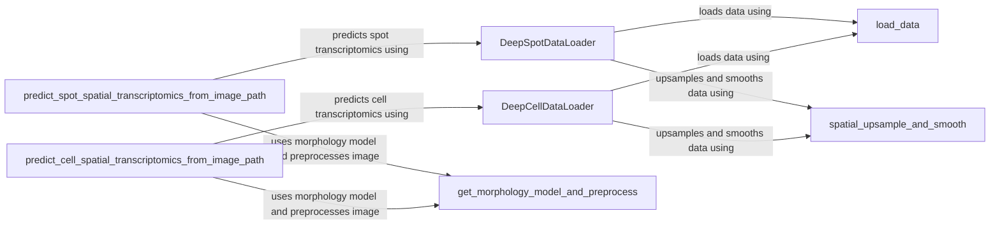

## Component Details

The Data Management and Preprocessing component is responsible for preparing spatial transcriptomics data for deep learning models. It includes loading data from various sources, preprocessing it to handle noise and resolution issues, and creating data loaders that can efficiently feed data to the models. The component supports both spot-based and cell-based data, ensuring that the data is in the correct format and structure for subsequent analysis by the DeepSpot and DeepCell models. It also integrates image processing techniques to extract relevant features from the images associated with the spatial transcriptomics data.

### DeepSpotDataLoader
The DeepSpotDataLoader class is responsible for loading and preprocessing spatial transcriptomics data specifically for spot-based analysis. It inherits from `torch.utils.data.Dataset` and handles data transformations, batching, and access to individual data items. It prepares the data in a format suitable for training and evaluating deep learning models focused on spot-level analysis.
- **Related Classes/Methods**: `DeepSpot.deepspot.spot.dataloader.DeepSpotDataLoader`

### DeepCellDataLoader
The DeepCellDataLoader class is responsible for loading and preprocessing spatial transcriptomics data for cell-based analysis. Similar to DeepSpotDataLoader, it inherits from `torch.utils.data.Dataset` and manages data loading, transformations, and access for cell-based analysis. It ensures that the data is properly formatted and structured for training and evaluating deep learning models designed for cell-level analysis.
- **Related Classes/Methods**: `DeepSpot.deepspot.cell.dataloader.DeepCellDataLoader`

### load_data
The `load_data` function is a utility function that loads spatial transcriptomics data from a specified source, such as a file. It handles file reading, initial data parsing, and returns the data in a usable format (e.g., a Pandas DataFrame or a NumPy array). This function is used by both DeepSpotDataLoader and DeepCellDataLoader to ingest the raw data.
- **Related Classes/Methods**: `DeepSpot.deepspot.utils.utils_dataloader:load_data`

### spatial_upsample_and_smooth
The `spatial_upsample_and_smooth` function is a utility function that upsamples and smooths spatial transcriptomics data. This is used to improve the resolution and reduce noise in the data, enhancing the quality of the input for the deep learning models. It likely applies interpolation techniques for upsampling and smoothing filters to reduce noise.
- **Related Classes/Methods**: `DeepSpot.deepspot.utils.utils_dataloader:spatial_upsample_and_smooth`

### predict_spot_spatial_transcriptomics_from_image_path
The `predict_spot_spatial_transcriptomics_from_image_path` function predicts spot-based spatial transcriptomics from an image path. It integrates image processing and machine learning models to infer transcriptomic information from the image. It uses a pre-trained morphology model and the DeepSpotDataLoader to perform the prediction.
- **Related Classes/Methods**: `DeepSpot.deepspot.utils.utils_image:predict_spot_spatial_transcriptomics_from_image_path`

### predict_cell_spatial_transcriptomics_from_image_path
The `predict_cell_spatial_transcriptomics_from_image_path` function predicts cell-based spatial transcriptomics from an image path, similar to the spot-based prediction but tailored for cell-level analysis. It uses a pre-trained morphology model and the DeepCellDataLoader.
- **Related Classes/Methods**: `DeepSpot.deepspot.utils.utils_image:predict_cell_spatial_transcriptomics_from_image_path`

### get_morphology_model_and_preprocess
The `get_morphology_model_and_preprocess` function retrieves the morphology model and preprocesses the image. This function is responsible for loading a pre-trained model for morphological analysis and applying necessary preprocessing steps to the input image, such as normalization or resizing. The preprocessed image and the model are then used for prediction.
- **Related Classes/Methods**: `DeepSpot.deepspot.utils.utils_image:get_morphology_model_and_preprocess`
