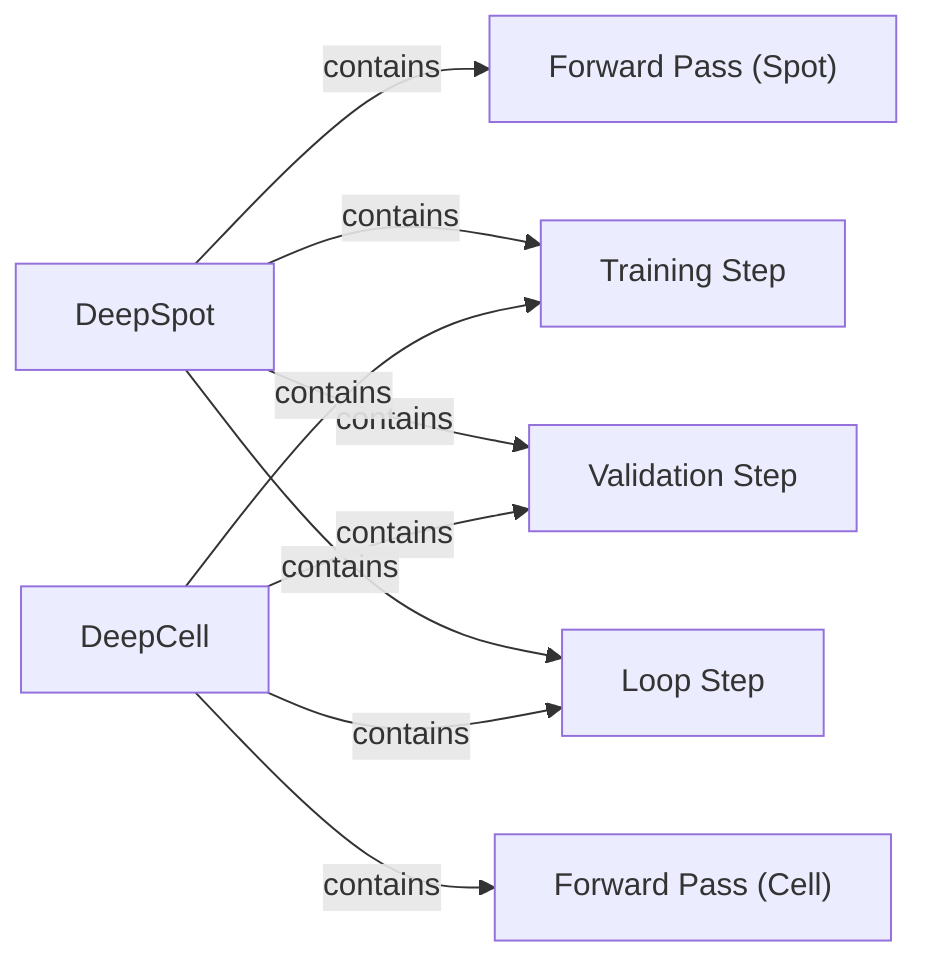

## Component Details

The Deep Learning Models component encompasses the DeepSpot and DeepCell models, which are PyTorch Lightning modules designed for spatial transcriptomics prediction. DeepSpot is used for spot-based analysis, considering interactions between spots, subspots, and neighboring spots. DeepCell, on the other hand, is used for cell-based analysis, focusing on interactions between cells and their neighbors. Both models implement forward passes, training, and validation steps, leveraging loss functions for optimization. The models inherit from PyTorch Lightning modules, which provide a structure for defining the training loop and managing the model's state.

### DeepSpot
The DeepSpot model is a PyTorch Lightning module designed for spot-based spatial transcriptomics analysis. It defines the network architecture and implements the forward pass, considering interactions between spots, subspots, and neighboring spots. It also includes training and validation steps for optimizing the model's parameters.
- **Related Classes/Methods**: `DeepSpot.deepspot.spot.model.DeepSpot`

### DeepCell
The DeepCell model is a PyTorch Lightning module designed for cell-based spatial transcriptomics analysis. It defines the network architecture and implements the forward pass, considering interactions between cells and their neighbors. It also includes training and validation steps for optimizing the model's parameters.
- **Related Classes/Methods**: `DeepSpot.deepspot.cell.model.DeepCell`

### Forward Pass (Spot)
The forward pass calculation for a DeepSpot object, considering different combinations of spot features, subspots, and neighboring spots. It includes methods for calculating the forward pass considering only the spot itself, subspots, neighbors, or both subspots and neighbors.
- **Related Classes/Methods**: `DeepSpot.deepspot.spot.model.DeepSpot:_forward_spot`, `DeepSpot.deepspot.spot.model.DeepSpot:_forward_spot_subspot`, `DeepSpot.deepspot.spot.model.DeepSpot:_forward_spot_neighbors`, `DeepSpot.deepspot.spot.model.DeepSpot:_forward_spot_subspot_neighbors`

### Forward Pass (Cell)
The forward pass calculation for a DeepCell object, considering the cell itself and its neighboring cells. It includes methods for calculating the forward pass considering only the cell itself or the cell and its neighbors.
- **Related Classes/Methods**: `DeepSpot.deepspot.cell.model.DeepCell:_forward_cell`, `DeepSpot.deepspot.cell.model.DeepCell:_forward_cell_neighbors`

### Training Step
Performs a single training step for either a DeepSpot or DeepCell object. This involves calculating the loss, performing backpropagation, and updating the model's parameters. It utilizes the loss functions defined in the Loss Functions component for optimization.
- **Related Classes/Methods**: `DeepSpot.deepspot.spot.model.DeepSpot:training_step`, `DeepSpot.deepspot.cell.model.DeepCell:training_step`

### Validation Step
Performs a single validation step for either a DeepSpot or DeepCell object. This involves calculating the loss and evaluating the model's performance on a validation dataset.
- **Related Classes/Methods**: `DeepSpot.deepspot.spot.model.DeepSpot:validation_step`, `DeepSpot.deepspot.cell.model.DeepCell:validation_step`

### Loop Step
Performs a single loop step for either a DeepSpot or DeepCell object. This might involve updating the model state or performing other iterative calculations during training or validation.
- **Related Classes/Methods**: `DeepSpot.deepspot.spot.model.DeepSpot:loop_step`, `DeepSpot.deepspot.cell.model.DeepCell:loop_step`
