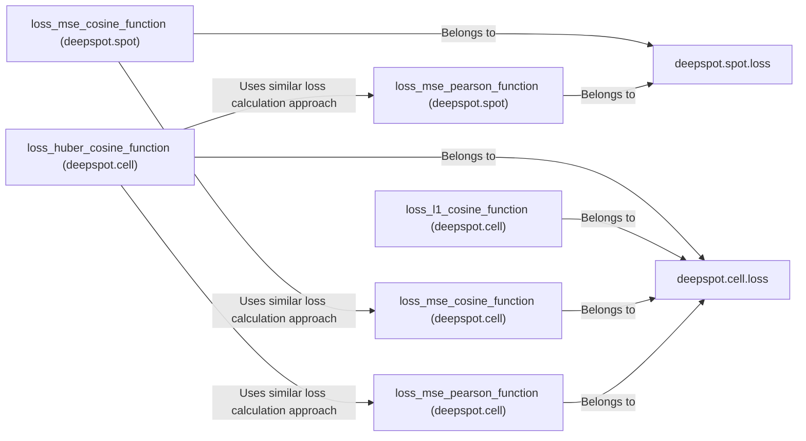

## Component Details

The Loss Functions and Optimization component defines various loss functions used to train the DeepSpot and DeepCell models. These loss functions, including MSE, Pearson correlation, cosine similarity, L1 loss, and Huber loss, calculate the difference between predicted and actual gene expression values during training. This difference guides the optimization process of the deep learning models, enabling them to learn and improve their predictive accuracy. The component is split into two sub-modules, one for 'spot' and one for 'cell', each containing a set of loss functions tailored to their specific needs.

### deepspot.spot.loss
This module contains the loss functions used for training the DeepSpot model, specifically for the 'spot' component. It includes functions like MSE, Pearson correlation, and cosine similarity, combined in different ways to optimize the model's performance.
- **Related Classes/Methods**: `DeepSpot.deepspot.spot.loss`

### deepspot.cell.loss
This module contains the loss functions used for training the DeepCell model, specifically for the 'cell' component. It includes functions like MSE, Pearson correlation, cosine similarity, L1 loss, and Huber loss, offering a variety of options to optimize the model's performance under different conditions and data characteristics.
- **Related Classes/Methods**: `DeepSpot.deepspot.cell.loss`

### loss_mse_pearson_function (deepspot.spot)
Calculates a loss based on the combination of Mean Squared Error (MSE) and Pearson correlation for the 'spot' module. It optimizes the model by considering both the magnitude of errors and the linear relationship between predicted and actual values, providing a balanced approach to training.
- **Related Classes/Methods**: `DeepSpot.deepspot.spot.loss:loss_mse_pearson_function`

### loss_mse_cosine_function (deepspot.spot)
Calculates a loss based on the combination of Mean Squared Error (MSE) and cosine similarity for the 'spot' module. It optimizes the model by considering both the magnitude of errors and the similarity in direction between predicted and actual values, useful when the direction of the prediction is more important than the exact magnitude.
- **Related Classes/Methods**: `DeepSpot.deepspot.spot.loss:loss_mse_cosine_function`

### loss_mse_pearson_function (deepspot.cell)
Calculates a loss based on the combination of Mean Squared Error (MSE) and Pearson correlation for the 'cell' module. It optimizes the model by considering both the magnitude of errors and the linear relationship between predicted and actual values, similar to its 'spot' counterpart but tailored for cell-specific data.
- **Related Classes/Methods**: `DeepSpot.deepspot.cell.loss:loss_mse_pearson_function`

### loss_mse_cosine_function (deepspot.cell)
Calculates a loss based on the combination of Mean Squared Error (MSE) and cosine similarity for the 'cell' module. It optimizes the model by considering both the magnitude of errors and the similarity in direction between predicted and actual values, again focusing on directional accuracy for cell data.
- **Related Classes/Methods**: `DeepSpot.deepspot.cell.loss:loss_mse_cosine_function`

### loss_l1_cosine_function (deepspot.cell)
Calculates a loss based on the combination of L1 loss (Mean Absolute Error) and cosine similarity for the 'cell' module. It optimizes the model by considering both the absolute magnitude of errors and the similarity in direction between predicted and actual values, potentially more robust to outliers than MSE-based losses.
- **Related Classes/Methods**: `DeepSpot.deepspot.cell.loss:loss_l1_cosine_function`

### loss_huber_cosine_function (deepspot.cell)
Calculates a loss based on the combination of Huber loss and cosine similarity for the 'cell' module. Huber loss is less sensitive to outliers than MSE. It optimizes the model by considering both the magnitude of errors (robust to outliers) and the similarity in direction between predicted and actual values, providing a robust and accurate training signal.
- **Related Classes/Methods**: `DeepSpot.deepspot.cell.loss:loss_huber_cosine_function`
