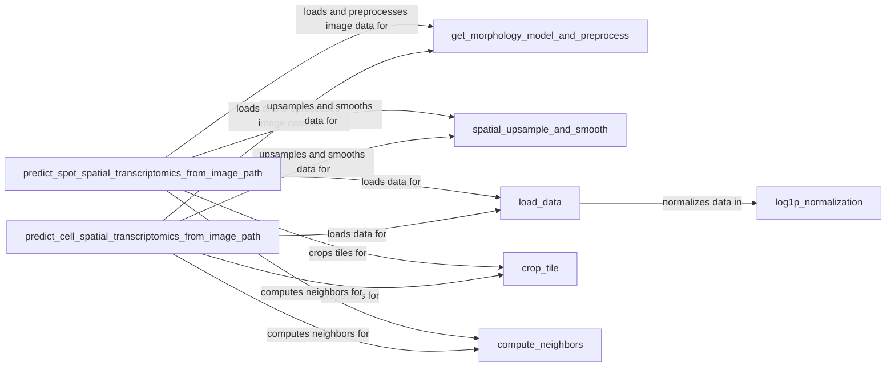

## Component Details

The Utilities and Support Functions component provides a suite of essential tools for image processing, data manipulation, and spatial data handling within the DeepSpot framework. These utilities are leveraged by other components to perform tasks such as image preprocessing, feature extraction, data normalization, and spatial data smoothing, enabling the core functionalities of spatial transcriptomics prediction and analysis.

### get_morphology_model_and_preprocess
Loads a pre-trained morphology model (e.g., ViT, ResNet, DenseNet) and its associated preprocessing steps. The model is used to extract image features. The preprocessing steps typically include resizing, normalization, and conversion to a tensor. This component is crucial for preparing image data for feature extraction.
- **Related Classes/Methods**: `DeepSpot.deepspot.utils.utils_image:get_morphology_model_and_preprocess`

### predict_spot_spatial_transcriptomics_from_image_path
Predicts spot-level spatial transcriptomics from an image path. It loads the image, crops tiles around spots, preprocesses the tiles using the morphology model's preprocessing steps, extracts features using the morphology model, and then uses a separate expression model to predict the transcriptomics. This is a core function for predicting gene expression at the spot level.
- **Related Classes/Methods**: `DeepSpot.deepspot.utils.utils_image:predict_spot_spatial_transcriptomics_from_image_path`

### predict_cell_spatial_transcriptomics_from_image_path
Predicts cell-level spatial transcriptomics from an image path. Similar to spot prediction, but operates at the cell level. It identifies neighboring cells, crops tiles around the cell and its neighbors, preprocesses the tiles, extracts features, and predicts transcriptomics. This function is essential for predicting gene expression at the cellular level.
- **Related Classes/Methods**: `DeepSpot.deepspot.utils.utils_image:predict_cell_spatial_transcriptomics_from_image_path`

### spatial_upsample_and_smooth
Upsamples and smooths the spatial data to improve the quality of the transcriptomics prediction. It uses neighborhood information to smooth the data and can integrate with clustering algorithms like Leiden or AESTETIK to improve the upsampling. This component enhances the spatial resolution and quality of the predicted transcriptomics data.
- **Related Classes/Methods**: `DeepSpot.deepspot.utils.utils_dataloader:spatial_upsample_and_smooth`

### load_data
Loads the image and expression data from specified paths. It handles loading expression data from pickle files, normalizes the expression data, and loads image features if available. It returns a dictionary containing the expression data, image features, and barcode information. This function is a crucial data loading and preprocessing step.
- **Related Classes/Methods**: `DeepSpot.deepspot.utils.utils_dataloader:load_data`

### crop_tile
Crops a tile from the image based on pixel coordinates and a specified diameter. This function is used to extract the region of interest around a spot or cell.
- **Related Classes/Methods**: `DeepSpot.deepspot.utils.utils_image`

### compute_neighbors
Computes the neighbors of a given spot or cell based on a specified radius. It uses a query to find neighboring cells within the radius and returns a string of their barcodes.
- **Related Classes/Methods**: `DeepSpot.deepspot.utils.utils_dataloader`

### log1p_normalization
Normalizes the gene expression data using a log1p transformation. This helps to reduce the skewness of the data and improve the performance of downstream analysis.
- **Related Classes/Methods**: `DeepSpot.deepspot.utils.utils_dataloader`
