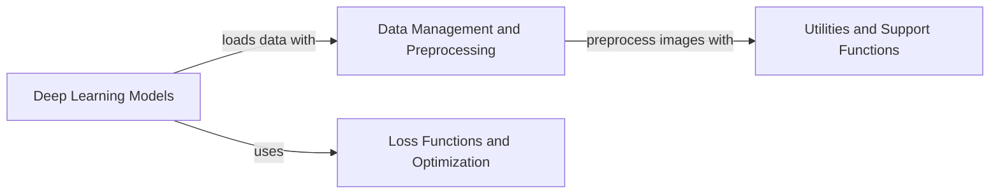

## Component Details

DeepSpot is a deep learning framework designed for spatial transcriptomics analysis. It provides functionalities for loading, preprocessing, and analyzing spatial gene expression data, with a focus on both spot-based and cell-based analysis. The framework includes deep learning models for predicting gene expression patterns and utilizes various loss functions to optimize model training. Utility functions are provided for common data manipulation and image processing tasks, supporting the core functionalities of the framework.

### Data Management and Preprocessing
This component is responsible for loading, preprocessing, and managing spatial transcriptomics data. It handles both spot-based and cell-based data, performing necessary image preprocessing steps and creating data loaders suitable for training the deep learning models. It ensures that the data is in the correct format and structure for subsequent analysis by the DeepSpot and DeepCell models.
- **Related Classes/Methods**: `DeepSpot.deepspot.spot.dataloader.DeepSpotDataLoader`, `DeepSpot.deepspot.cell.dataloader.DeepCellDataLoader`, `DeepSpot.deepspot.utils.utils_dataloader`, `DeepSpot.deepspot.utils.utils_image`

### Deep Learning Models
This component encompasses the core deep learning models used for spatial transcriptomics prediction. It includes both the DeepSpot model for spot-based analysis and the DeepCell model for cell-based analysis. These models define the network architectures, forward passes, and training/validation steps necessary for predicting gene expression patterns from spatial data. They rely on the Loss Functions component for optimization during training.
- **Related Classes/Methods**: `DeepSpot.deepspot.spot.model.DeepSpot`, `DeepSpot.deepspot.cell.model.DeepCell`

### Loss Functions and Optimization
This component defines the various loss functions used to train the DeepSpot and DeepCell models. It includes functions such as MSE, Pearson correlation, cosine similarity, L1 loss, and Huber loss. These loss functions are used to calculate the difference between predicted and actual gene expression values during training, guiding the optimization process of the deep learning models.
- **Related Classes/Methods**: `DeepSpot.deepspot.spot.loss`, `DeepSpot.deepspot.cell.loss`

### Utilities and Support Functions
This component provides a collection of utility functions for data manipulation, image processing, and other common tasks required by the framework. These utilities are used by other components, such as Data Management and Preprocessing, for tasks like image resizing, normalization, and data format conversion. They provide essential support for the core functionalities of the framework.
- **Related Classes/Methods**: `DeepSpot.deepspot.utils.utils`