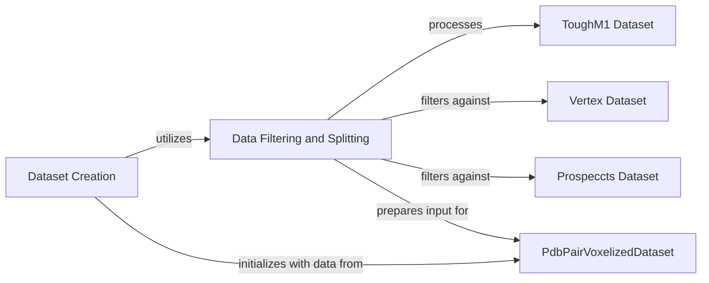

## Component Details

This component overview details the dataset preparation and management within the DeeplyTough system. It highlights the `Dataset Creation` component as the orchestrator, which leverages `Data Filtering and Splitting` to process the `ToughM1 Dataset` and filter it against `Vertex Dataset` and `Prospeccts Dataset`. The filtered and split data is then prepared for the `PdbPairVoxelizedDataset`, which represents the final voxelized data used for training and testing.

### Dataset Creation
This component is responsible for the overall process of preparing and initializing the datasets used in the DeeplyTough system. It orchestrates the loading, preprocessing, and final assembly of data, leveraging specialized components for filtering and splitting to generate the training and testing datasets.

**Related Classes/Methods**:

- <a href="https://github.com/benevolentAI/DeeplyTough/blob/master/deeplytough/engine/datasets.py#L236-L315" target="_blank" rel="noopener noreferrer">`DeeplyTough.deeplytough.engine.datasets.create_tough_dataset` (236:315)</a>

### Data Filtering and Splitting
This component encapsulates the logic for filtering and splitting the combined protein dataset. It specifically handles the exclusion of entries from the training set based on overlap with other datasets (Vertex, ProSPECCTS) and manages the division of data into training and testing subsets, preparing them for voxelization.

**Related Classes/Methods**:

- <a href="https://github.com/benevolentAI/DeeplyTough/blob/master/deeplytough/engine/datasets.py#L236-L315" target="_blank" rel="noopener noreferrer">`DeeplyTough.deeplytough.engine.datasets.create_tough_dataset` (236:315)</a>

### ToughM1 Dataset
This component represents the ToughM1 dataset, providing methods for preprocessing and retrieving structural information. It's a core dataset used for training and testing in the DeeplyTough system.

**Related Classes/Methods**:

- <a href="https://github.com/benevolentAI/DeeplyTough/blob/master/deeplytough/datasets/toughm1.py#L20-L253" target="_blank" rel="noopener noreferrer">`DeeplyTough.deeplytough.datasets.toughm1.ToughM1` (20:253)</a>
- <a href="https://github.com/benevolentAI/DeeplyTough/blob/master/deeplytough/datasets/toughm1.py#L101-L133" target="_blank" rel="noopener noreferrer">`DeeplyTough.deeplytough.datasets.toughm1.ToughM1.preprocess_once` (101:133)</a>
- <a href="https://github.com/benevolentAI/DeeplyTough/blob/master/deeplytough/datasets/toughm1.py#L167-L193" target="_blank" rel="noopener noreferrer">`DeeplyTough.deeplytough.datasets.toughm1.ToughM1.get_structures_splits` (167:193)</a>
- <a href="https://github.com/benevolentAI/DeeplyTough/blob/master/deeplytough/datasets/toughm1.py#L135-L165" target="_blank" rel="noopener noreferrer">`DeeplyTough.deeplytough.datasets.toughm1.ToughM1.get_structures` (135:165)</a>

### Vertex Dataset
This component handles the Vertex dataset, including its preprocessing and the retrieval of structural data. It's used to filter the training set of the ToughM1 dataset.

**Related Classes/Methods**:

- <a href="https://github.com/benevolentAI/DeeplyTough/blob/master/deeplytough/datasets/vertex.py#L18-L171" target="_blank" rel="noopener noreferrer">`DeeplyTough.deeplytough.datasets.vertex.Vertex` (18:171)</a>
- <a href="https://github.com/benevolentAI/DeeplyTough/blob/master/deeplytough/datasets/vertex.py#L40-L60" target="_blank" rel="noopener noreferrer">`DeeplyTough.deeplytough.datasets.vertex.Vertex.preprocess_once` (40:60)</a>
- <a href="https://github.com/benevolentAI/DeeplyTough/blob/master/deeplytough/datasets/vertex.py#L62-L99" target="_blank" rel="noopener noreferrer">`DeeplyTough.deeplytough.datasets.vertex.Vertex.get_structures` (62:99)</a>

### Prospeccts Dataset
This component manages the ProSPECCTS dataset, providing functionalities for preprocessing and accessing structural information. Similar to the Vertex dataset, it's used to filter the training set of the ToughM1 dataset.

**Related Classes/Methods**:

- <a href="https://github.com/benevolentAI/DeeplyTough/blob/master/deeplytough/datasets/prospeccts.py#L16-L228" target="_blank" rel="noopener noreferrer">`DeeplyTough.deeplytough.datasets.prospeccts.Prospeccts` (16:228)</a>
- <a href="https://github.com/benevolentAI/DeeplyTough/blob/master/deeplytough/datasets/prospeccts.py#L90-L114" target="_blank" rel="noopener noreferrer">`DeeplyTough.deeplytough.datasets.prospeccts.Prospeccts.preprocess_once` (90:114)</a>
- <a href="https://github.com/benevolentAI/DeeplyTough/blob/master/deeplytough/datasets/prospeccts.py#L141-L172" target="_blank" rel="noopener noreferrer">`DeeplyTough.deeplytough.datasets.prospeccts.Prospeccts.get_structures` (141:172)</a>

### PdbPairVoxelizedDataset
This component represents a voxelized dataset of PDB (Protein Data Bank) pairs. It's responsible for handling the actual data used for training and testing, including positive and negative pairs, and applying augmentations.

**Related Classes/Methods**:

- <a href="https://github.com/benevolentAI/DeeplyTough/blob/master/deeplytough/engine/datasets.py#L194-L212" target="_blank" rel="noopener noreferrer">`DeeplyTough.deeplytough.engine.datasets.PdbPairVoxelizedDataset` (194:212)</a>

### [FAQ](https://github.com/CodeBoarding/GeneratedOnBoardings/tree/main?tab=readme-ov-file#faq)