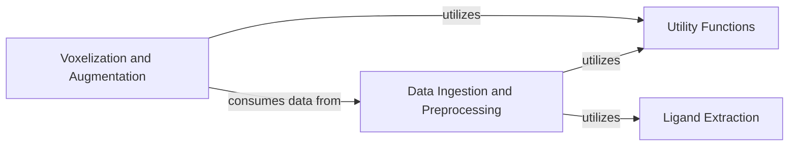

## Details

The `Data Pipeline` component is central to the DeeplyTough project, handling all aspects of data preparation for deep learning models. It encompasses raw data ingestion, preprocessing, transformation into a voxelized format, data augmentation, and efficient data loading. This component is crucial for ensuring that the models receive consistently prepared and optimized input, which is fundamental for the project's research-oriented deep learning application.

### Data Ingestion and Preprocessing
This sub-component is responsible for ingesting raw biological datasets from various sources (e.g., PDB files, pocket definitions) and performing initial preprocessing steps. This includes tasks like HTMD featurization, extracting pockets, and mapping PDB entries to UniProt accessions. It acts as the first stage of the data pipeline, preparing raw structural data for further processing.

**Related Classes/Methods**:

- `deeplytough.datasets` (1:100)
- <a href="https://github.com/benevolentAI/DeeplyTough/blob/master/deeplytough/datasets/custom.py#L4-L67" target="_blank" rel="noopener noreferrer">`deeplytough.datasets.Custom` (4:67)</a>
- <a href="https://github.com/benevolentAI/DeeplyTough/blob/master/deeplytough/datasets/prospeccts.py#L16-L228" target="_blank" rel="noopener noreferrer">`deeplytough.datasets.Prospeccts` (16:228)</a>
- `deeplytough.datasets.ToughM1` (1:100)
- <a href="https://github.com/benevolentAI/DeeplyTough/blob/master/deeplytough/datasets/vertex.py#L18-L171" target="_blank" rel="noopener noreferrer">`deeplytough.datasets.Vertex` (18:171)</a>

### Voxelization and Augmentation
This sub-component takes the preprocessed structural data and transforms it into a voxelized format suitable for 3D convolutional neural networks. It also applies various data augmentation techniques, such as rotation and mirroring, to enhance model robustness and generalization. This component is critical for converting raw structural information into a machine-learning-ready format.

**Related Classes/Methods**:

- <a href="https://github.com/benevolentAI/DeeplyTough/blob/master/deeplytough/engine/datasets.py#L19-L116" target="_blank" rel="noopener noreferrer">`deeplytough.engine.datasets.VoxelizedDataset` (19:116)</a>
- <a href="https://github.com/benevolentAI/DeeplyTough/blob/master/deeplytough/engine/datasets.py#L119-L191" target="_blank" rel="noopener noreferrer">`deeplytough.engine.datasets.PdbTupleVoxelizedDataset` (119:191)</a>
- <a href="https://github.com/benevolentAI/DeeplyTough/blob/master/deeplytough/engine/datasets.py#L194-L212" target="_blank" rel="noopener noreferrer">`deeplytough.engine.datasets.PdbPairVoxelizedDataset` (194:212)</a>

### Utility Functions
This component provides a collection of utility functions that support various stages of the data pipeline, particularly in preprocessing and featurization. This includes functions for HTMD featurization, calculating VOC AP (Average Precision), and handling RCSB PDB clusters.

**Related Classes/Methods**:

- <a href="https://github.com/benevolentAI/DeeplyTough/blob/master/deeplytough/misc/utils.py#L133-L201" target="_blank" rel="noopener noreferrer">`deeplytough.misc.utils.htmd_featurizer` (133:201)</a>
- <a href="https://github.com/benevolentAI/DeeplyTough/blob/master/deeplytough/misc/utils.py#L204-L224" target="_blank" rel="noopener noreferrer">`deeplytough.misc.utils.voc_ap` (204:224)</a>
- <a href="https://github.com/benevolentAI/DeeplyTough/blob/master/deeplytough/misc/utils.py#L242-L279" target="_blank" rel="noopener noreferrer">`deeplytough.misc.utils.RcsbPdbClusters` (242:279)</a>

### Ligand Extraction
This component focuses on the specific task of extracting pockets around ligands from protein structures. This is a crucial step for many structural biology applications, as the binding pocket is often the region of interest for drug discovery and protein-ligand interaction studies.

**Related Classes/Methods**:

- <a href="https://github.com/benevolentAI/DeeplyTough/blob/master/deeplytough/misc/ligand_extract.py#L84-L151" target="_blank" rel="noopener noreferrer">`deeplytough.misc.ligand_extract.PocketFromLigandDetector` (84:151)</a>

### [FAQ](https://github.com/CodeBoarding/GeneratedOnBoardings/tree/main?tab=readme-ov-file#faq)