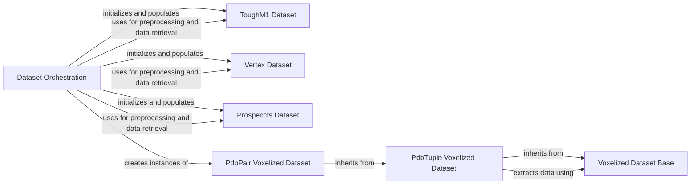

## Component Details

This graph illustrates the `Dataset Orchestration` component's role in preparing protein structure datasets for model consumption. It shows how `Dataset Orchestration` integrates and processes raw data from `ToughM1`, `Vertex`, and `Prospeccts` datasets, and then initializes specialized `PdbPair Voxelized Dataset` instances. The `PdbPair Voxelized Dataset` and `PdbTuple Voxelized Dataset` components are built upon the `Voxelized Dataset Base`, demonstrating a clear inheritance hierarchy for handling voxelized data.

### Dataset Orchestration
This component is responsible for the high-level orchestration of dataset creation. It integrates various raw protein structure datasets, handles filtering and splitting, and initializes the specialized voxelized datasets for consumption by the model.

**Related Classes/Methods**:

- <a href="https://github.com/benevolentAI/DeeplyTough/blob/master/deeplytough/engine/datasets.py#L236-L315" target="_blank" rel="noopener noreferrer">`DeeplyTough.deeplytough.engine.datasets.create_tough_dataset` (236:315)</a>

### ToughM1 Dataset
This component manages the ToughM1 dataset, including its preprocessing and the retrieval of structural data. It provides methods to get structures and split them for training and testing purposes.

**Related Classes/Methods**:

- <a href="https://github.com/benevolentAI/DeeplyTough/blob/master/deeplytough/datasets/toughm1.py#L20-L253" target="_blank" rel="noopener noreferrer">`DeeplyTough.deeplytough.datasets.toughm1.ToughM1` (20:253)</a>
- <a href="https://github.com/benevolentAI/DeeplyTough/blob/master/deeplytough/datasets/toughm1.py#L101-L133" target="_blank" rel="noopener noreferrer">`DeeplyTough.deeplytough.datasets.toughm1.ToughM1.preprocess_once` (101:133)</a>
- <a href="https://github.com/benevolentAI/DeeplyTough/blob/master/deeplytough/datasets/toughm1.py#L167-L193" target="_blank" rel="noopener noreferrer">`DeeplyTough.deeplytough.datasets.toughm1.ToughM1.get_structures_splits` (167:193)</a>
- <a href="https://github.com/benevolentAI/DeeplyTough/blob/master/deeplytough/datasets/toughm1.py#L135-L165" target="_blank" rel="noopener noreferrer">`DeeplyTough.deeplytough.datasets.toughm1.ToughM1.get_structures` (135:165)</a>

### Vertex Dataset
This component handles the Vertex dataset, including its preprocessing and the retrieval of structural data. It provides methods to get structures and preprocess them.

**Related Classes/Methods**:

- <a href="https://github.com/benevolentAI/DeeplyTough/blob/master/deeplytough/datasets/vertex.py#L18-L171" target="_blank" rel="noopener noreferrer">`DeeplyTough.deeplytough.datasets.vertex.Vertex` (18:171)</a>
- <a href="https://github.com/benevolentAI/DeeplyTough/blob/master/deeplytough/datasets/vertex.py#L40-L60" target="_blank" rel="noopener noreferrer">`DeeplyTough.deeplytough.datasets.vertex.Vertex.preprocess_once` (40:60)</a>
- <a href="https://github.com/benevolentAI/DeeplyTough/blob/master/deeplytough/datasets/vertex.py#L62-L99" target="_blank" rel="noopener noreferrer">`DeeplyTough.deeplytough.datasets.vertex.Vertex.get_structures` (62:99)</a>

### Prospeccts Dataset
This component manages the Prospeccts dataset, including its preprocessing and the retrieval of structural data. It provides methods to get structures and preprocess them, and also defines the internal paths for Prospeccts data.

**Related Classes/Methods**:

- <a href="https://github.com/benevolentAI/DeeplyTough/blob/master/deeplytough/datasets/prospeccts.py#L16-L228" target="_blank" rel="noopener noreferrer">`DeeplyTough.deeplytough.datasets.prospeccts.Prospeccts` (16:228)</a>
- <a href="https://github.com/benevolentAI/DeeplyTough/blob/master/deeplytough/datasets/prospeccts.py#L90-L114" target="_blank" rel="noopener noreferrer">`DeeplyTough.deeplytough.datasets.prospeccts.Prospeccts.preprocess_once` (90:114)</a>
- <a href="https://github.com/benevolentAI/DeeplyTough/blob/master/deeplytough/datasets/prospeccts.py#L141-L172" target="_blank" rel="noopener noreferrer">`DeeplyTough.deeplytough.datasets.prospeccts.Prospeccts.get_structures` (141:172)</a>
- <a href="https://github.com/benevolentAI/DeeplyTough/blob/master/deeplytough/datasets/prospeccts.py#L116-L139" target="_blank" rel="noopener noreferrer">`DeeplyTough.deeplytough.datasets.prospeccts.Prospeccts._prospeccts_paths` (116:139)</a>

### Voxelized Dataset Base
This is the base component for voxelized datasets, providing core functionalities for sampling augmentations, extracting volumes, and getting occupancy information. It serves as a foundational class for more specific voxelized dataset implementations.

**Related Classes/Methods**:

- <a href="https://github.com/benevolentAI/DeeplyTough/blob/master/deeplytough/engine/datasets.py#L19-L116" target="_blank" rel="noopener noreferrer">`DeeplyTough.deeplytough.engine.datasets.VoxelizedDataset` (19:116)</a>
- <a href="https://github.com/benevolentAI/DeeplyTough/blob/master/deeplytough/engine/datasets.py#L26-L52" target="_blank" rel="noopener noreferrer">`DeeplyTough.deeplytough.engine.datasets.VoxelizedDataset.__init__` (26:52)</a>
- <a href="https://github.com/benevolentAI/DeeplyTough/blob/master/deeplytough/engine/datasets.py#L60-L73" target="_blank" rel="noopener noreferrer">`DeeplyTough.deeplytough.engine.datasets.VoxelizedDataset._sample_augmentation` (60:73)</a>
- <a href="https://github.com/benevolentAI/DeeplyTough/blob/master/deeplytough/engine/datasets.py#L75-L96" target="_blank" rel="noopener noreferrer">`DeeplyTough.deeplytough.engine.datasets.VoxelizedDataset._extract_volume` (75:96)</a>
- <a href="https://github.com/benevolentAI/DeeplyTough/blob/master/deeplytough/engine/datasets.py#L99-L116" target="_blank" rel="noopener noreferrer">`DeeplyTough.deeplytough.engine.datasets.VoxelizedDataset._getOccupancyC` (99:116)</a>

### PdbTuple Voxelized Dataset
This component extends the Voxelized Dataset Base and is responsible for handling voxelized PDB tuple data. It provides methods for initializing the dataset and extracting patches from the voxelized data.

**Related Classes/Methods**:

- <a href="https://github.com/benevolentAI/DeeplyTough/blob/master/deeplytough/engine/datasets.py#L119-L191" target="_blank" rel="noopener noreferrer">`DeeplyTough.deeplytough.engine.datasets.PdbTupleVoxelizedDataset` (119:191)</a>
- <a href="https://github.com/benevolentAI/DeeplyTough/blob/master/deeplytough/engine/datasets.py#L122-L150" target="_blank" rel="noopener noreferrer">`DeeplyTough.deeplytough.engine.datasets.PdbTupleVoxelizedDataset.__init__` (122:150)</a>
- <a href="https://github.com/benevolentAI/DeeplyTough/blob/master/deeplytough/engine/datasets.py#L152-L191" target="_blank" rel="noopener noreferrer">`DeeplyTough.deeplytough.engine.datasets.PdbTupleVoxelizedDataset._get_patch` (152:191)</a>

### PdbPair Voxelized Dataset
This component specializes in handling voxelized PDB pair data. It inherits from PdbTupleVoxelizedDataset and is used to create datasets for training and testing, specifically for pairs of PDB structures.

**Related Classes/Methods**:

- <a href="https://github.com/benevolentAI/DeeplyTough/blob/master/deeplytough/engine/datasets.py#L194-L212" target="_blank" rel="noopener noreferrer">`DeeplyTough.deeplytough.engine.datasets.PdbPairVoxelizedDataset` (194:212)</a>
- <a href="https://github.com/benevolentAI/DeeplyTough/blob/master/deeplytough/engine/datasets.py#L197-L199" target="_blank" rel="noopener noreferrer">`DeeplyTough.deeplytough.engine.datasets.PdbPairVoxelizedDataset.__len__` (197:199)</a>

### [FAQ](https://github.com/CodeBoarding/GeneratedOnBoardings/tree/main?tab=readme-ov-file#faq)