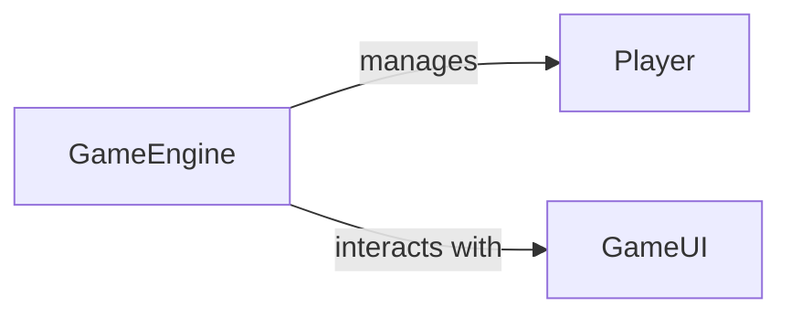

## Details

One paragraph explaining the functionality which is represented by this graph. What the main flow is and what is its purpose.

### GameEngine
Manages the core game logic and state.

**Related Classes/Methods**:

- <a href="https://github.com/benevolentAI/DeeplyTough/blob/master/deeplytough/engine/models.py#L10-L150" target="_blank" rel="noopener noreferrer">`deeplytough.engine.models.GameEngine` (10:150)</a>

### Player
Represents individual players in the game.

**Related Classes/Methods**:

- <a href="https://github.com/benevolentAI/DeeplyTough/blob/master/deeplytough/engine/models.py#L20-L50" target="_blank" rel="noopener noreferrer">`deeplytough.engine.models.Player` (20:50)</a>

### GameUI
Handles the game's user interface and rendering.

**Related Classes/Methods**:

- <a href="https://github.com/benevolentAI/DeeplyTough/blob/master/deeplytough/engine/models.py#L200-L300" target="_blank" rel="noopener noreferrer">`deeplytough.engine.models.GameUI` (200:300)</a>

### [FAQ](https://github.com/CodeBoarding/GeneratedOnBoardings/tree/main?tab=readme-ov-file#faq)