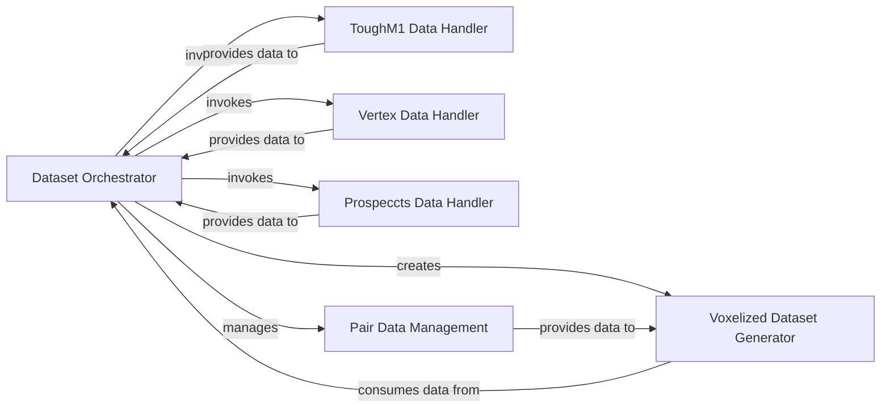

## Component Details

This system orchestrates the creation of the TOUGH dataset, which involves preprocessing various sub-datasets (ToughM1, Vertex, Prospeccts), filtering data based on exclusion criteria, and constructing voxelized training and testing datasets. It manages the reading and preparation of positive and negative pocket pairs, shuffles them, and then uses these pairs along with processed PDB structures to generate the final voxelized datasets for training and testing, incorporating augmentation techniques.

### Dataset Orchestrator
This component is responsible for orchestrating the creation of the TOUGH dataset, including preprocessing various sub-datasets (ToughM1, Vertex, Prospeccts), filtering data based on exclusion criteria, and finally constructing the voxelized training and testing datasets.

**Related Classes/Methods**:

- <a href="https://github.com/benevolentAI/DeeplyTough/blob/master/deeplytough/engine/datasets.py#L236-L315" target="_blank" rel="noopener noreferrer">`deeplytough.engine.datasets.create_tough_dataset` (236:315)</a>

### ToughM1 Data Handler
This component handles the preprocessing and splitting of the ToughM1 dataset, providing the core structures for training and testing.

**Related Classes/Methods**:

- <a href="https://github.com/benevolentAI/DeeplyTough/blob/master/deeplytough/datasets/toughm1.py#L20-L253" target="_blank" rel="noopener noreferrer">`deeplytough.datasets.toughm1.ToughM1` (20:253)</a>
- <a href="https://github.com/benevolentAI/DeeplyTough/blob/master/deeplytough/datasets/toughm1.py#L101-L133" target="_blank" rel="noopener noreferrer">`deeplytough.datasets.toughm1.ToughM1.preprocess_once` (101:133)</a>
- <a href="https://github.com/benevolentAI/DeeplyTough/blob/master/deeplytough/datasets/toughm1.py#L167-L193" target="_blank" rel="noopener noreferrer">`deeplytough.datasets.toughm1.ToughM1.get_structures_splits` (167:193)</a>

### Vertex Data Handler
This component manages the Vertex dataset, including its preprocessing and retrieval of structures, which can then be used to filter the main training dataset.

**Related Classes/Methods**:

- <a href="https://github.com/benevolentAI/DeeplyTough/blob/master/deeplytough/datasets/vertex.py#L18-L171" target="_blank" rel="noopener noreferrer">`deeplytough.datasets.vertex.Vertex` (18:171)</a>
- <a href="https://github.com/benevolentAI/DeeplyTough/blob/master/deeplytough/datasets/vertex.py#L40-L60" target="_blank" rel="noopener noreferrer">`deeplytough.datasets.vertex.Vertex.preprocess_once` (40:60)</a>
- <a href="https://github.com/benevolentAI/DeeplyTough/blob/master/deeplytough/datasets/vertex.py#L62-L99" target="_blank" rel="noopener noreferrer">`deeplytough.datasets.vertex.Vertex.get_structures` (62:99)</a>

### Prospeccts Data Handler
This component is responsible for handling the Prospeccts dataset, including preprocessing and retrieving structures, which are used to filter the main training dataset.

**Related Classes/Methods**:

- <a href="https://github.com/benevolentAI/DeeplyTough/blob/master/deeplytough/datasets/prospeccts.py#L16-L228" target="_blank" rel="noopener noreferrer">`deeplytough.datasets.prospeccts.Prospeccts` (16:228)</a>
- <a href="https://github.com/benevolentAI/DeeplyTough/blob/master/deeplytough/datasets/prospeccts.py#L90-L114" target="_blank" rel="noopener noreferrer">`deeplytough.datasets.prospeccts.Prospeccts.preprocess_once` (90:114)</a>
- <a href="https://github.com/benevolentAI/DeeplyTough/blob/master/deeplytough/datasets/prospeccts.py#L141-L172" target="_blank" rel="noopener noreferrer">`deeplytough.datasets.prospeccts.Prospeccts.get_structures` (141:172)</a>

### Voxelized Dataset Generator
This component is responsible for creating the final voxelized dataset instances (training and testing) from the processed PDB pairs and structures, applying various augmentation techniques.

**Related Classes/Methods**:

- <a href="https://github.com/benevolentAI/DeeplyTough/blob/master/deeplytough/engine/datasets.py#L194-L212" target="_blank" rel="noopener noreferrer">`deeplytough.engine.datasets.PdbPairVoxelizedDataset` (194:212)</a>

### Pair Data Management
This component is responsible for reading, preparing, and managing positive and negative pocket pairs from predefined lists, including shuffling them for dataset construction.

**Related Classes/Methods**:

- <a href="https://github.com/benevolentAI/DeeplyTough/blob/master/deeplytough/engine/datasets.py#L236-L315" target="_blank" rel="noopener noreferrer">`DeeplyTough.deeplytough.engine.datasets.create_tough_dataset` (236:315)</a>

### [FAQ](https://github.com/CodeBoarding/GeneratedOnBoardings/tree/main?tab=readme-ov-file#faq)