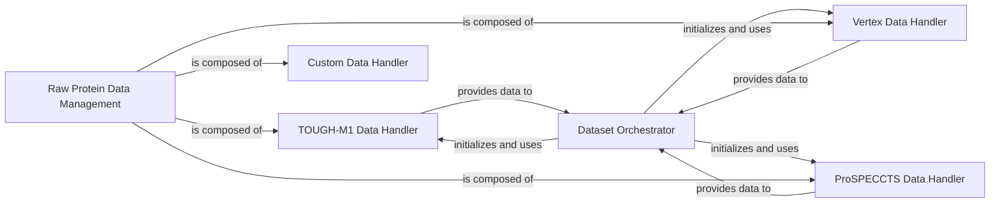

## Component Details

This subsystem is responsible for the comprehensive management of raw protein data, encompassing initial preprocessing, retrieval, and organization from diverse datasets such as TOUGH-M1, Vertex, ProSPECCTS, and custom sources. It orchestrates the preparation of these datasets for downstream tasks, including data splitting, filtering, and the initialization of voxelized datasets for model training and evaluation. The core functionality revolves around specialized data handlers for each dataset type, ensuring data integrity and readiness for analysis.

### Raw Protein Data Management
This component manages the initial preprocessing and retrieval of protein structures from various raw datasets, including TOUGH-M1, Vertex, ProSPECCTS, and custom datasets. It acts as an overarching conceptual component for all individual data handlers.

**Related Classes/Methods**:

- <a href="https://github.com/benevolentAI/DeeplyTough/blob/master/deeplytough/datasets/toughm1.py#L20-L253" target="_blank" rel="noopener noreferrer">`DeeplyTough.deeplytough.datasets.toughm1.ToughM1` (20:253)</a>
- <a href="https://github.com/benevolentAI/DeeplyTough/blob/master/deeplytough/datasets/toughm1.py#L101-L133" target="_blank" rel="noopener noreferrer">`DeeplyTough.deeplytough.datasets.toughm1.ToughM1.preprocess_once` (101:133)</a>
- <a href="https://github.com/benevolentAI/DeeplyTough/blob/master/deeplytough/datasets/toughm1.py#L167-L193" target="_blank" rel="noopener noreferrer">`DeeplyTough.deeplytough.datasets.toughm1.ToughM1.get_structures_splits` (167:193)</a>
- <a href="https://github.com/benevolentAI/DeeplyTough/blob/master/deeplytough/datasets/vertex.py#L18-L171" target="_blank" rel="noopener noreferrer">`DeeplyTough.deeplytough.datasets.vertex.Vertex` (18:171)</a>
- <a href="https://github.com/benevolentAI/DeeplyTough/blob/master/deeplytough/datasets/vertex.py#L40-L60" target="_blank" rel="noopener noreferrer">`DeeplyTough.deeplytough.datasets.vertex.Vertex.preprocess_once` (40:60)</a>
- <a href="https://github.com/benevolentAI/DeeplyTough/blob/master/deeplytough/datasets/vertex.py#L62-L99" target="_blank" rel="noopener noreferrer">`DeeplyTough.deeplytough.datasets.vertex.Vertex.get_structures` (62:99)</a>
- <a href="https://github.com/benevolentAI/DeeplyTough/blob/master/deeplytough/datasets/prospeccts.py#L16-L228" target="_blank" rel="noopener noreferrer">`DeeplyTough.deeplytough.datasets.prospeccts.Prospeccts` (16:228)</a>
- <a href="https://github.com/benevolentAI/DeeplyTough/blob/master/deeplytough/datasets/prospeccts.py#L90-L114" target="_blank" rel="noopener noreferrer">`DeeplyTough.deeplytough.datasets.prospeccts.Prospeccts.preprocess_once` (90:114)</a>
- <a href="https://github.com/benevolentAI/DeeplyTough/blob/master/deeplytough/datasets/prospeccts.py#L141-L172" target="_blank" rel="noopener noreferrer">`DeeplyTough.deeplytough.datasets.prospeccts.Prospeccts.get_structures` (141:172)</a>
- <a href="https://github.com/benevolentAI/DeeplyTough/blob/master/deeplytough/datasets/custom.py#L17-L19" target="_blank" rel="noopener noreferrer">`DeeplyTough.deeplytough.datasets.custom.Custom.preprocess_once` (17:19)</a>
- <a href="https://github.com/benevolentAI/DeeplyTough/blob/master/deeplytough/datasets/custom.py#L21-L44" target="_blank" rel="noopener noreferrer">`DeeplyTough.deeplytough.datasets.custom.Custom.get_structures` (21:44)</a>

### Dataset Orchestrator
This component is responsible for orchestrating the creation and preparation of the TOUGH-M1 dataset, integrating data from various sources like TOUGH-M1, Vertex, and ProSPECCTS. It handles preprocessing, data splitting into training and testing sets, and filtering based on specified criteria (e.g., excluding entries present in other datasets). It also initializes the final voxelized dataset for model training and evaluation.

**Related Classes/Methods**:

- <a href="https://github.com/benevolentAI/DeeplyTough/blob/master/deeplytough/engine/datasets.py#L236-L315" target="_blank" rel="noopener noreferrer">`DeeplyTough.deeplytough.engine.datasets.create_tough_dataset` (236:315)</a>
- <a href="https://github.com/benevolentAI/DeeplyTough/blob/master/deeplytough/engine/datasets.py#L194-L212" target="_blank" rel="noopener noreferrer">`DeeplyTough.deeplytough.engine.datasets.PdbPairVoxelizedDataset` (194:212)</a>

### TOUGH-M1 Data Handler
This component manages the TOUGH-M1 dataset, including its preprocessing, structure retrieval, and splitting into training and testing subsets. It handles tasks like running `fpocket2` for pocket identification, mapping PDB chains to UniProt accessions, and evaluating pocket matching performance using AUC metrics.

**Related Classes/Methods**:

- <a href="https://github.com/benevolentAI/DeeplyTough/blob/master/deeplytough/datasets/toughm1.py#L20-L253" target="_blank" rel="noopener noreferrer">`DeeplyTough.deeplytough.datasets.toughm1.ToughM1` (20:253)</a>
- <a href="https://github.com/benevolentAI/DeeplyTough/blob/master/deeplytough/datasets/toughm1.py#L101-L133" target="_blank" rel="noopener noreferrer">`DeeplyTough.deeplytough.datasets.toughm1.ToughM1.preprocess_once` (101:133)</a>
- <a href="https://github.com/benevolentAI/DeeplyTough/blob/master/deeplytough/datasets/toughm1.py#L167-L193" target="_blank" rel="noopener noreferrer">`DeeplyTough.deeplytough.datasets.toughm1.ToughM1.get_structures_splits` (167:193)</a>
- <a href="https://github.com/benevolentAI/DeeplyTough/blob/master/deeplytough/datasets/toughm1.py#L135-L165" target="_blank" rel="noopener noreferrer">`DeeplyTough.deeplytough.datasets.toughm1.ToughM1.get_structures` (135:165)</a>
- <a href="https://github.com/benevolentAI/DeeplyTough/blob/master/deeplytough/datasets/toughm1.py#L29-L99" target="_blank" rel="noopener noreferrer">`DeeplyTough.deeplytough.datasets.toughm1.ToughM1._preprocess_worker` (29:99)</a>
- <a href="https://github.com/benevolentAI/DeeplyTough/blob/master/deeplytough/datasets/toughm1.py#L195-L253" target="_blank" rel="noopener noreferrer">`DeeplyTough.deeplytough.datasets.toughm1.ToughM1.evaluate_matching` (195:253)</a>

### Vertex Data Handler
This component is responsible for handling the Vertex dataset. Its primary functions include preprocessing the dataset and retrieving the structural information, which can then be used by the Dataset Orchestrator for filtering the main TOUGH-M1 training set.

**Related Classes/Methods**:

- <a href="https://github.com/benevolentAI/DeeplyTough/blob/master/deeplytough/datasets/vertex.py#L18-L171" target="_blank" rel="noopener noreferrer">`DeeplyTough.deeplytough.datasets.vertex.Vertex` (18:171)</a>
- <a href="https://github.com/benevolentAI/DeeplyTough/blob/master/deeplytough/datasets/vertex.py#L40-L60" target="_blank" rel="noopener noreferrer">`DeeplyTough.deeplytough.datasets.vertex.Vertex.preprocess_once` (40:60)</a>
- <a href="https://github.com/benevolentAI/DeeplyTough/blob/master/deeplytough/datasets/vertex.py#L62-L99" target="_blank" rel="noopener noreferrer">`DeeplyTough.deeplytough.datasets.vertex.Vertex.get_structures` (62:99)</a>

### ProSPECCTS Data Handler
This component manages the ProSPECCTS dataset. It provides functionalities for preprocessing the dataset and retrieving its structural data. Similar to the Vertex Data Handler, its output is utilized by the Dataset Orchestrator to refine the TOUGH-M1 training set by excluding overlapping entries.

**Related Classes/Methods**:

- <a href="https://github.com/benevolentAI/DeeplyTough/blob/master/deeplytough/datasets/prospeccts.py#L16-L228" target="_blank" rel="noopener noreferrer">`DeeplyTough.deeplytough.datasets.prospeccts.Prospeccts` (16:228)</a>
- <a href="https://github.com/benevolentAI/DeeplyTough/blob/master/deeplytough/datasets/prospeccts.py#L90-L114" target="_blank" rel="noopener noreferrer">`DeeplyTough.deeplytough.datasets.prospeccts.Prospeccts.preprocess_once` (90:114)</a>
- <a href="https://github.com/benevolentAI/DeeplyTough/blob/master/deeplytough/datasets/prospeccts.py#L141-L172" target="_blank" rel="noopener noreferrer">`DeeplyTough.deeplytough.datasets.prospeccts.Prospeccts.get_structures` (141:172)</a>
- <a href="https://github.com/benevolentAI/DeeplyTough/blob/master/deeplytough/datasets/prospeccts.py#L49-L88" target="_blank" rel="noopener noreferrer">`DeeplyTough.deeplytough.datasets.prospeccts.Prospeccts._extract_pocket_and_get_uniprot` (49:88)</a>
- <a href="https://github.com/benevolentAI/DeeplyTough/blob/master/deeplytough/datasets/prospeccts.py#L25-L46" target="_blank" rel="noopener noreferrer">`DeeplyTough.deeplytough.datasets.prospeccts.Prospeccts._get_pdb_code_from_raw_pdb` (25:46)</a>
- <a href="https://github.com/benevolentAI/DeeplyTough/blob/master/deeplytough/datasets/prospeccts.py#L116-L139" target="_blank" rel="noopener noreferrer">`DeeplyTough.deeplytough.datasets.prospeccts.Prospeccts._prospeccts_paths` (116:139)</a>
- <a href="https://github.com/benevolentAI/DeeplyTough/blob/master/deeplytough/datasets/prospeccts.py#L174-L228" target="_blank" rel="noopener noreferrer">`DeeplyTough.deeplytough.datasets.prospeccts.Prospeccts.evaluate_matching` (174:228)</a>

### Custom Data Handler
This component provides basic functionalities for handling custom datasets, specifically for preprocessing and retrieving structural information. While not directly involved in the `create_tough_dataset` flow shown in the CFG, it represents a generic interface for custom data integration.

**Related Classes/Methods**:

- <a href="https://github.com/benevolentAI/DeeplyTough/blob/master/deeplytough/datasets/custom.py#L4-L67" target="_blank" rel="noopener noreferrer">`DeeplyTough.deeplytough.datasets.custom.Custom` (4:67)</a>
- <a href="https://github.com/benevolentAI/DeeplyTough/blob/master/deeplytough/datasets/custom.py#L17-L19" target="_blank" rel="noopener noreferrer">`DeeplyTough.deeplytough.datasets.custom.Custom.preprocess_once` (17:19)</a>
- <a href="https://github.com/benevolentAI/DeeplyTough/blob/master/deeplytough/datasets/custom.py#L21-L44" target="_blank" rel="noopener noreferrer">`DeeplyTough.deeplytough.datasets.custom.Custom.get_structures` (21:44)</a>

### [FAQ](https://github.com/CodeBoarding/GeneratedOnBoardings/tree/main?tab=readme-ov-file#faq)