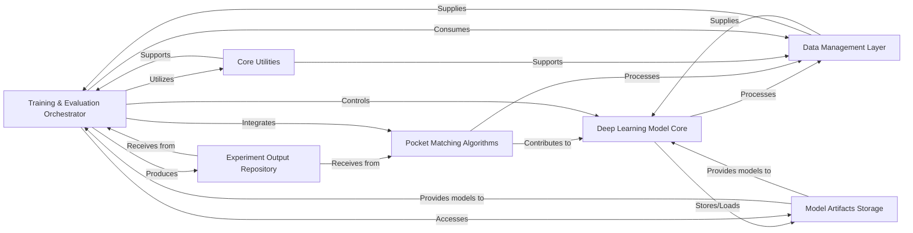

## Details

The Training & Evaluation Engine is a fundamental component in this research-oriented deep learning application, serving as the central control unit for the entire model lifecycle. Its importance stems from its role in orchestrating the complex processes of model training, optimization, and rigorous performance evaluation, which are critical for deep learning research.

### Training & Evaluation Orchestrator
This component is the central orchestrator for the model's learning process and performance assessment. It manages the training loop, including optimizer configuration, learning rate scheduling, loss computation, logging metrics (e.g., to TensorBoard), and saving/resuming model checkpoints. It also initiates and coordinates benchmark evaluations to assess model performance against established datasets (PROSPECCTS, ToughM1, Vertex). It acts as the primary user interface for running experiments.

**Related Classes/Methods**:

- <a href="https://github.com/benevolentAI/DeeplyTough/blob/master/deeplytough/scripts/train.py" target="_blank" rel="noopener noreferrer">`deeplytough/scripts/train.py`</a>
- <a href="https://github.com/benevolentAI/DeeplyTough/blob/master/deeplytough/scripts/prospeccts_benchmark.py" target="_blank" rel="noopener noreferrer">`deeplytough/scripts/prospeccts_benchmark.py`</a>
- <a href="https://github.com/benevolentAI/DeeplyTough/blob/master/deeplytough/scripts/toughm1_benchmark.py" target="_blank" rel="noopener noreferrer">`deeplytough/scripts/toughm1_benchmark.py`</a>
- <a href="https://github.com/benevolentAI/DeeplyTough/blob/master/deeplytough/scripts/vertex_benchmark.py" target="_blank" rel="noopener noreferrer">`deeplytough/scripts/vertex_benchmark.py`</a>
- <a href="https://github.com/benevolentAI/DeeplyTough/blob/master/deeplytough/scripts/custom_evaluation.py" target="_blank" rel="noopener noreferrer">`deeplytough/scripts/custom_evaluation.py`</a>

### Data Management Layer
Responsible for handling various datasets, including loading, preprocessing, and providing data to other components. It abstracts the specifics of different datasets (PROSPECCTS, ToughM1, Vertex, Custom).

**Related Classes/Methods**:

- <a href="https://github.com/benevolentAI/DeeplyTough/blob/master/deeplytough/datasets/__init__.py" target="_blank" rel="noopener noreferrer">`deeplytough/datasets/__init__.py`</a>
- <a href="https://github.com/benevolentAI/DeeplyTough/blob/master/deeplytough/datasets/custom.py" target="_blank" rel="noopener noreferrer">`deeplytough/datasets/custom.py`</a>
- <a href="https://github.com/benevolentAI/DeeplyTough/blob/master/deeplytough/datasets/prospeccts.py" target="_blank" rel="noopener noreferrer">`deeplytough/datasets/prospeccts.py`</a>
- <a href="https://github.com/benevolentAI/DeeplyTough/blob/master/deeplytough/datasets/toughm1.py" target="_blank" rel="noopener noreferrer">`deeplytough/datasets/toughm1.py`</a>
- <a href="https://github.com/benevolentAI/DeeplyTough/blob/master/deeplytough/datasets/vertex.py" target="_blank" rel="noopener noreferrer">`deeplytough/datasets/vertex.py`</a>
- <a href="https://github.com/benevolentAI/DeeplyTough/blob/master/deeplytough/engine/datasets.py" target="_blank" rel="noopener noreferrer">`deeplytough/engine/datasets.py`</a>

### Deep Learning Model Core
Contains the definitions and implementations of the deep learning models (neural network architectures) and their fundamental forward pass and prediction logic. This is where the "intelligence" of the application resides.

**Related Classes/Methods**:

- <a href="https://github.com/benevolentAI/DeeplyTough/blob/master/deeplytough/engine/models.py" target="_blank" rel="noopener noreferrer">`deeplytough/engine/models.py`</a>
- <a href="https://github.com/benevolentAI/DeeplyTough/blob/master/deeplytough/engine/predictor.py" target="_blank" rel="noopener noreferrer">`deeplytough/engine/predictor.py`</a>

### Pocket Matching Algorithms
Implements specialized algorithms for comparing and evaluating protein pockets, such as `DeeplyTough`. These algorithms are crucial for the structural biology domain of the project.

**Related Classes/Methods**:

- <a href="https://github.com/benevolentAI/DeeplyTough/blob/master/deeplytough/matchers/__init__.py" target="_blank" rel="noopener noreferrer">`deeplytough/matchers/__init__.py`</a>
- <a href="https://github.com/benevolentAI/DeeplyTough/blob/master/deeplytough/matchers/deeply_tough.py" target="_blank" rel="noopener noreferrer">`deeplytough/matchers/deeply_tough.py`</a>
- <a href="https://github.com/benevolentAI/DeeplyTough/blob/master/deeplytough/matchers/pocket_matcher.py" target="_blank" rel="noopener noreferrer">`deeplytough/matchers/pocket_matcher.py`</a>
- <a href="https://github.com/benevolentAI/DeeplyTough/blob/master/deeplytough/matchers/tough_officials.py" target="_blank" rel="noopener noreferrer">`deeplytough/matchers/tough_officials.py`</a>

### Core Utilities
Provides a collection of general-purpose helper functions, including mathematical operations, data transformations, logging setup, argument parsing, and other reusable functionalities that support various parts of the application.

**Related Classes/Methods**:

- <a href="https://github.com/benevolentAI/DeeplyTough/blob/master/deeplytough/misc/cc_ligands.py" target="_blank" rel="noopener noreferrer">`deeplytough/misc/cc_ligands.py`</a>
- <a href="https://github.com/benevolentAI/DeeplyTough/blob/master/deeplytough/misc/ligand_extract.py" target="_blank" rel="noopener noreferrer">`deeplytough/misc/ligand_extract.py`</a>
- <a href="https://github.com/benevolentAI/DeeplyTough/blob/master/deeplytough/misc/utils.py" target="_blank" rel="noopener noreferrer">`deeplytough/misc/utils.py`</a>

### Model Artifacts Storage
A dedicated repository for storing pre-trained model weights and saved training checkpoints, facilitating model reuse, transfer learning, and the ability to resume interrupted training sessions.

**Related Classes/Methods**:

- `networks/deeplytough_prospeccts/`
- `networks/deeplytough_toughm1_test/`
- `networks/deeplytough_vertex/`

### Experiment Output Repository
Manages the storage of all experiment outputs, including detailed training logs, performance metrics (e.g., AUC scores), and structured results files (e.g., CSV, pickle files) generated during training and benchmarking.

**Related Classes/Methods**:

- `results/csv_files/`

### [FAQ](https://github.com/CodeBoarding/GeneratedOnBoardings/tree/main?tab=readme-ov-file#faq)