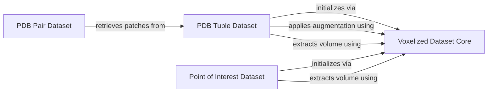

## Component Details

This subsystem, 'Voxelized Data Processing', provides foundational functionalities for handling and generating voxelized protein data. It includes abstract base classes for voxelized datasets, specialized datasets for PDB tuples and pairs, and datasets for points of interest. The core functionalities involve extracting volumetric data, sampling augmentations, managing occupancy grids, and constructing specialized voxelized datasets.

### Voxelized Dataset Core
This is an abstract base class for datasets of voxelized proteins. It provides core functionalities for handling PDB lists, defining box sizes, and implementing data augmentation techniques like rotation and mirroring. It also includes methods for extracting voxelized volumes from atomic coordinates and channels, and for calling a C function to compute occupancy values.

**Related Classes/Methods**:

- <a href="https://github.com/benevolentAI/DeeplyTough/blob/master/deeplytough/engine/datasets.py#L19-L116" target="_blank" rel="noopener noreferrer">`DeeplyTough.deeplytough.engine.datasets.VoxelizedDataset` (19:116)</a>
- <a href="https://github.com/benevolentAI/DeeplyTough/blob/master/deeplytough/engine/datasets.py#L26-L52" target="_blank" rel="noopener noreferrer">`DeeplyTough.deeplytough.engine.datasets.VoxelizedDataset.__init__` (26:52)</a>
- <a href="https://github.com/benevolentAI/DeeplyTough/blob/master/deeplytough/engine/datasets.py#L75-L96" target="_blank" rel="noopener noreferrer">`DeeplyTough.deeplytough.engine.datasets.VoxelizedDataset._extract_volume` (75:96)</a>
- <a href="https://github.com/benevolentAI/DeeplyTough/blob/master/deeplytough/engine/datasets.py#L99-L116" target="_blank" rel="noopener noreferrer">`DeeplyTough.deeplytough.engine.datasets.VoxelizedDataset._getOccupancyC` (99:116)</a>
- <a href="https://github.com/benevolentAI/DeeplyTough/blob/master/deeplytough/engine/datasets.py#L60-L73" target="_blank" rel="noopener noreferrer">`DeeplyTough.deeplytough.engine.datasets.VoxelizedDataset._sample_augmentation` (60:73)</a>

### PDB Tuple Dataset
This class extends VoxelizedDataset and is an abstract base class for datasets of tuples of subvolumes of voxelized proteins. It manages positive and negative pairs of PDB entries, filters them based on available PDBs, and provides a method to get a voxelized patch around a specified center, including options for decoy points and robustness augmentation.

**Related Classes/Methods**:

- <a href="https://github.com/benevolentAI/DeeplyTough/blob/master/deeplytough/engine/datasets.py#L119-L191" target="_blank" rel="noopener noreferrer">`DeeplyTough.deeplytough.engine.datasets.PdbTupleVoxelizedDataset` (119:191)</a>
- <a href="https://github.com/benevolentAI/DeeplyTough/blob/master/deeplytough/engine/datasets.py#L122-L150" target="_blank" rel="noopener noreferrer">`DeeplyTough.deeplytough.engine.datasets.PdbTupleVoxelizedDataset.__init__` (122:150)</a>
- <a href="https://github.com/benevolentAI/DeeplyTough/blob/master/deeplytough/engine/datasets.py#L152-L191" target="_blank" rel="noopener noreferrer">`DeeplyTough.deeplytough.engine.datasets.PdbTupleVoxelizedDataset._get_patch` (152:191)</a>

### PDB Pair Dataset
This class inherits from PdbTupleVoxelizedDataset and specifically handles datasets of pairs of voxelized pockets. It determines whether a pair is positive or negative and retrieves the corresponding voxelized patches for each member of the pair.

**Related Classes/Methods**:

- <a href="https://github.com/benevolentAI/DeeplyTough/blob/master/deeplytough/engine/datasets.py#L194-L212" target="_blank" rel="noopener noreferrer">`DeeplyTough.deeplytough.engine.datasets.PdbPairVoxelizedDataset` (194:212)</a>
- <a href="https://github.com/benevolentAI/DeeplyTough/blob/master/deeplytough/engine/datasets.py#L201-L212" target="_blank" rel="noopener noreferrer">`DeeplyTough.deeplytough.engine.datasets.PdbPairVoxelizedDataset.__getitem__` (201:212)</a>

### Point of Interest Dataset
This class extends VoxelizedDataset and is designed for datasets of voxelized subvolumes around specific points of interest within proteins. It initializes with a list of PDBs and corresponding extraction points, and its __getitem__ method extracts voxelized volumes for each specified point.

**Related Classes/Methods**:

- <a href="https://github.com/benevolentAI/DeeplyTough/blob/master/deeplytough/engine/datasets.py#L215-L233" target="_blank" rel="noopener noreferrer">`DeeplyTough.deeplytough.engine.datasets.PointOfInterestVoxelizedDataset` (215:233)</a>
- <a href="https://github.com/benevolentAI/DeeplyTough/blob/master/deeplytough/engine/datasets.py#L218-L220" target="_blank" rel="noopener noreferrer">`DeeplyTough.deeplytough.engine.datasets.PointOfInterestVoxelizedDataset.__init__` (218:220)</a>
- <a href="https://github.com/benevolentAI/DeeplyTough/blob/master/deeplytough/engine/datasets.py#L222-L233" target="_blank" rel="noopener noreferrer">`DeeplyTough.deeplytough.engine.datasets.PointOfInterestVoxelizedDataset.__getitem__` (222:233)</a>

### [FAQ](https://github.com/CodeBoarding/GeneratedOnBoardings/tree/main?tab=readme-ov-file#faq)