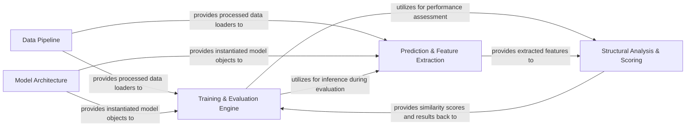

## Details

The `DeeplyTough` project, a research-oriented deep learning application in computational structural biology and cheminformatics, exhibits a modular and pipeline-driven architecture. The core components are designed to handle the entire workflow from raw data ingestion to model training, prediction, and structural analysis.

### Data Pipeline [[Expand]](./Data_Pipeline.md)
This component is responsible for the entire data lifecycle, from ingesting raw biological datasets (e.g., PDB files, pocket definitions) and performing initial preprocessing (e.g., HTMD featurization) to transforming data into a voxelized format, applying augmentations, and generating efficient data loaders. It ensures that data is consistently prepared and accessible for both model training and inference.

**Related Classes/Methods**:

- `deeplytough.datasets` (1:1)
- <a href="https://github.com/benevolentAI/DeeplyTough/blob/master/deeplytough/engine/datasets.py#L1-L1" target="_blank" rel="noopener noreferrer">`deeplytough.engine.datasets` (1:1)</a>

### Model Architecture [[Expand]](./Model_Architecture.md)
This component defines and constructs the deep learning neural network architectures, primarily focusing on SE(3)-equivariant networks. It encapsulates the logic for building complex 3D convolutional layers and handling model configuration, ensuring that the neural network structure is flexible and adaptable to various tasks.

**Related Classes/Methods**:

- <a href="https://github.com/benevolentAI/DeeplyTough/blob/master/deeplytough/engine/models.py#L1-L1" target="_blank" rel="noopener noreferrer">`deeplytough.engine.models` (1:1)</a>

### Training & Evaluation Engine [[Expand]](./Training_Evaluation_Engine.md)
This is the central orchestrator for the model's learning process. It manages the training loop, including optimizer configuration, learning rate scheduling, loss computation, logging metrics (e.g., to TensorBoard), and saving/resuming model checkpoints. It also initiates and coordinates benchmark evaluations to assess model performance against established datasets.

**Related Classes/Methods**:

- <a href="https://github.com/benevolentAI/DeeplyTough/blob/master/deeplytough/scripts/train.py#L1-L1" target="_blank" rel="noopener noreferrer">`deeplytough.scripts.train` (1:1)</a>
- <a href="https://github.com/benevolentAI/DeeplyTough/blob/master/deeplytough/scripts/prospeccts_benchmark.py#L1-L1" target="_blank" rel="noopener noreferrer">`deeplytough.scripts.prospeccts_benchmark` (1:1)</a>
- <a href="https://github.com/benevolentAI/DeeplyTough/blob/master/deeplytough/scripts/toughm1_benchmark.py#L1-L1" target="_blank" rel="noopener noreferrer">`deeplytough.scripts.toughm1_benchmark` (1:1)</a>
- `deeplytough.scripts.vertex` (1:1)

### Prediction & Feature Extraction
This component handles the inference phase of the deep learning models. It is responsible for loading trained models from checkpoints, performing forward passes on new input data, and extracting high-dimensional feature vectors (descriptors) from specific points of interest within the structural data. It acts as the primary interface for applying trained models to new inputs.

**Related Classes/Methods**:

- <a href="https://github.com/benevolentAI/DeeplyTough/blob/master/deeplytough/engine/predictor.py#L1-L1" target="_blank" rel="noopener noreferrer">`deeplytough.engine.predictor` (1:1)</a>

### Structural Analysis & Scoring
This component implements various algorithms for comparing and scoring the similarity between structural features (descriptors) that have been extracted by the Prediction & Feature Extraction component. It provides different matching strategies (e.g., pairwise, complete, bipartite) and calculates similarity scores, which are then used for quantifying model performance and facilitating structural comparisons.

**Related Classes/Methods**:

- `deeplytough.matchers` (1:1)

### [FAQ](https://github.com/CodeBoarding/GeneratedOnBoardings/tree/main?tab=readme-ov-file#faq)