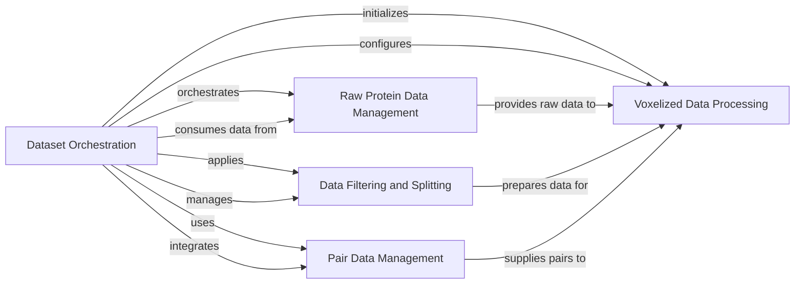

## Component Details

This architecture describes the data processing pipeline for the DeeplyTough project, focusing on the preparation of protein structure datasets for machine learning models. The main flow involves orchestrating the ingestion and preprocessing of various raw protein datasets, transforming them into a voxelized format, and applying filtering and splitting logic to prepare training and testing sets. The system ensures that diverse protein data sources are harmonized and made ready for consumption by downstream analytical or model training components.

### Dataset Orchestration
This component is responsible for the high-level orchestration of dataset creation. It integrates various raw protein structure datasets, handles filtering and splitting, and initializes the specialized voxelized datasets for consumption by the model.

**Related Classes/Methods**:

- <a href="https://github.com/benevolentAI/DeeplyTough/blob/master/deeplytough/engine/datasets.py#L236-L315" target="_blank" rel="noopener noreferrer">`DeeplyTough.deeplytough.engine.datasets.create_tough_dataset` (236:315)</a>

### Raw Protein Data Management
This component manages the initial preprocessing and retrieval of protein structures from various raw datasets, including TOUGH-M1, Vertex, ProSPECCTS, and custom datasets.

**Related Classes/Methods**:

- <a href="https://github.com/benevolentAI/DeeplyTough/blob/master/deeplytough/datasets/toughm1.py#L20-L253" target="_blank" rel="noopener noreferrer">`DeeplyTough.deeplytough.datasets.toughm1.ToughM1` (20:253)</a>
- <a href="https://github.com/benevolentAI/DeeplyTough/blob/master/deeplytough/datasets/toughm1.py#L101-L133" target="_blank" rel="noopener noreferrer">`DeeplyTough.deeplytough.datasets.toughm1.ToughM1.preprocess_once` (101:133)</a>
- <a href="https://github.com/benevolentAI/DeeplyTough/blob/master/deeplytough/datasets/toughm1.py#L167-L193" target="_blank" rel="noopener noreferrer">`DeeplyTough.deeplytough.datasets.toughm1.ToughM1.get_structures_splits` (167:193)</a>
- <a href="https://github.com/benevolentAI/DeeplyTough/blob/master/deeplytough/datasets/vertex.py#L18-L171" target="_blank" rel="noopener noreferrer">`DeeplyTough.deeplytough.datasets.vertex.Vertex` (18:171)</a>
- <a href="https://github.com/benevolentAI/DeeplyTough/blob/master/deeplytough/datasets/vertex.py#L40-L60" target="_blank" rel="noopener noreferrer">`DeeplyTough.deeplytough.datasets.vertex.Vertex.preprocess_once` (40:60)</a>
- <a href="https://github.com/benevolentAI/DeeplyTough/blob/master/deeplytough/datasets/vertex.py#L62-L99" target="_blank" rel="noopener noreferrer">`DeeplyTough.deeplytough.datasets.vertex.Vertex.get_structures` (62:99)</a>
- <a href="https://github.com/benevolentAI/DeeplyTough/blob/master/deeplytough/datasets/prospeccts.py#L16-L228" target="_blank" rel="noopener noreferrer">`DeeplyTough.deeplytough.datasets.prospeccts.Prospeccts` (16:228)</a>
- <a href="https://github.com/benevolentAI/DeeplyTough/blob/master/deeplytough/datasets/prospeccts.py#L90-L114" target="_blank" rel="noopener noreferrer">`DeeplyTough.deeplytough.datasets.prospeccts.Prospeccts.preprocess_once` (90:114)</a>
- <a href="https://github.com/benevolentAI/DeeplyTough/blob/master/deeplytough/datasets/prospeccts.py#L141-L172" target="_blank" rel="noopener noreferrer">`DeeplyTough.deeplytough.datasets.prospeccts.Prospeccts.get_structures` (141:172)</a>
- <a href="https://github.com/benevolentAI/DeeplyTough/blob/master/deeplytough/datasets/custom.py#L17-L19" target="_blank" rel="noopener noreferrer">`DeeplyTough.deeplytough.datasets.custom.Custom.preprocess_once` (17:19)</a>
- <a href="https://github.com/benevolentAI/DeeplyTough/blob/master/deeplytough/datasets/custom.py#L21-L44" target="_blank" rel="noopener noreferrer">`DeeplyTough.deeplytough.datasets.custom.Custom.get_structures` (21:44)</a>

### Voxelized Data Processing
This component provides foundational functionalities for handling and generating voxelized protein data, including extracting volumetric data, sampling augmentations, managing occupancy grids, and constructing specialized voxelized datasets like PDB tuples and pairs.

**Related Classes/Methods**:

- <a href="https://github.com/benevolentAI/DeeplyTough/blob/master/deeplytough/engine/datasets.py#L26-L52" target="_blank" rel="noopener noreferrer">`DeeplyTough.deeplytough.engine.datasets.VoxelizedDataset.__init__` (26:52)</a>
- <a href="https://github.com/benevolentAI/DeeplyTough/blob/master/deeplytough/engine/datasets.py#L75-L96" target="_blank" rel="noopener noreferrer">`DeeplyTough.deeplytough.engine.datasets.VoxelizedDataset._extract_volume` (75:96)</a>
- <a href="https://github.com/benevolentAI/DeeplyTough/blob/master/deeplytough/engine/datasets.py#L99-L116" target="_blank" rel="noopener noreferrer">`DeeplyTough.deeplytough.engine.datasets.VoxelizedDataset._getOccupancyC` (99:116)</a>
- <a href="https://github.com/benevolentAI/DeeplyTough/blob/master/deeplytough/engine/datasets.py#L60-L73" target="_blank" rel="noopener noreferrer">`DeeplyTough.deeplytough.engine.datasets.VoxelizedDataset._sample_augmentation` (60:73)</a>
- <a href="https://github.com/benevolentAI/DeeplyTough/blob/master/deeplytough/engine/datasets.py#L122-L150" target="_blank" rel="noopener noreferrer">`DeeplyTough.deeplytough.engine.datasets.PdbTupleVoxelizedDataset.__init__` (122:150)</a>
- <a href="https://github.com/benevolentAI/DeeplyTough/blob/master/deeplytough/engine/datasets.py#L152-L191" target="_blank" rel="noopener noreferrer">`DeeplyTough.deeplytough.engine.datasets.PdbTupleVoxelizedDataset._get_patch` (152:191)</a>
- <a href="https://github.com/benevolentAI/DeeplyTough/blob/master/deeplytough/engine/datasets.py#L194-L212" target="_blank" rel="noopener noreferrer">`DeeplyTough.deeplytough.engine.datasets.PdbPairVoxelizedDataset` (194:212)</a>
- <a href="https://github.com/benevolentAI/DeeplyTough/blob/master/deeplytough/engine/datasets.py#L201-L212" target="_blank" rel="noopener noreferrer">`DeeplyTough.deeplytough.engine.datasets.PdbPairVoxelizedDataset.__getitem__` (201:212)</a>
- <a href="https://github.com/benevolentAI/DeeplyTough/blob/master/deeplytough/engine/datasets.py#L218-L220" target="_blank" rel="noopener noreferrer">`DeeplyTough.deeplytough.engine.datasets.PointOfInterestVoxelizedDataset.__init__` (218:220)</a>
- <a href="https://github.com/benevolentAI/DeeplyTough/blob/master/deeplytough/engine/datasets.py#L222-L233" target="_blank" rel="noopener noreferrer">`DeeplyTough.deeplytough.engine.datasets.PointOfInterestVoxelizedDataset.__getitem__` (222:233)</a>

### Data Filtering and Splitting
This component encapsulates the logic for filtering and splitting the combined protein dataset. It specifically handles the exclusion of entries from the training set based on overlap with other datasets and manages the division of data into training and testing subsets.

**Related Classes/Methods**:

- <a href="https://github.com/benevolentAI/DeeplyTough/blob/master/deeplytough/engine/datasets.py#L236-L315" target="_blank" rel="noopener noreferrer">`DeeplyTough.deeplytough.engine.datasets.create_tough_dataset` (236:315)</a>
- <a href="https://github.com/benevolentAI/DeeplyTough/blob/master/deeplytough/engine/datasets.py#L236-L315" target="_blank" rel="noopener noreferrer">`DeeplyTough.deeplytough.engine.datasets.create_tough_dataset` (236:315)</a>
- <a href="https://github.com/benevolentAI/DeeplyTough/blob/master/deeplytough/engine/datasets.py#L236-L315" target="_blank" rel="noopener noreferrer">`DeeplyTough.deeplytough.engine.datasets.create_tough_dataset` (236:315)</a>

### Pair Data Management
This component is responsible for reading, preparing, and managing positive and negative pocket pairs from predefined lists, including shuffling them for dataset construction.

**Related Classes/Methods**:

- <a href="https://github.com/benevolentAI/DeeplyTough/blob/master/deeplytough/engine/datasets.py#L236-L315" target="_blank" rel="noopener noreferrer">`DeeplyTough.deeplytough.engine.datasets.create_tough_dataset` (236:315)</a>
- <a href="https://github.com/benevolentAI/DeeplyTough/blob/master/deeplytough/engine/datasets.py#L236-L315" target="_blank" rel="noopener noreferrer">`DeeplyTough.deeplytough.engine.datasets.create_tough_dataset` (236:315)</a>

### [FAQ](https://github.com/CodeBoarding/GeneratedOnBoardings/tree/main?tab=readme-ov-file#faq)