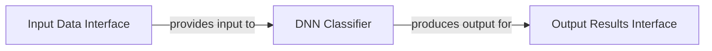

## Details

The `CNN Object Recognition Module` within `optFlowFarneback` is architecturally centered around the `DNN Classifier` component, implemented by the `DNN` C++ class. This component serves as a comprehensive unit, handling all aspects of deep neural network-based object recognition, including model management, prediction execution, and result interpretation. It receives image data via the `Input Data Interface`, which is concretely an OpenCV `Mat` object. Upon processing, the `DNN Classifier` generates structured classification results, comprising the object label and its probability, which are then exposed through the `Output Results Interface`, represented by the `probLabel` struct. This streamlined architecture ensures a clear flow of data and responsibilities for the object recognition functionality.

### DNN Classifier
This central component encapsulates the entire object recognition pipeline. It manages the loading and configuration of the pre-trained GoogLeNet model, performs the forward pass for inference on input image data, interprets the raw classification scores to identify the most confident class, and loads human-readable class names for output. It consolidates the functionalities previously attributed to "DNN Model Manager," "Prediction Engine," "Classification Interpreter," and "Class Name Loader."

**Related Classes/Methods**:

- `DNN`:21-138
- `DNN::predictLabel`:61-135
- `DNN::getMaxClass`:29-36
- `DNN::readClassNames`:38-59

### Input Data Interface
This interface represents the structured image data provided to the DNN Classifier for processing. It is concretely implemented as an OpenCV Mat object, which is a standard data structure for image representation in OpenCV.

**Related Classes/Methods**:

- `cv::Mat`

### Output Results Interface
This interface represents the structured output from the DNN Classifier, containing the classified object label and its confidence probability. It is concretely implemented by the probLabel struct, which bundles the label string and its corresponding probability.

**Related Classes/Methods**:

- `probLabel`
- `DNN::predictLabel`

### [FAQ](https://github.com/CodeBoarding/GeneratedOnBoardings/tree/main?tab=readme-ov-file#faq)