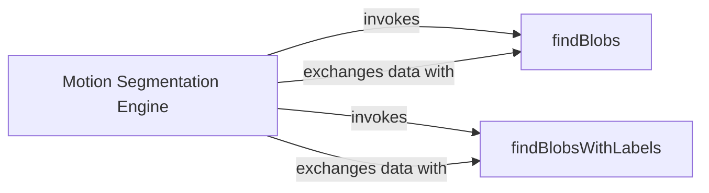

## Details

The `optFlowFarneback` subsystem is designed for real-time motion segmentation using dense optical flow. At its core, the `Motion Segmentation Engine` (implemented in the `main` function) continuously processes video frames. It first computes the optical flow between consecutive frames and then thresholds the resulting magnitude to create a binary motion mask. This mask, along with the original video frame, is then passed to either the `findBlobs` component for basic motion region detection or the `findBlobsWithLabels` component for more advanced, labeled blob identification. Both blob detection components return processed frames with visual indicators of detected motion, which are then handled by the `Motion Segmentation Engine` for output. This architecture ensures a clear separation of concerns between optical flow calculation, motion region identification, and the overall orchestration of the segmentation pipeline.

### Motion Segmentation Engine [[Expand]](./Motion_Segmentation_Engine.md)
This component, embodied by the `main` function, serves as the central orchestrator for the motion segmentation process. It captures video frames, calculates dense optical flow, thresholds the flow magnitude to identify motion regions, and then dynamically invokes either `findBlobs` or `findBlobsWithLabels` to process these regions. It manages the overall control flow, data preparation, and integration of the segmentation results for output.

**Related Classes/Methods**:

- `main`

### findBlobs
This component implements a core algorithm for detecting and delineating regions of significant motion ("blobs") within the input motion mask. It identifies motion areas without assigning unique identifiers, focusing on basic motion detection. It processes the motion mask and the original frame to draw bounding boxes around detected blobs.

**Related Classes/Methods**:

- `findBlobs`

### findBlobsWithLabels
This component is an advanced variant of the blob detection algorithm. It identifies motion regions and assigns unique labels or identifiers to each detected blob. This labeling capability enables differentiation and individual object analysis. It processes the motion mask and the original frame to draw bounding boxes and potentially labels on detected blobs.

**Related Classes/Methods**:

- `findBlobsWithLabels`

### [FAQ](https://github.com/CodeBoarding/GeneratedOnBoardings/tree/main?tab=readme-ov-file#faq)