```mermaid
graph LR
    Video_Stream_Manager["Video Stream Manager"]
    Video_Frame_Acquirer["Video Frame Acquirer"]
    Dense_Optical_Flow_Calculator["Dense Optical Flow Calculator"]
    Motion_Segmentation_Module["Motion Segmentation Module"]
    CNN_Inference_Engine["CNN Inference Engine"]
    Processed_Output_Renderer["Processed Output Renderer"]
    Video_File_Writer["Video File Writer"]
    Video_Stream_Manager -- "orchestrates" --> Video_Frame_Acquirer
    Video_Stream_Manager -- "orchestrates" --> Dense_Optical_Flow_Calculator
    Video_Stream_Manager -- "orchestrates" --> Motion_Segmentation_Module
    Video_Stream_Manager -- "orchestrates" --> CNN_Inference_Engine
    Video_Stream_Manager -- "orchestrates" --> Processed_Output_Renderer
    Video_Stream_Manager -- "orchestrates" --> Video_File_Writer
    Video_Frame_Acquirer -- "provides frames to" --> Dense_Optical_Flow_Calculator
    Video_Frame_Acquirer -- "provides frames to" --> Processed_Output_Renderer
    Dense_Optical_Flow_Calculator -- "receives frames from" --> Video_Frame_Acquirer
    Dense_Optical_Flow_Calculator -- "provides optical flow data to" --> Motion_Segmentation_Module
    Dense_Optical_Flow_Calculator -- "provides optical flow visualization data to" --> Processed_Output_Renderer
    Motion_Segmentation_Module -- "receives optical flow data from" --> Dense_Optical_Flow_Calculator
    Motion_Segmentation_Module -- "provides segmented regions to" --> CNN_Inference_Engine
    Motion_Segmentation_Module -- "provides segmentation masks to" --> Processed_Output_Renderer
    CNN_Inference_Engine -- "receives segmented regions from" --> Motion_Segmentation_Module
    CNN_Inference_Engine -- "provides classification results to" --> Processed_Output_Renderer
    Processed_Output_Renderer -- "receives raw frames from" --> Video_Frame_Acquirer
    Processed_Output_Renderer -- "receives optical flow visualization data from" --> Dense_Optical_Flow_Calculator
    Processed_Output_Renderer -- "receives segmentation masks from" --> Motion_Segmentation_Module
    Processed_Output_Renderer -- "receives classification results from" --> CNN_Inference_Engine
    Processed_Output_Renderer -- "provides combined frames/outputs to" --> Video_File_Writer
    Video_File_Writer -- "receives frames/outputs from" --> Processed_Output_Renderer
    click Video_Stream_Manager href "https://github.com/CodeBoarding/GeneratedOnBoardings/blob/main/Dense_OpticalFlow_and_CNN_based_Motion_Segmentation_and_Object_Recognition/Video_Stream_Manager.md" "Details"
```

## Details

The system is designed to process video streams for motion segmentation and object recognition. It operates by acquiring video frames, calculating dense optical flow to detect motion, segmenting moving regions, and then applying a Convolutional Neural Network (CNN) for object inference. The processed outputs, including visualizations of optical flow, segmented objects, and classification results, are rendered in real-time and can be written to video files for persistence. The `main` function acts as the central orchestrator, managing the flow of data and control between these specialized components.

### Video Stream Manager [[Expand]](./Video_Stream_Manager.md)
The central orchestrator of the entire video processing pipeline. It initializes and manages the lifecycle of all other components, coordinating the sequential and parallel data flow between them. Its primary role is to ensure frames are acquired, processed through optical flow, segmentation, and CNN inference, and then displayed or saved.

**Related Classes/Methods**:

- `main`

### Video Frame Acquirer
Responsible for obtaining raw video frames from various input sources, such as video files or live camera feeds. It acts as the entry point for all video data into the processing pipeline.

**Related Classes/Methods**:

- `cv::VideoCapture`

### Dense Optical Flow Calculator
Computes dense motion vectors between consecutive video frames using algorithms like Farneback's method. This component provides the foundational motion data for subsequent analysis.

**Related Classes/Methods**:

- `cv::calcOpticalFlowFarneback`

### Motion Segmentation Module
Identifies and segments moving regions within the video frames based on the optical flow data. It isolates areas of interest for further analysis, such as object classification.

**Related Classes/Methods**:

- `findBlobs`
- `findBlobsWithLabels`

### CNN Inference Engine
Performs object classification or other inference tasks on the segmented regions using a pre-trained Convolutional Neural Network (e.g., Caffe models). It provides semantic understanding of the detected motion.

**Related Classes/Methods**:

- `DNN`

### Processed Output Renderer
Visualizes the various stages of processing, including raw frames, optical flow visualizations, motion segmentation masks, and the results of object classification. It provides real-time feedback and debugging capabilities.

**Related Classes/Methods**:

- `cv::imshow`
- `drawOptFlowMap`

### Video File Writer
Handles the persistence of processed video streams by writing them to output files. This includes saving raw frames, processed frames with overlays, or specific output visualizations.

**Related Classes/Methods**:

- `cv::VideoWriter`

### [FAQ](https://github.com/CodeBoarding/GeneratedOnBoardings/tree/main?tab=readme-ov-file#faq)