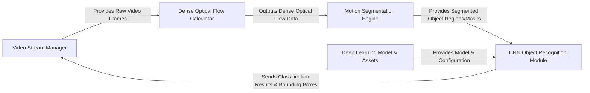

## Details

The system processes video streams to detect and classify moving objects. It begins with the Video Stream Manager acquiring frames and orchestrating the overall process, including the final display of results. The Dense Optical Flow Calculator then quantifies pixel motion between frames. This motion data is fed into the Motion Segmentation Engine, which identifies and isolates regions of significant movement. Finally, the CNN Object Recognition Module utilizes a pre-trained deep learning model from the Deep Learning Model & Assets to classify the segmented objects, with the results being displayed by the Video Stream Manager.

### Video Stream Manager [[Expand]](./Video_Stream_Manager.md)
Manages the acquisition of raw video frames from input sources (e.g., video files or camera) and orchestrates the display of all processed outputs, including raw frames, optical flow visualizations, motion segmentation masks, and object classification results. It also handles writing processed video streams to files.

**Related Classes/Methods**:

- `main`
- `findBlobs`
- `findBlobsWithLabels`
- `VideoWriter`

### Dense Optical Flow Calculator
Computes dense optical flow vectors between consecutive video frames using the Farneback algorithm, quantifying pixel-wise motion across the entire frame.

**Related Classes/Methods**:

- `calcOpticalFlowFarneback`

### Motion Segmentation Engine [[Expand]](./Motion_Segmentation_Engine.md)
Processes dense optical flow data to identify and isolate regions of significant motion within the video frames, segmenting moving objects or areas of interest for subsequent recognition.

**Related Classes/Methods**:

- `findBlobs`
- `findBlobsWithLabels`

### CNN Object Recognition Module [[Expand]](./CNN_Object_Recognition_Module.md)
Encapsulates all functionalities related to deep learning-based object classification. It handles the loading of a pre-trained Convolutional Neural Network (GoogLeNet), performs inference on segmented motion regions, and interprets the classification results.

**Related Classes/Methods**:

- `DNN`
- `DNN::predictLabel`
- `DNN::getMaxClass`
- `DNN::readClassNames`

### Deep Learning Model & Assets
A passive component responsible for storing the pre-trained CNN model (GoogLeNet), its architecture definition, and the class labels required for object classification. These are static assets used by the CNN Object Recognition Module.

**Related Classes/Methods**:

- `bvlc_googlenet.caffemodel`
- `bvlc_googlenet.prototxt`
- `synset_words.txt`

### [FAQ](https://github.com/CodeBoarding/GeneratedOnBoardings/tree/main?tab=readme-ov-file#faq)