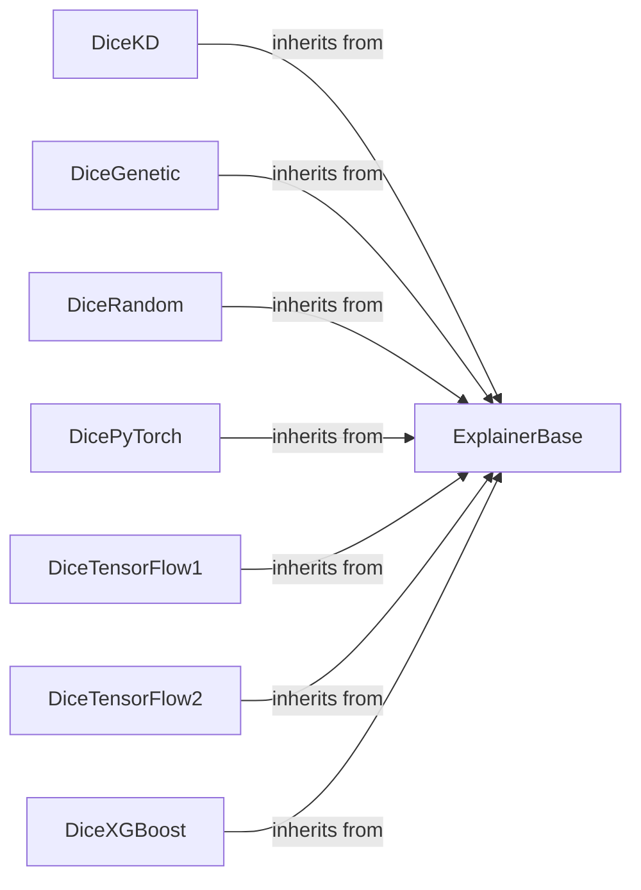

## Details

The `dice_ml.explainer_interfaces` subsystem is central to the DiCE project, providing a unified framework for generating diverse counterfactual explanations. At its core is the `ExplainerBase` abstract component, which defines the common interface for all counterfactual generation methods, embodying the Strategy design pattern. Various concrete explainer implementations, including `DiceKD`, `DiceGenetic`, `DiceRandom`, `DicePyTorch`, `DiceTensorFlow1`, `DiceTensorFlow2`, and `DiceXGBoost`, inherit directly from `ExplainerBase`. Each concrete explainer is responsible for implementing the counterfactual generation logic tailored to specific model types or algorithmic approaches, such as KD-trees, genetic algorithms, random sampling, or gradient-based optimization for deep learning and tree-based models. This clear inheritance structure ensures extensibility and consistency across different counterfactual explanation techniques, with helper functionalities encapsulated within each specific explainer's implementation.

### ExplainerBase
The abstract base component that defines the common interface (`find_counterfactuals`) for all counterfactual generation methods. It orchestrates the overall process and ensures a consistent API, embodying the Strategy pattern's interface.

**Related Classes/Methods**:

- <a href="https://github.com/interpretml/DiCE/blob/main/dice_ml/explainer_interfaces/explainer_base.py#L20-L906" target="_blank" rel="noopener noreferrer">`dice_ml.explainer_interfaces.explainer_base.ExplainerBase`:20-906</a>

### DiceKD
A concrete implementation of `ExplainerBase` that uses a KD-tree based approach for generating diverse counterfactual explanations, suitable for tabular data. Its internal logic encapsulates KD-tree specific operations.

**Related Classes/Methods**:

- <a href="https://github.com/interpretml/DiCE/blob/main/dice_ml/explainer_interfaces/dice_KD.py#L16-L295" target="_blank" rel="noopener noreferrer">`dice_ml.explainer_interfaces.dice_KD.DiceKD`:16-295</a>

### DiceGenetic
A concrete implementation of `ExplainerBase` that employs a Genetic Algorithm for generating diverse counterfactual explanations, offering a heuristic search approach. Its internal logic handles genetic algorithm specific functionalities.

**Related Classes/Methods**:

- <a href="https://github.com/interpretml/DiCE/blob/main/dice_ml/explainer_interfaces/dice_genetic.py#L18-L587" target="_blank" rel="noopener noreferrer">`dice_ml.explainer_interfaces.dice_genetic.DiceGenetic`:18-587</a>

### DiceRandom
A concrete implementation of `ExplainerBase` that uses a random sampling approach for generating counterfactual explanations, serving as a baseline or for simple cases. Its internal logic manages random sampling utilities.

**Related Classes/Methods**:

- <a href="https://github.com/interpretml/DiCE/blob/main/dice_ml/explainer_interfaces/dice_random.py#L17-L248" target="_blank" rel="noopener noreferrer">`dice_ml.explainer_interfaces.dice_random.DiceRandom`:17-248</a>

### DicePyTorch
A concrete implementation of `ExplainerBase` specifically designed for PyTorch models, utilizing a gradient-based optimization approach for counterfactual generation. Its internal logic handles PyTorch-specific gradient calculations.

**Related Classes/Methods**:

- <a href="https://github.com/interpretml/DiCE/blob/main/dice_ml/explainer_interfaces/dice_pytorch.py#L15-L611" target="_blank" rel="noopener noreferrer">`dice_ml.explainer_interfaces.dice_pytorch.DicePyTorch`:15-611</a>

### DiceTensorFlow1
A concrete implementation of `ExplainerBase` tailored for TensorFlow 1.x models, employing a gradient-based approach for counterfactual generation. Its internal logic handles TensorFlow 1.x-specific gradient calculations.

**Related Classes/Methods**:

- <a href="https://github.com/interpretml/DiCE/blob/main/dice_ml/explainer_interfaces/dice_tensorflow1.py#L16-L696" target="_blank" rel="noopener noreferrer">`dice_ml.explainer_interfaces.dice_tensorflow1.DiceTensorFlow1`:16-696</a>

### DiceTensorFlow2
A concrete implementation of `ExplainerBase` for TensorFlow 2.x models, using a gradient-based optimization strategy for counterfactual generation. Its internal logic handles TensorFlow 2.x-specific gradient calculations.

**Related Classes/Methods**:

- <a href="https://github.com/interpretml/DiCE/blob/main/dice_ml/explainer_interfaces/dice_tensorflow2.py#L15-L613" target="_blank" rel="noopener noreferrer">`dice_ml.explainer_interfaces.dice_tensorflow2.DiceTensorFlow2`:15-613</a>

### DiceXGBoost
A concrete implementation of `ExplainerBase` for XGBoost models, likely utilizing a gradient-based or tree-specific optimization approach for counterfactual generation. Its internal logic handles XGBoost-specific counterfactual generation.

**Related Classes/Methods**:

- <a href="https://github.com/interpretml/DiCE/blob/main/dice_ml/explainer_interfaces/dice_xgboost.py#L4-L12" target="_blank" rel="noopener noreferrer">`dice_ml.explainer_interfaces.dice_xgboost.DiceXGBoost`:4-12</a>

### [FAQ](https://github.com/CodeBoarding/GeneratedOnBoardings/tree/main?tab=readme-ov-file#faq)