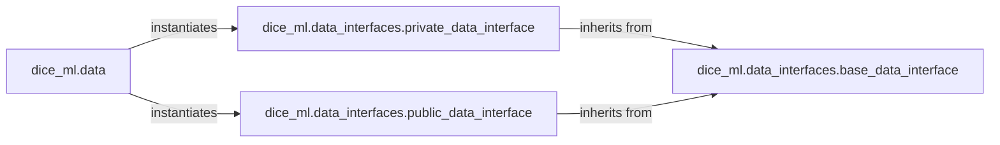

## Details

The Data Abstraction Layer subsystem is primarily defined by the `dice_ml.data` module and the `dice_ml.data_interfaces` package. This includes the core factory class `dice_ml.data.Data` and the various data interface implementations found within `dice_ml/data_interfaces/`. It is structured around the Strategy/Plugin pattern, where `dice_ml.data` acts as a factory that selects and instantiates specific data handling strategies (`private_data_interface` or `public_data_interface`). Both concrete data interfaces inherit from `dice_ml.data_interfaces.base_data_interface`, ensuring a consistent API and adherence to common data handling principles. This design promotes modularity, allowing new data sources or preprocessing strategies to be added without altering the core `dice_ml.data` component, thus supporting the project's bias towards extensibility and model agnosticism.

### dice_ml.data
Serves as the central entry point and factory for the Data Abstraction Layer. It abstracts the complexity of choosing and instantiating the correct data interface (`private_data_interface` or `public_data_interface`) based on the characteristics of the input dataset. This component embodies the Facade pattern, providing a simplified interface to the underlying data handling mechanisms.

**Related Classes/Methods**:

- <a href="https://github.com/interpretml/DiCE/blob/main/dice_ml/data.py#L12-L25" target="_blank" rel="noopener noreferrer">`dice_ml.data.Data`:12-25</a>
- <a href="https://github.com/interpretml/DiCE/blob/main/dice_ml/data_interfaces/private_data_interface.py" target="_blank" rel="noopener noreferrer">`dice_ml.data_interfaces.private_data_interface`</a>
- <a href="https://github.com/interpretml/DiCE/blob/main/dice_ml/data_interfaces/public_data_interface.py" target="_blank" rel="noopener noreferrer">`dice_ml.data_interfaces.public_data_interface`</a>

### dice_ml.data_interfaces.base_data_interface
This abstract base class defines the common interface and foundational methods that all concrete data interface implementations must adhere to. It ensures consistency in data handling operations such as type checking, data querying, and basic preprocessing across different data sources, promoting a unified approach to data manipulation.

**Related Classes/Methods**:

- <a href="https://github.com/interpretml/DiCE/blob/main/dice_ml/data_interfaces/base_data_interface.py" target="_blank" rel="noopener noreferrer">`dice_ml.data_interfaces.base_data_interface`</a>

### dice_ml.data_interfaces.private_data_interface
Specializes in handling private datasets, which often require specific preprocessing steps for gradient-based explanation methods. Its responsibilities include loading, validating, and performing detailed transformations like one-hot encoding, normalization, handling decimal precision, and extracting min/max values, crucial for internal model operations.

**Related Classes/Methods**:

- <a href="https://github.com/interpretml/DiCE/blob/main/dice_ml/data_interfaces/private_data_interface.py" target="_blank" rel="noopener noreferrer">`dice_ml.data_interfaces.private_data_interface`</a>
- <a href="https://github.com/interpretml/DiCE/blob/main/dice_ml/data_interfaces/base_data_interface.py" target="_blank" rel="noopener noreferrer">`dice_ml.data_interfaces.base_data_interface`</a>

### dice_ml.data_interfaces.public_data_interface
Manages public datasets, focusing on preprocessing steps suitable for publicly available data. This includes setting appropriate feature data types, one-hot encoding, normalization, and providing data quantiles, ensuring the data is in a suitable format for explanation generation without exposing sensitive details.

**Related Classes/Methods**:

- <a href="https://github.com/interpretml/DiCE/blob/main/dice_ml/data_interfaces/public_data_interface.py" target="_blank" rel="noopener noreferrer">`dice_ml.data_interfaces.public_data_interface`</a>
- <a href="https://github.com/interpretml/DiCE/blob/main/dice_ml/data_interfaces/base_data_interface.py" target="_blank" rel="noopener noreferrer">`dice_ml.data_interfaces.base_data_interface`</a>

### [FAQ](https://github.com/CodeBoarding/GeneratedOnBoardings/tree/main?tab=readme-ov-file#faq)