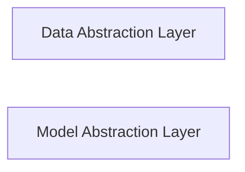

## Details

One paragraph explaining the functionality which is represented by this graph. What the main flow is and what is its purpose.

### Data Abstraction Layer [[Expand]](./Data_Abstraction_Layer.md)
Handles data-related operations and interactions with various data sources.

**Related Classes/Methods**:

- <a href="https://github.com/interpretml/DiCE/blob/main/dice_ml/data_interfaces/base_data_interface.py" target="_blank" rel="noopener noreferrer">`dice_ml.data_interfaces.base_data_interface`</a>

### Model Abstraction Layer [[Expand]](./Model_Abstraction_Layer.md)
Provides a unified interface for different machine learning models, abstracting their complexities.

**Related Classes/Methods**:

- <a href="https://github.com/interpretml/DiCE/blob/main/dice_ml/model_interfaces/base_model.py" target="_blank" rel="noopener noreferrer">`dice_ml.model_interfaces.base_model`</a>

### [FAQ](https://github.com/CodeBoarding/GeneratedOnBoardings/tree/main?tab=readme-ov-file#faq)