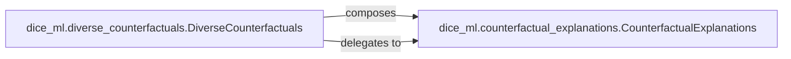

## Details

The Explanation Output & Serialization subsystem in DiCE is responsible for the structured representation, persistence (serialization/deserialization), and presentation of generated counterfactual explanations. Its primary goal is to prepare the explanation data for various downstream uses, including display to users, storage, or integration with other analysis tools, while adhering to defined data schemas.

### dice_ml.counterfactual_explanations.CounterfactualExplanations
This class serves as the foundational data structure for a *single* set of counterfactual explanations. It encapsulates the explanation data (e.g., feature values, predictions), associated metadata, and provides essential functionalities for its lifecycle.

**Related Classes/Methods**:

- <a href="https://github.com/interpretml/DiCE/blob/main/dice_ml/counterfactual_explanations.py#L43-L302" target="_blank" rel="noopener noreferrer">`dice_ml.counterfactual_explanations.CounterfactualExplanations`:43-302</a>
- <a href="https://github.com/interpretml/DiCE/blob/main/dice_ml/counterfactual_explanations.py" target="_blank" rel="noopener noreferrer">`dice_ml.counterfactual_explanations.CounterfactualExplanations:to_json`</a>
- <a href="https://github.com/interpretml/DiCE/blob/main/dice_ml/counterfactual_explanations.py" target="_blank" rel="noopener noreferrer">`dice_ml.counterfactual_explanations.CounterfactualExplanations:from_json`</a>
- <a href="https://github.com/interpretml/DiCE/blob/main/dice_ml/counterfactual_explanations.py" target="_blank" rel="noopener noreferrer">`dice_ml.counterfactual_explanations.CounterfactualExplanations:visualize_as_dataframe`</a>
- <a href="https://github.com/interpretml/DiCE/blob/main/dice_ml/counterfactual_explanations.py" target="_blank" rel="noopener noreferrer">`dice_ml.counterfactual_explanations.CounterfactualExplanations:visualize_as_list`</a>

### dice_ml.diverse_counterfactuals.DiverseCounterfactuals
This class specializes in managing and presenting *multiple, diverse* counterfactual explanations. It acts as an aggregator and orchestrator for visualizing and handling collections of individual explanations.

**Related Classes/Methods**:

- <a href="https://github.com/interpretml/DiCE/blob/main/dice_ml/diverse_counterfactuals.py" target="_blank" rel="noopener noreferrer">`dice_ml.diverse_counterfactuals.DiverseCounterfactuals`</a>
- <a href="https://github.com/interpretml/DiCE/blob/main/dice_ml/diverse_counterfactuals.py" target="_blank" rel="noopener noreferrer">`dice_ml.diverse_counterfactuals.DiverseCounterfactuals:visualize_as_dataframe`</a>
- <a href="https://github.com/interpretml/DiCE/blob/main/dice_ml/diverse_counterfactuals.py" target="_blank" rel="noopener noreferrer">`dice_ml.diverse_counterfactuals.DiverseCounterfactuals:visualize_as_list`</a>

### [FAQ](https://github.com/CodeBoarding/GeneratedOnBoardings/tree/main?tab=readme-ov-file#faq)