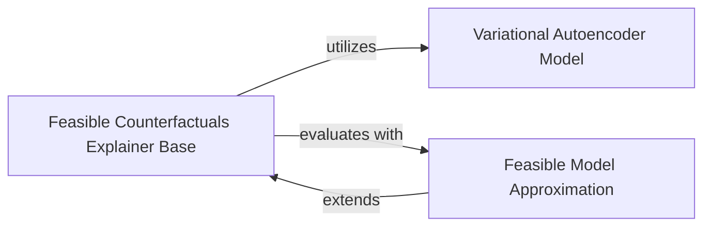

## Details

The `dice_ml` subsystem for feasible counterfactuals is designed around a generative model approach, primarily utilizing a Variational Autoencoder (VAE) to ensure the generated counterfactuals are realistic and adhere to the underlying data distribution. The `Feasible Counterfactuals Explainer Base` orchestrates the entire process, training the VAE and guiding the counterfactual generation. It interacts with the `Variational Autoencoder Model` for data generation and the `Feasible Model Approximation` to ensure the generated counterfactuals lead to desired predictions from the black-box model. This modular design allows for flexible integration of different VAE architectures and model approximation techniques while maintaining a clear separation of concerns for generating feasible and valid counterfactual explanations.

### Variational Autoencoder Model
This component encapsulates the core generative model, a Variational Autoencoder (VAE), specifically the `CF_VAE` class. Its responsibility is to learn a compressed latent representation of the input data and to generate new data points from this latent space. This is crucial for ensuring the *feasibility* of generated counterfactuals by constraining them to the learned data distribution. It provides methods for encoding input data into latent space, decoding latent codes back into data space, and sampling from the latent distribution.

**Related Classes/Methods**:

- <a href="https://github.com/interpretml/DiCE/blob/main/dice_ml/utils/sample_architecture/vae_model.py#L6-L131" target="_blank" rel="noopener noreferrer">`dice_ml.utils.sample_architecture.vae_model.CF_VAE`:6-131</a>

### Feasible Counterfactuals Explainer Base
This component, represented by the `FeasibleBaseVAE` class, acts as the primary orchestrator for generating feasible counterfactual explanations using a VAE. It defines the overall training process for the VAE within the counterfactual generation context and incorporates specific loss functions (reconstruction error, KL divergence, validity loss) to ensure the generated counterfactuals align with data distribution constraints and lead to the desired prediction. It leverages the `Variational Autoencoder Model` for data generation and interacts with the `Feasible Model Approximation` to evaluate the validity of generated counterfactuals against the black-box model.

**Related Classes/Methods**:

- <a href="https://github.com/interpretml/DiCE/blob/main/dice_ml/explainer_interfaces/feasible_base_vae.py#L14-L244" target="_blank" rel="noopener noreferrer">`dice_ml.explainer_interfaces.feasible_base_vae.FeasibleBaseVAE`:14-244</a>

### Feasible Model Approximation
This component, implemented by the `FeasibleModelApprox` class, provides an interface or implementation for approximating the behavior of the black-box machine learning model. This approximation is vital for guiding the counterfactual generation process (often by the VAE) to ensure that the generated counterfactuals not only look realistic but also lead to the desired change in the black-box model's prediction. It extends the `FeasibleBaseVAE` and adds functionality to incorporate additional constraints during training, such as unary or monotonic constraints, further refining the counterfactual generation process.

**Related Classes/Methods**:

- <a href="https://github.com/interpretml/DiCE/blob/main/dice_ml/explainer_interfaces/feasible_model_approx.py#L12-L135" target="_blank" rel="noopener noreferrer">`dice_ml.explainer_interfaces.feasible_model_approx.FeasibleModelApprox`:12-135</a>

### [FAQ](https://github.com/CodeBoarding/GeneratedOnBoardings/tree/main?tab=readme-ov-file#faq)